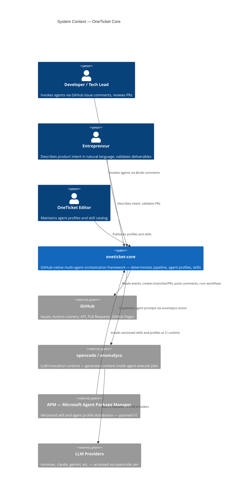

# C1 — System Context

## Summary

High-level view of OneTicket and its external actors and systems.

## Diagram

## Notes

- APM integration is planned for V1 — profiles and skills are currently installed via `oneticket-install.mjs` at CI runtime
- LLM provider is configurable via `config.yml` — `opencode/minimax-m2.7` is the current default
- GitHub is the only required external dependency for V1 — no cloud infrastructure needed
