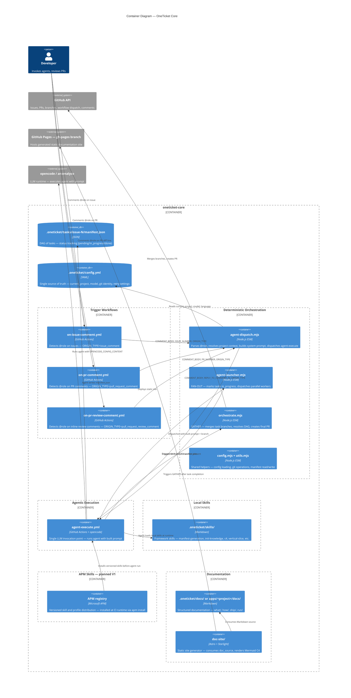

# C2 — Containers

## Summary

Technical containers that make up oneticket-core and their interactions.

## Diagram

## Notes

- Local skills in `.oneticket/skills/` are installed via `oneticket-install.mjs` at each CI run
- APM will complement (not replace) local skills — local skills persist for framework-level knowledge
- `doc-site-static/` is a CI artifact — never committed to the repository
- The deterministic/agentic boundary is strict: only `agent-execute.yml` invokes an LLM
