# C3 — Components

## Summary

Internal components of the deterministic orchestration layer — the core of oneticket-core.

## Diagram

```mermaid
C4Component
  title Component Diagram — Deterministic Orchestration

  Container_Boundary(orchestration, "Deterministic Orchestration — src/") {

    Component(agent_dispatch, "agent-dispatch.mjs", "Node.js ESM", "Entry point — parses @role comment, resolves project context (docs_path, app_path), builds system prompt with ## Agent contract + ## Project context, dispatches agent-execute workflow")

    Component(resolve_context, "resolveProjectContext()", "Function", "Deterministically resolves docs_path and app_path from current_project — three states: absent (error), empty (framework), set (application)")

    Component(build_prompt, "buildPrompt()", "Function", "Constructs system prompt — profile + language + mode + project context + agent contract (origin-aware gh command) + request + context block")

    Component(launch_fanout, "launch-fanout.mjs", "Node.js ESM", "FAN-OUT bootstrap — checks manifest presence, reads pending tasks, calls launchReadyTasks()")

    Component(agent_launcher, "agent-launcher.mjs", "Node.js ESM", "FAN-OUT executor — identifies ready tasks (pending + dependencies satisfied), marks in_progress, commits manifest, dispatches parallel agent-execute workflows")

    Component(orchestrate, "orchestrate.mjs", "Node.js ESM", "GATHER — receives task completion signal, merges task branch into feature/issue-N, marks task done, routes: ready tasks → new FAN-OUT, all done → final PR")

    Component(dispatch_gather, "dispatch-gather.mjs", "Node.js ESM", "Triggers on-gather.yml via workflow_dispatch after task push — reliable signal independent of PR mergeability")

    Component(retry_dispatch, "retry-dispatch.mjs", "Node.js ESM", "Retry on agent failure — re-dispatches agent-execute with incremented retry_count and exponential backoff, up to retry_max")

    Component(config_module, "config.mjs", "Node.js ESM", "loadConfig() — reads and validates .oneticket/config.yml, extracts model from agent_config.<cli>.model")

    Component(utils, "utils.mjs", "Node.js ESM", "Shared helpers — run(), runCapture(), runWithRetry(), setupGit(), writeManifest(), readManifest(), areDependenciesSatisfied(), dispatchWorkflow()")

    Component(init_doc, "init-doc.mjs", "Node.js ESM", "Initializes docs_path structure from .oneticket/templates/docs/ — idempotent, creates what/, how/, ship/, run/")

    Component(generate_config, "generate-config.mjs", "Node.js ESM", "Generates OPENCODE_CONFIG_CONTENT JSON from config.yml — injected as env var into agent-execute, no file written to disk")

    Component(print_config, "print-config.mjs", "Node.js ESM", "Reads a single config.yml key to stdout — used by GitHub Actions workflow steps for conditional logic")

    Component(oneticket_install, "oneticket-install.mjs", "Node.js ESM", "Installs .oneticket/skills/* into .agents/skills/ at CI runtime — makes skills natively discoverable by opencode before agent run")
  }

  ContainerDb(config_yml, "config.yml", "YAML", "Single source of truth")
  ContainerDb(manifest_json, "manifest.json", "JSON DAG", "Task state")
  ContainerDb(agent_profile, ".agent.md", "Markdown", "Agent profile")
  ContainerDb(skills_dir, ".oneticket/skills/", "Markdown", "Local skills")

  System_Ext(github_actions, "GitHub Actions API", "workflow_dispatch, branch ops, PR creation")

  Rel(agent_dispatch, resolve_context, "Resolves docs_path + app_path")
  Rel(agent_dispatch, build_prompt, "Builds system prompt")
  Rel(agent_dispatch, config_module, "Loads config")
  Rel(agent_dispatch, github_actions, "Dispatches agent-execute.yml")
  Rel(build_prompt, agent_profile, "Injects profile content")
  Rel(resolve_context, config_yml, "Reads current_project")

  Rel(launch_fanout, manifest_json, "Reads pending tasks")
  Rel(launch_fanout, agent_launcher, "Calls launchReadyTasks()")

  Rel(agent_launcher, manifest_json, "Marks tasks in_progress, commits")
  Rel(agent_launcher, utils, "areDependenciesSatisfied()")
  Rel(agent_launcher, github_actions, "Dispatches N parallel workers")

  Rel(orchestrate, manifest_json, "Marks task done")
  Rel(orchestrate, utils, "Merges branch, creates PR")
  Rel(orchestrate, agent_launcher, "Triggers FAN-OUT for newly ready tasks")
  Rel(orchestrate, github_actions, "Creates final PR when all done")

  Rel(dispatch_gather, github_actions, "Dispatches on-gather.yml")
  Rel(retry_dispatch, github_actions, "Re-dispatches agent-execute.yml")

  Rel(oneticket_install, skills_dir, "Copies to .agents/skills/")
  Rel(generate_config, config_yml, "Reads agent_config.<cli>")
  Rel(print_config, config_yml, "Reads single key")
  Rel(init_doc, config_yml, "Reads docs_path convention")
```

## Notes

- `resolveProjectContext()` is the single function that enforces the `current_project` → `docs_path` / `app_path` convention — no agent ever computes these paths
- `areDependenciesSatisfied()` in `utils.mjs` is the DAG resolver — purely deterministic
- `oneticket-install.mjs` will be replaced or complemented by `apm install` in V1
- Local skills in `.oneticket/skills/` coexist with APM-distributed skills — local skills handle framework-level knowledge that APM cannot distribute
