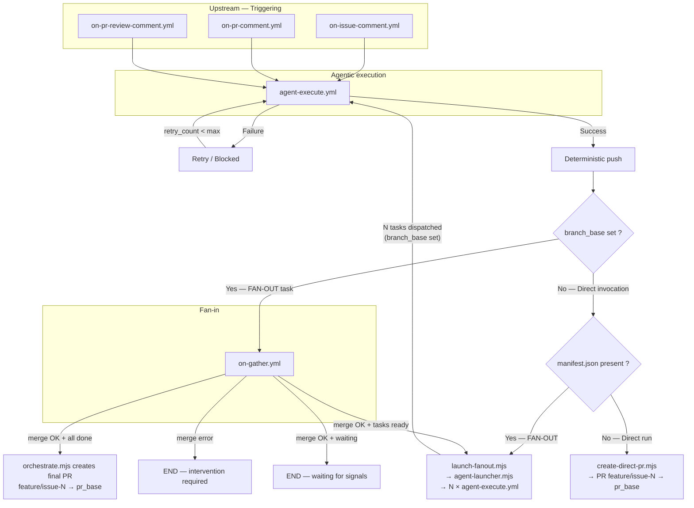

# Product Specification

| Field     | Value                                               |
|-----------|-----------------------------------------------------|
| Version   | 0.5.0                                               |
| Status    | ☐ draft  ☐ review  ☑ stable                        |
| Author    | @dsissoko                                           |
| Date      | 2026-06-03                                          |
| Changelog | 0.5.0 — reference version for the v0.5.0 OneTicket tag |

---

## 1. Vision

OneTicket is a GitHub-native multi-agent collaboration framework. It provides the orchestration model, the agent profiles, and the skill catalog that let a team and its agents build software together — from product intent to reviewable change.

Four macro-capabilities define the product:

**1. Task orchestration** — Certain agent roles have the ability to decompose a request into subtasks and assign them to specialized agents. Results are gathered, dependencies resolved, and a pull request is produced automatically.

**2. Autonomous mode** — Agents operate within a declared workflow: each role knows where to route a request and what to hand off. Routing and handoff rules make agent-to-agent chaining explicit and controllable, in both interactive and autonomous modes.

**3. Documentation generation** — OneTicket covers the full software product lifecycle through structured documentation: product specification, architecture, epics, user stories, implementation slices, C4 diagrams, CI/CD, and operations. Documentation is the source of truth that agents read before acting.

**4. Skill and agent management** — Agent profiles and skills are the distributable unit of the product. Integration with APM (Microsoft Agent Package Manager) is planned to enable versioned skill distribution and agent identity management.

The core principle: orchestration logic lives in deterministic code. LLMs only generate content — they never make control flow decisions.

---

## 2. Users and Actors

| Persona | Description | Main need |
|---|---|---|
| **Tech lead / User** | Initializes the project, invokes agents, validates PRs | A workflow that is quickly usable, understandable, and controllable |
| **Entrepreneur** | Arrives with an idea, describes the project in natural language, never sees YAML | A working agent team from a single GitHub issue comment |
| **OneTicket editor** | Maintains profiles and skills, monitors usage, evolves the catalog | A reliable skill catalog and a robust agent team |
| **Agent @po** | Maintains product knowledge, epics, user stories | Find business context and produce actionable specs |
| **Agent @architect** | Maintains architecture knowledge and C4 diagrams | Structure technical decisions and their consequences |
| **Agent @dev** | Implements validated user stories | Work from explicit specs and decisions |
| **Agent @qa** | Reviews code, specs, and PRs | Verify quality before merge |
| **Agent @analyst** | Business analysis and domain modeling | Clarify the domain before product slicing |
| **Agent @help** | Onboarding, FAQ, framework guidance | Help the user operate OneTicket |

`@po`, `@architect`, and `@dev` form the core of the `v0.1.0` baseline.
The `@qa`, `@analyst`, and `@help` roles belong to the V1 trajectory.

---

## 3. Problems to Solve

- Agent invocations are prompt-based and stateless — no shared context, no role boundaries, no coordination between agents
- Task decomposition is manual — developers break down work themselves, assign it, track it
- There is no standard way to declare routing and handoff rules between agents
- Documentation is produced ad hoc — not structured, not reusable, not readable by agents
- Agent CLIs are not interchangeable — switching tools requires rewriting workflows
- Agent identity is fragile — no reliable way to distinguish agent responses from human responses
- Skills are scattered and unversioned — no standard format, no distribution mechanism, no catalog

---

## 4. Product Goals

- Provide a deterministic orchestration layer — zero LLM in pipeline control flow
- Provide basic patterns for agentic orchestration and communication
- Make documentation the source of truth — structured, agent-readable, covering the full product lifecycle
- Decouple agent profiles and skills from the agent CLI — configuration-driven, CLI-agnostic
- Distribute versioned skills and agent profiles via APM (Microsoft Agent Package Manager)
- Provide a GitHub-native runtime with zero infrastructure overhead for V1

---

## 5. Out of Scope

- Cloud runtime and persistent agent sandboxes (V2)
- Graphical UI for agent orchestration
- Deployment targets other than GitHub Pages — Vercel, Netlify, Cloudflare Pages are supported via workflow swap, not built-in
- Application backend for the GitHub App (V1 medium term)
- Full-stack application generation (backend, database, infrastructure) — current skills cover frontend generation only; full-stack coverage is a V1 skill roadmap item
- Multi-repository orchestration
- Agent billing and quota management (V2)

---

## 6. Business Concepts

| Concept | Definition |
|---|---|
| **Issue** | The unit of work — every agent invocation starts from a GitHub issue |
| **Manifest** | A JSON file describing a DAG of tasks with dependencies — produced by decomposer agents, consumed by the pipeline |
| **FAN-OUT** | Parallel dispatch of ready tasks to specialized worker agents |
| **GATHER** | Sequential merge of completed task branches into the feature branch, with dependency resolution and next-task routing |
| **FAN-IN** | Aggregation of parallel results into a single synthesized output — not yet implemented |
| **Agent profile** | A markdown file (`.agent.md`) declaring a role's identity, responsibilities, and skill loading rules |
| **Skill** | An instruction set encoding domain knowledge — loaded by agents at runtime to guide their behavior |
| **Role** | A named agent identity invokable via `@role` comment on a GitHub issue |
| **Routing** | The rule declaring which role handles which type of request |
| **Handoff** | The explicit transmission of context and intent from one agent to the next |
| **current_project** | The active project name in `config.yml` — drives path resolution for documentation and source code |
| **docs_path** | Resolved path to project documentation — `apps/<current_project>/docs` or `.oneticket/docs` for framework context |
| **app_path** | Resolved path to project source code — `apps/<current_project>/app` — internal structure is skill-defined |

---

## 7. Product Capabilities

| Capability | Description | Status |
|---|---|---|
| **Agent invocation** | Invoke any agent by commenting `@role` on a GitHub issue | ✅ v0.1.0 |
| **Task decomposition** | Decomposer agents (e.g. `@po`) break requests into a manifest DAG | ✅ v0.1.0 |
| **FAN-OUT execution** | Ready tasks dispatched in parallel to worker agents | ✅ v0.1.0 |
| **GATHER and merge** | Completed task branches merged sequentially, dependencies resolved, PR created | ✅ v0.1.0 |
| **Multi-trigger support** | Issue comments, PR comments, inline review comments | ✅ v0.1.0 |
| **Documentation generation** | Structured docs covering product, architecture, epics, US, slices, C4, ship | ✅ v0.1.0 |
| **Skill loading** | Agent profiles load domain-specific skills at runtime | ✅ v0.1.0 |
| **Routing and handoff** | Declared rules for agent-to-agent communication | 🔲 V1 |
| **Autonomous mode** | Agent-to-agent chaining without human intervention | 🔲 V1 |
| **Full-stack generation** | Backend, database, infrastructure generation via skills | 🔲 V1 |
| **APM integration** | Versioned skill and profile distribution via Microsoft APM | 🔲 V1 |
| **Cloud runtime** | Long-running agent sessions in isolated sandboxes | 🔲 V2 |

---

## 8. High-Level Workflows

**Workflow 1 — Task execution**
```
Developer comments @po <request> on a GitHub issue
  → agent-dispatch.mjs builds prompt + creates feature/issue-N
  → @po produces manifest.json (DAG of tasks)
  → FAN-OUT: ready tasks dispatched in parallel to worker agents
  → Each worker produces one file, commits, triggers GATHER
  → GATHER merges branch, resolves dependencies, dispatches next ready tasks
  → When all tasks done → PR feature/issue-N → main created automatically
```

**Workflow 2 — Documentation cycle**
```
Developer comments @po <doc request> on a GitHub issue
  → @po loads oneticket-init-knowledge skill
  → Gates 1-4: product-spec → architecture → epic-0-mvp → confirmation
  → Each gate produces structured markdown in docs_path
  → Human validates each gate before proceeding
```

**Workflow 3 — Direct agent response**
```
Developer comments @po <question> on a GitHub issue
  → @po reads request context
  → Posts GitHub comment directly — no manifest, no FAN-OUT
```

**Workflow 4 — PR comment**
```
Developer comments @role <request> on a pull request
  → on-pr-comment.yml detects @role on PR
  → agent-dispatch.mjs builds prompt with PR context (title, body)
  → Agent responds via gh pr comment — no manifest, no FAN-OUT
```

**Workflow 5 — Inline PR review comment**
```
Developer comments @role <request> on a specific line in a PR diff
  → on-pr-review-comment.yml detects @role on review comment
  → agent-dispatch.mjs builds prompt with diff hunk + file + line context
  → Agent replies inline in the review thread via gh api in_reply_to
```

**Workflow 6 — GitHub event-driven (V1)**
```
Any GitHub event — label added, PR merged, milestone closed, tag pushed, etc.
  → A dedicated workflow listens to the event
  → agent-dispatch.mjs builds prompt with event context
  → Agent acts accordingly — comment, commit, manifest, or documentation update

In V1, any GitHub Actions trigger (push, pull_request, release, label,
milestone, schedule, etc.) can become an agent invocation entry point
by adding a corresponding workflow file.
```

---

## 9. Business Rules

- Orchestration logic must live in deterministic code — LLMs never make control flow decisions
- Every agent invocation must start from a GitHub issue or a GitHub event
- OneTicket mimics agile team best practices — each subtask gets its own branch, work is merged progressively as tasks complete, the final output is a single reviewable PR
- Merge to `main` is an explicit human decision — the pipeline creates the PR, the human reviews and merges
- In autonomous mode (V1), automatic merge will be supported for bounded and validated scenarios
- An agent must never push directly to `main` — all changes go through feature branches and PRs
- `current_project` must be set in `config.yml` before any agent can be dispatched
- `docs_path` and `app_path` are always resolved deterministically by the dispatcher — agents never resolve them themselves
- One task = one file produced = one branch = one completion signal
- A manifest must be a valid JSON DAG — no cycles, no undefined dependencies
- Agent responses must always be posted as GitHub comments — no silent execution
- Skills contain declarative instructions only — no control flow logic
- Agent profiles define keyword-to-skill routing — the wording of a request determines which skills are referenced in the manifest content field; using the right keywords is critical to trigger the correct skill. The semantic chain is: user request keywords → agent profile skill selection table → skill metadata (description:) → skill instructions loaded

---

## 10. Success Criteria

- `reply` test passes — agent responds to a direct question with a GitHub comment, no manifest produced
- `manifest` test passes — injected manifest triggers FAN-OUT, all tasks execute, PR created
- `decompose` test passes — agent decomposes a natural language request into the correct DAG, FAN-OUT executes, PR created
- `parallel` test passes — two simultaneous pipelines execute independently, no branch crossing
- Documentation cycle completes — Gates 1-4 produce valid `product-spec.md`, `architecture.md`, `epic-0-mvp/` without human-provided content being overwritten
- PR comment and inline review comment trigger the correct agent response channel
- No silent execution — every agent job ends with a GitHub comment
- Multi-project isolation — changing `current_project` switches the active project context; `apps/<current_project>/docs/` for documentation and `apps/<current_project>/app/` for source code are preserved per project. This design is architecturally sound but not yet validated in real multi-project conditions
- `current_project` as a global switch is a known limitation for concurrent multi-project work — open question for V1

---

## 11. Open Questions

| # | Question | Scope |
|---|---|---|
| 1 | Which scenarios make autonomous mode safe without intermediate human validation? | V1 |
| 2 | What format should the routing and handoff matrix use? | V1 |
| 3 | What minimal context should be injected per agent role and request origin? | V1 |
| 4 | Which agent CLIs should be officially supported beyond opencode? | V1 |
| 5 | Which complementary roles should be prioritized after `@po` — `@architect`, `@qa`, `@dev`? | V1 |
| 6 | How to handle concurrent `current_project` switches in multi-developer scenarios? | V1 |
| 7 | Should `apps/<current_project>/app/` structure be enforced by the framework or left to skills? | V1 |
| 8 | Do deployment skills exist for major cloud providers (AWS, GCP, Azure, Vercel, Fly.io)? What is their impact on oneticket — new agent roles, new skill format, infrastructure manifest? | V1 |
| 9 | What supervision UX is needed for autonomous and fan-out/fan-in runs? | V2 |
| 10 | Which cloud target for agentic sandboxes — E2B or equivalent? | V2 |
| 11 | Which full-stack skills should be prioritized — backend, database, infrastructure? | V1 |

---

## 12. Roadmap

| Milestone | Epics | Goal |
|---|---|---|
| **v0.1.0** — current | Agent invocation, FAN-OUT/GATHER, `@po` profile, skill loading, multi-trigger | GitHub-native pipeline fully operational end-to-end |
| **V1** — planned | Routing & handoff matrix, autonomous mode, full-stack skills, APM integration, deployment skills | Complete agentic team operating autonomously on bounded scenarios |
| **V2** — planned | Cloud runtime, persistent sandboxes, multi-sandbox fan-out, observability | Long-running agent sessions without GitHub Actions constraints |

> Macro-versions V1 and V2 are planning labels, not SemVer versions. Official releases follow semantic versioning — `v0.1.0`, `v0.2.0`, `v1.0.0`, etc. — carried by git tags. Documentation is a snapshot of the repository state at each tag.

---

## 13. Pipeline Architecture

### 13.1 Simplified workflow overview

This section presents only the structural GitHub workflows and the main scripts they use.

#### GitHub entry points

```text
on-issue-comment.yml
  → build-context.mjs          (fetches comment history, formats the prompt context block)
  → agent-dispatch.mjs         (creates feature/issue-N if absent, Gate 0 on current_project,
                                 resolves docs_path/app_path, builds prompt,
                                 sets in progress label, dispatches agent-execute.yml)

on-pr-comment.yml
  → build-context.mjs          (fetches PR comment history, formats the prompt context block)
  → agent-dispatch.mjs         (resolves docs_path/app_path, builds prompt, dispatches agent-execute.yml)

on-pr-review-comment.yml
  → build-context.mjs          (fetches diff hunk, line, file, formats the prompt context block)
  → agent-dispatch.mjs         (resolves docs_path/app_path, builds prompt, dispatches agent-execute.yml)
```

#### Agentic execution

```text
agent-execute.yml
  → oneticket-install.mjs      (copies skills .oneticket/skills/ → .agents/skills/)
  → generate-config.mjs        (generates opencode config from config.yml → OPENCODE_CONFIG_CONTENT)
  → anomalyco/opencode         (runs the agent — only non-deterministic step)
  → retry-dispatch.mjs         (exponential backoff + jitter, sets blocked label on exhaustion)
  → deterministic push of the working branch
  → if branch_base set (FAN-OUT task):
      → dispatch-gather.mjs    (triggers on-gather.yml)
  → if branch_base empty (direct invocation):
      → if manifest.json present → launch-fanout.mjs  (triggers FAN-OUT)
      → if no manifest           → create-direct-pr.mjs (creates PR feature/issue-N → pr_base)
```

### 13.2 `agent-execute.yml` interface

| Input | Type | Set by | Description |
|---|---|---|---|
| `branch` | string | `agent-dispatch.mjs` or `agent-launcher.mjs` | Working branch (`feature/issue-N` or `task/issue-N-X`) |
| `issue_number` | string | `agent-dispatch.mjs` or `agent-launcher.mjs` | GitHub issue number |
| `branch_base` | string | `agent-launcher.mjs` → `feature/issue-N`, `agent-dispatch.mjs` → `""` | Empty = direct invocation. Set = FAN-OUT task — value is the parent feature branch |
| `prompt` | string | `agent-dispatch.mjs` or `agent-launcher.mjs` | Full system prompt injected into anomalyco |
| `model` | string | `config.yml` via `agent-dispatch.mjs` | LLM model to use |
| `role` | string | `agent-dispatch.mjs` | Optional agent profile (dev, architect, analyst...) |
| `retry_count` | string | `retry-dispatch.mjs` | Current attempt count |
| `retry_max` | string | `config.yml` | Maximum allowed attempts |

### 13.3 Fan-out

FAN-OUT is triggered from `agent-execute.yml` when the agent produces a `manifest.json` on a direct invocation (`branch_base` empty).

```text
agent-execute.yml detects manifest.json present + branch_base empty
  → launch-fanout.mjs          (git setup, checkout feature/issue-N, reads manifest)
  → agent-launcher.mjs         (DAG calc, marks tasks in_progress, dispatches N × agent-execute.yml
                                 with branch_base set to feature/issue-N, batch of 4, 2s delay)

Note: task/* branches are created by a bash step inside agent-execute.yml at runner startup,
not by agent-launcher.mjs before dispatch.
```

### 13.4 Fan-in

```text
on-gather.yml  (triggered by dispatch-gather.mjs via workflow_dispatch)
  inputs:
    task_branch  — e.g. task/issue-42-A
    branch_base  — e.g. feature/issue-42 (required — passed by dispatch-gather.mjs)
  → validate-task-branch.mjs   (cross-issue guard: task/issue-N-X → feature/issue-N only)
  → orchestrate.mjs            (merges task/*, optimistic retry 5x, updates manifest, progress bar,
                                 closes task PR, deletes task branch, DAG recalc)
  → agent-launcher.mjs         (dispatches next READY tasks, or creates final PR if all done)
```

### 13.5 Project initialization

Gate 0 is enforced inline in `agent-dispatch.mjs`: if `current_project` is not defined in `config.yml`, the script posts a comment on the issue and stops — no agent is invoked.

Doc structure initialization is handled by `init-doc.mjs`, called from skills or manually. It is not yet triggered automatically by the pipeline.

```text
init-doc.mjs <docs_path>
  → copies .oneticket/templates/docs/ to <docs_path> — idempotent, never overwrites existing files
  → called from skills (oneticket-doc-structure) or manually — not called by the pipeline automatically
```

### 13.6 Script reference

#### Entry scripts

| Script | Functional content |
|---|---|
| `build-context.mjs` | Fetches GitHub comment history (max 10, truncated to 500 chars), formats the context block injected into the prompt. Supports `issue_comment`, `pull_request_comment`, and `pull_request_review_comment` origin types |
| `agent-dispatch.mjs` | Creates `feature/issue-N` if absent (idempotent), Gate 0 (`current_project` check), resolves `docs_path`/`app_path`, builds the system prompt (agent profile, project context, contract), sets `in progress` label, dispatches `agent-execute.yml` with `branch_base` empty |

#### Agentic execution scripts

| Script | Functional content |
|---|---|
| `oneticket-install.mjs` | Copies skills `.oneticket/skills/` → `.agents/skills/` and `AGENTS.md` before each run — opencode discovers them natively |
| `generate-config.mjs` | Generates the opencode JSON config from `agent_config.<cli>` in `config.yml` — injected via `OPENCODE_CONFIG_CONTENT` |
| `retry-dispatch.mjs` | Re-dispatches `agent-execute.yml` with exponential backoff + jitter (`2^n * 1000ms + [0,500ms]`), preserving all original inputs including `branch_base` — sets `blocked` label on `retry_max` exhaustion |

#### Fan-out scripts

| Script | Functional content |
|---|---|
| `launch-fanout.mjs` | Git setup, checkout `feature/issue-N`, reads manifest, verifies pending tasks exist, delegates to `agent-launcher.mjs` |
| `agent-launcher.mjs` | Identifies ready tasks (DAG), marks `in_progress`, commits and pushes manifest update (optimistic lock — aborts if non-fast-forward), dispatches N × `agent-execute.yml` with `branch_base` set, in batches of 4 with 2s anti-cancellation delay. Task branches are created by a bash step inside `agent-execute.yml` at runner startup |

#### Fan-in scripts

| Script | Functional content |
|---|---|
| `dispatch-gather.mjs` | Sends the `workflow_dispatch` signal to `on-gather.yml` from `agent-execute.yml` when a `task/*` branch completes. Requires `TASK_BRANCH` and `BRANCH_BASE` from env |
| `validate-task-branch.mjs` | Cross-issue guard: verifies that `task/issue-N-X` belongs to `feature/issue-N` — rejects any issue number mismatch |
| `orchestrate.mjs` | Merges `task/*` → `feature/issue-N` with optimistic retry (5 attempts, exponential backoff), marks task `done` or `merge-failed`, posts progress bar on the issue, closes the task PR, deletes the task branch via GitHub API, recalculates DAG, delegates to `agent-launcher.mjs` for next ready tasks — or creates the final PR if all tasks are done |

#### Initialization scripts

| Script | Functional content |
|---|---|
| `init-doc.mjs` | Copies `.oneticket/templates/docs/` to `<docs_path>` — idempotent, never overwrites existing files. Called from skills or manually |

#### Direct run scripts

| Script | Functional content |
|---|---|
| `create-direct-pr.mjs` | Creates a PR `feature/issue-N → pr_base` when the agent completes a direct run without producing a manifest. Idempotent: checks for an existing open PR first. Guard: requires at least one commit ahead of `pr_base` |

#### Utility scripts (cross-cutting)

| Script | Functional content |
|---|---|
| `constants.mjs` | Single source of truth for reserved framework paths — no dependencies |
| `config.mjs` | Reads and parses `.oneticket/config.yml`, exposes `loadConfig()` |
| `utils.mjs` | Shell (`run`, `runWithRetry`), git (`setupGit`), manifest (`readManifest`, `writeManifest`), DAG (`areDependenciesSatisfied`), GitHub API (`dispatchWorkflow`, `applyLabel`, `removeLabel`) |
| `print-config.mjs` | CLI wrapper for `config.mjs` — allows YAML workflows to read a config value without inline code |

### 13.7 Labels and signals

| Label | Set by | Removed by | Meaning |
|---|---|---|---|
| `in progress` | `agent-dispatch.mjs` | `orchestrate.mjs` (when all DONE) | An agentic run is in progress on this issue |
| `merge error` | `orchestrate.mjs` | Manual | A task branch could not be merged — human intervention required |
| `blocked` | `retry-dispatch.mjs` | Manual | The agent has exhausted its retry attempts |
| `ready for review` | — | — | User decision — never set automatically by the pipeline |

> The `ready for review` label is never set automatically — it is a user decision.

### 13.8 Robustness

- **`notify-failure`** — all workflows (`on-issue-comment`, `on-pr-comment`, `on-pr-review-comment`, `agent-execute`, `on-gather`) have a `notify-failure` job that posts a comment on the issue when the workflow fails definitively
- **Optimistic manifest retry** — `orchestrate.mjs` handles concurrent manifest access conflicts via hard reset + re-fetch + re-merge (max 5 attempts, `orchestrate_retry_max` in `config.yml`)
- **Exclude sandbox artefacts** — `agent-execute.yml` injects `.agents/`, `.opencode/`, `opencode.json` into `.git/info/exclude` so the agent does not accidentally commit them
- **Cross-issue guard** — `validate-task-branch.mjs` prevents any task branch from merging into a feature branch of a different issue

### 13.9 Manifest structure

The manifest is the contract between `@leaddev` and the execution pipeline. It is produced by the agent and never modified by another agent — only by deterministic scripts (`orchestrate.mjs`, `agent-launcher.mjs`).

```json
{
  "issue": 42,
  "branch_base": "feature/issue-42",
  "tasks": [
    {
      "id": "A",
      "branch": "task/issue-42-A",
      "file": "src/screens/GameScreen.tsx",
      "content": "Complete self-contained instruction for the executing agent...",
      "role": "dev",
      "depends_on": [],
      "status": "pending"
    }
  ]
}
```

| Field | Type | Constraint |
|---|---|---|
| `issue` | integer | Exact GitHub issue number |
| `branch_base` | string | Parent feature branch — `feature/issue-N`. Used by `agent-launcher.mjs` and `orchestrate.mjs` |
| `tasks` | array | Non-empty — max `max_tasks` (config.yml) |
| `id` | string | Unique uppercase letter(s) — A, B, C... |
| `branch` | string | Strict convention: `task/issue-N-X` |
| `file` | string | Relative path from repo root — no leading `/` |
| `content` | string | Self-contained instruction — the agent has no other context |
| `role` | string | Optional — `dev`, `architect`, `analyst`... |
| `depends_on` | array | Ids existing in this manifest — `[]` if no dependency |
| `status` | string | `pending` \| `in_progress` \| `done` \| `merge-failed` |

### 13.10 Configuration — `.oneticket/config.yml`

Single source of truth for framework parameters. Read by `config.mjs` and injected into scripts and workflows.

| Parameter | Role in the pipeline |
|---|---|
| `current_project` | Determines `docs_path` and `app_path` — verified by Gate 0 inline in `agent-dispatch.mjs` |
| `model` | LLM model used by anomalyco — extracted from `agent_config.<cli>.model` |
| `max_tasks` | Limits the number of tasks in a manifest |
| `retry_max` | Maximum agent retries in `retry-dispatch.mjs` |
| `orchestrate_retry_max` | Maximum optimistic retries in `orchestrate.mjs` |
| `clear_session_cache` | Clears the opencode session cache before each run |
| `pr_base` | Target branch for final PRs (e.g. `main`) |
| `oneticket_git_user_name` | Git identity of the CI bot |
| `oneticket_git_user_email` | Git email of the CI bot |

### 13.11 Required infrastructure

#### Repository structure

```
.oneticket/
  config.yml                  ← framework parameters (source of truth)
  AGENTS.md                   ← agent team definition
  agents/                     ← agent profiles (*.agent.md)
  skills/                     ← oneticket skills (<name>/SKILL.md)
  tasks/                      ← manifests and workflow logs (issue-N/manifest.json)
  templates/
    docs/                     ← doc structure template (copied by init-doc.mjs)

src/                          ← all framework .mjs scripts
.github/
  workflows/                  ← all GitHub Actions .yml workflows
.gitattributes                ← merge=union rule for workflow.md
apps/
  <project>/
    app/                      ← application source code
    docs/                     ← project documentation (what/how/ship/run)
```

#### Branch naming conventions

| Convention | Format | Example |
|---|---|---|
| Issue branch | `feature/issue-N` | `feature/issue-42` |
| Task branch | `task/issue-N-X` | `task/issue-42-A` |

These conventions are **strict** — `validate-task-branch.mjs` rejects any deviation and `agent-execute.yml` refuses to run on any branch that does not match these formats.

#### `.gitattributes`

```
.oneticket/tasks/issue-*/workflow.md merge=union
```

`merge=union` guarantees that parallel appends to `workflow.md` never create a git conflict.

#### `workflow.md`

Each `.oneticket/tasks/issue-N/` folder contains a `workflow.md` — append-only log of task progress, protected by `merge=union`.

Entry format:
```
2026-06-01 14:32 | A | apps/breakout/app/src/screens/GameScreen.tsx
```

#### Required GitHub secrets

| Secret | Description | Required permissions |
|---|---|---|
| `ONETICKET_GH_PAT` | GitHub Personal Access Token for the bot | `contents: write`, `issues: write`, `pull-requests: write`, `workflows: write` |
| `OPENCODE_API_KEY` | opencode / anomalyco API key | Access to the LLM model configured in `config.yml` |

### 13.12 Architectural philosophy

OneTicket enforces a strict separation between agentic operations and deterministic operations.

**Agents are allowed to:**
- analyze a context
- produce content
- modify files
- create a local commit
- publish a GitHub response

**Agents are not allowed to:**
- create branches
- choose a branch
- push code
- merge branches
- create Pull Requests
- directly modify the global orchestration

**`.mjs` scripts are responsible for:** git management, branch management, pushes, merges, manifests, DAG calculation, fanout, fanin, retries, and GitHub API interactions.

**Design decisions:**
- **Manifest = DAG condition** — the presence of `manifest.json` on a direct invocation triggers FAN-OUT; `branch_base` set triggers GATHER
- **branch_base as routing signal** — `branch_base` empty = direct invocation; `branch_base` set = FAN-OUT task. It is stored in the manifest and passed between workflows as the parent feature branch reference
- **PR created automatically on direct run** — when the agent completes a direct invocation without producing a manifest, `create-direct-pr.mjs` creates `feature/issue-N → pr_base` automatically
- **PR created automatically on DAG completion** — `orchestrate.mjs` creates the final PR when all tasks are `done`
- **Branch always created upstream** — `feature/issue-N` is guaranteed to exist before any agentic run (inline in `agent-dispatch.mjs`). `task/issue-N-X` branches are created by a bash step inside `agent-execute.yml` at runner startup
- **Gate 0 inline** — `current_project` verification is done inside `agent-dispatch.mjs`; if missing, the pipeline stops without invoking an agent
- **switched=true** — the prompt injects `FIRST ACTION: git checkout <branch>`. anomalyco disables auto-push and PR creation. The pipeline resumes control via the deterministic steps of `agent-execute.yml`

### 13.13 Macro view (Mermaid)



### 13.14 Example — 3 sequential tasks A → B → C

`@leaddev` produces this manifest on `feature/issue-42`:

```json
{
  "issue": 42,
  "branch_base": "feature/issue-42",
  "tasks": [
    { "id": "A", "branch": "task/issue-42-A", "file": "src/screens/GameScreen.tsx", "content": "Create the GameScreen component...", "role": "dev", "depends_on": [], "status": "pending" },
    { "id": "B", "branch": "task/issue-42-B", "file": "src/utils/collision.ts", "content": "Implement the AABB collision module...", "role": "dev", "depends_on": ["A"], "status": "pending" },
    { "id": "C", "branch": "task/issue-42-C", "file": "src/main.tsx", "content": "Add the /game route in main.tsx...", "role": "dev", "depends_on": ["B"], "status": "pending" }
  ]
}
```

**Step 1** — `on-issue-comment.yml` → `agent-execute.yml` (`branch_base` empty): `@leaddev` produces and commits `manifest.json` on `feature/issue-42`, push. `agent-execute.yml` detects `manifest.json` → calls `launch-fanout.mjs`.

**Step 2** — `launch-fanout.mjs` → `agent-launcher.mjs`: DAG → only A is ready. Marks A `in_progress`, pushes manifest. Dispatches `agent-execute.yml` with `branch: task/issue-42-A`, `branch_base: feature/issue-42`.

**Step 3** — `agent-execute.yml` on `task/issue-42-A` (`branch_base` set): bash step creates `task/issue-42-A` from `feature/issue-42`. `@dev` creates `GameScreen.tsx`, commits, push. `dispatch-gather.mjs` → `on-gather.yml`.

**Step 4** — `on-gather.yml`: merges A → `feature/issue-42`. Marks A `done`. DAG → B is ready. `agent-launcher.mjs` dispatches B. Progress: `█░░  1/3 done`.

**Step 5** — Same sequence for B. Progress: `██░  2/3 done`.

**Step 6** — Merges C → `feature/issue-42`. Marks C `done`. `allDone = true`. Progress: `███  3/3 done`. `orchestrate.mjs` creates the final PR `feature/issue-42 → main`.

---

## 14. Parallel Task Execution Contract

OneTicket executes tasks in parallel via FAN-OUT — each task runs on its own isolated branch and produces files that are merged back into the feature branch by GATHER.

For deterministic merging to work, parallel tasks must respect one absolute rule:

> **No two tasks that run in parallel may produce or modify the same file.**

A violation causes an `add/add` merge conflict that cannot be resolved automatically and requires human intervention. This is not a recoverable error — it is a design flaw in the manifest.

### Why this matters

Git merge strategy for `add/add` conflicts has no automatic resolution — both versions are equally valid, and only a human can decide which to keep. In a FAN-OUT pipeline, this blocks GATHER and stalls the entire issue.

### Known patterns for conflict-free parallel decomposition

Three patterns are documented in multi-agent coding research and validated in OneTicket:

#### Pattern 1 — Skeleton-first (recommended for greenfield implementation)

A single sequential task with no `depends_on` creates all files as empty stubs (class declarations, empty functions, module exports — no logic). All parallel tasks then fill their own module with real logic, without creating new files.

```
Task A  (skeleton, depends_on: [])           → creates ALL empty files
    ↓
Tasks B, C, D, E  (parallel, depends_on: [A]) → each fills ONE file with real logic
    ↓
Task F  (integration, depends_on: [B,C,D,E]) → verifies everything assembles
```

**Use when:** starting from scratch, no existing codebase.

**Reference:** [DevSwarm — branch isolation pattern](https://github.com/devswarm-ai/devswarm)

#### Pattern 2 — Strict file ownership per task

Each task declares exactly which files it owns. The manifest makes ownership explicit. No two parallel tasks may declare the same file in their scope.

```json
{ "id": "B", "file": "app/js/gameState.js", "depends_on": ["A"], ... }
{ "id": "C", "file": "app/js/physics.js",   "depends_on": ["A"], ... }
{ "id": "D", "file": "app/js/renderer.js",  "depends_on": ["A"], ... }
```

**Use when:** decomposing by module with clear boundaries, each module maps to one file.

**Reference:** [MetaGPT — role-based file assignment](https://github.com/geekan/MetaGPT), [ChatDev — atomic task assignment](https://github.com/OpenBMB/ChatDev)

#### Pattern 3 — Sequential dependency chain

Tasks that share files are chained sequentially with explicit `depends_on`. No parallelism — simpler but slower.

```
Task A → Task B (depends_on: [A]) → Task C (depends_on: [B])
```

**Use when:** file boundaries cannot be separated cleanly, or the implementation is inherently sequential.

### Rule for `@leaddev`

`@leaddev` **must use Pattern 1 or Pattern 2** when producing implementation manifests.

- Pattern 1 is preferred for new projects or when the file structure is not yet established.
- Pattern 2 is preferred when the architecture defines clear module boundaries.
- Pattern 3 is acceptable only when file coupling makes parallel execution impossible.

A manifest where parallel tasks produce the same file is invalid and will cause a merge conflict at GATHER.

---

## 15. Decomposition and Quality Trade-offs

Operating a multi-agent pipeline requires navigating two fundamental tensions. Understanding them allows conscious, deliberate configuration — not trial and error.

### The Cost Triangle

Every pipeline run sits inside a triangle with three competing forces:

```
         Agentic cost
        (tokens, CI runs)
              /\
             /  \
            /    \
           /______\
    LLM quality    Human cost
    (model choice)  (review, debug, correction)
```

- **Reducing agentic cost** (cheaper model, fewer tasks) increases human cost — the agent produces more imprecisions, inconsistencies, and structural errors that require human correction.
- **Increasing LLM quality** (more capable model) reduces human cost but increases agentic cost.
- **The framework acts as a quality multiplier** — robust skills, guided templates, and deterministic guards reduce human cost independently of the model. A well-designed framework shifts the entire triangle toward lower human cost at any given model tier.

There is no universally optimal configuration. The right balance depends on the project phase, the acceptable level of human involvement, and the budget allocated to agent runs.

### The Decomposition Triangle

Task granularity introduces a second tension:

```
         Decomposition granularity
         (number of tasks, task scope)
                  /\
                 /  \
                /    \
               /______\
   Unit errors        Integration risks
   (per-task quality)  (merge, incoherence,
                        runtime dysfunction)
```

- **Coarse decomposition** (few large tasks, one agent handles many files) — unit errors are higher because the agent has more surface to cover and more decisions to make. Integration risks are lower because fewer merges occur and the agent maintains its own coherence.
- **Fine decomposition** (many small tasks, one agent per file) — unit errors are lower because each agent has a narrow, focused scope. Integration risks are higher: merge conflicts, interface mismatches, and runtime incoherence between independently produced modules.

### Combined implications

The two triangles are not independent. A fine-grained decomposition amplifies the impact of LLM quality: with a capable model, fine decomposition produces clean, coherent modules that integrate well; with a weaker model, the same fine decomposition produces modules that are individually correct but fail at integration boundaries.

Key principles:

- **Documentation phase** — fine decomposition is safer. Documentation files are largely independent; integration risk is low; a file produced by one agent does not need to call functions defined in another.
- **Implementation phase** — decomposition granularity must be matched to the integration strategy. The skeleton-first pattern (§13) is the recommended mitigation: a single task establishes the shared structure, then fine-grained tasks fill independent modules.
- **Model choice is a project-level decision** — it should be made explicitly, not by default. A cheaper model with a more robust framework configuration can outperform a capable model with a poorly structured decomposition.
- **Human cost is never zero** — the framework reduces it, it does not eliminate it. Planning for a human validation pass is part of the delivery process, not a sign of framework failure.

### Observed examples

These examples illustrate the trade-offs in practice. They are not exceptional failures — they are the expected behavior of any multi-agent system operating at this granularity.

**Documentation — coarse task, unit error:**
A single task asked to produce all implementation slices for a project generated duplicate slices (two slices sharing the same sequence number, different names, e.g. `slice-1-entry-crud` and `slice-1-entry-data-model`). The agent had too much freedom within one task and produced redundant artifacts requiring manual cleanup. Mitigation: one task per slice, explicit naming in the manifest.

**Documentation — fine tasks, integration success:**
When the manifest explicitly named each slice as a separate task, each agent produced a coherent slice file. No duplicates. Cross-references were handled by a dedicated final task. The documentation was complete and navigable on the first pass.

**Implementation — fine tasks, integration failure:**
A game implementation decomposed into one task per JS module produced individually correct files. At runtime, the ball had a radius of zero (not initialized by the module that owned the ball), physics ran during the menu phase (no shared phase guard), and the first game frame computed a large delta time after the menu delay — causing the ball to teleport outside the canvas. Five debug iterations were required to identify and fix the integration boundaries. The agents had no shared contract on initial state, lifecycle phases, or timing assumptions. Mitigation: skeleton-first task establishes the shared contract before any parallel implementation begins.

---

## 16. Merge Conflict Recovery

Merge conflicts are a **normal and expected** operational event in a FAN-OUT/GATHER pipeline — not an anomaly or a framework failure. They are the mechanical consequence of running parallel branches that share configuration files.

### Structural cause

In any multi-agent implementation pipeline, certain files are inherently shared across tasks:

- **Dependency manifests**: `package.json`, `package-lock.json`, `requirements.txt`, `Cargo.toml`
- **Build configuration**: `vite.config.ts`, `tsconfig.json`, `webpack.config.js`
- **Test setup**: `vitest.setup.ts`, `jest.setup.ts`, `conftest.py`

Each agent modifies these files independently on its own branch, without knowledge of what other branches have done. When GATHER merges these branches sequentially into the feature branch, the second and subsequent merges encounter conflicts on these shared files.

This is not a design flaw — it is the price of parallelism. The mitigation is not to eliminate it but to make recovery fast and reproducible.

### Recovery principles

1. **The manifest is the source of truth** — always verify manifest status against actual branch state before any recovery action. A manifest that says `done` for a branch that still exists open is a sign of corrupted state.

2. **Orchestrate is idempotent** — `orchestrate.mjs` can be safely re-triggered on a task already marked `done`. It exits cleanly without side effects. Use this property to resume a stalled pipeline after manual recovery.

3. **Merge in order of lag** — merge branches from least behind to most behind (fewest commits behind the feature branch first). Each successful merge reduces the conflict surface for subsequent branches.

4. **Always use `--ours` on shared config files** — the feature branch version of `package.json`, `tsconfig.json`, and build config files is authoritative. Individual task branches only add new source files; their config changes are either redundant or incomplete relative to the accumulated feature branch state.

5. **Never commit build artifacts** — `dist/`, `test-results/`, `playwright-report/`, `*.tsbuildinfo`, `*.js` compiled from `*.ts` config files must never be tracked. A missing or incomplete `.gitignore` is the root cause; fix it in the stack bootstrap task before any implementation task runs.

### Pipeline resume after manual recovery

After manual conflict resolution and manifest correction, resume the pipeline by triggering `Workflow Gather` (GitHub Actions UI) with:

- `task_branch`: the last task successfully merged (use idempotence — pick any `done` task)
- `branch_base`: the feature branch

`orchestrate.mjs` will detect the task as already `done`, skip the merge, read the manifest, identify ready tasks, and dispatch them.

> See the full step-by-step procedure in [Runbook — Merge Conflict Recovery](../runbooks/merge-recovery.md).

---

## 17. Glossary

| Term | Definition |
|---|---|
| **DAG** | Directed Acyclic Graph. In OneTicket, the DAG is the dependency graph between tasks in a manifest. It determines execution order: a task can only start when all its dependencies (`depends_on`) are in `done` state. DAG calculation is done by `areDependenciesSatisfied()` in `utils.mjs`. |
| **FAN-OUT** | Dispatch of N tasks in parallel from a manifest. Triggered from `agent-execute.yml` when `manifest.json` is detected on a direct invocation, then re-triggered by `orchestrate.mjs` each time new tasks are unblocked by the DAG. |
| **FAN-IN** | Collection of a task completion signal and integration of its result into the issue branch. Handled by `on-gather.yml` → `orchestrate.mjs`. |
| **GATHER** | Signal sent by a completed task to trigger FAN-IN. Sent via `dispatch-gather.mjs` → `workflow_dispatch` → `on-gather.yml`. |
| **Manifest** | JSON file produced by `@leaddev` describing the task graph to execute. Stored in `.oneticket/tasks/issue-N/manifest.json`. Contains the issue number, `branch_base`, and the list of tasks with their dependencies, statuses, and instructions. |
| **branch_base** | The parent feature branch of a set of tasks — `feature/issue-N`. Stored in the manifest and passed as a parameter between workflows. Empty = direct invocation; set = FAN-OUT task. Used by `agent-execute.yml` as the routing signal between direct run and FAN-OUT task paths. |
| **Task branch** | Working branch created for each task in a manifest. Format: `task/issue-N-X`. Created by a bash step inside `agent-execute.yml` at runner startup, merged into `feature/issue-N` after completion by `orchestrate.mjs`, then deleted. |
| **Feature branch** | Main issue branch. Format: `feature/issue-N`. Created by `agent-dispatch.mjs` (inline) on first invocation on the issue. Receives all task branch merges. |
| **Direct run** | Execution of an agent on `feature/issue-N` without producing a manifest — comment reply, fix, doc, review. No FAN-OUT triggered. If the agent commits code, `create-direct-pr.mjs` creates a PR automatically. |
| **switched=true** | Internal anomalyco mechanism: when the agent's first action is a `git checkout`, anomalyco disables automatic push and PR creation, letting the pipeline resume control via the deterministic steps of `agent-execute.yml`. |
| **Gate 0** | Verification performed inline in `agent-dispatch.mjs` before any agentic run: `current_project` must be defined in `config.yml`. If missing, a comment is posted on the issue and the pipeline stops without invoking an agent. |
| **Optimistic lock** | Concurrent manifest access conflict handling in `orchestrate.mjs` and `agent-launcher.mjs`: on non-fast-forward push, hard reset + re-fetch + re-merge up to `orchestrate_retry_max` attempts. |
| **current_project** | Parameter in `config.yml` that determines which project agents work on. Determines `docs_path` (`apps/<project>/docs`) and `app_path` (`apps/<project>/app`). |
| **merge=union** | Git strategy applied to `workflow.md` — guarantees that parallel task appends never create a git conflict. |
