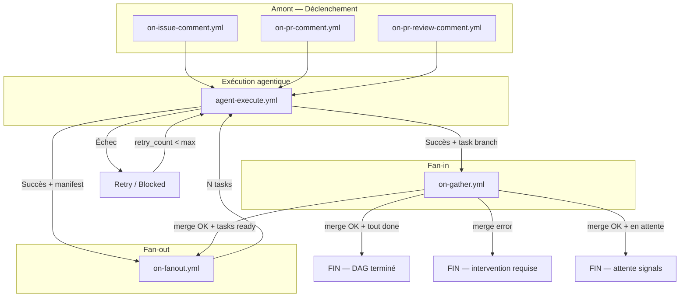

# OneTicket Workflow Specification

## Introduction

Ce document complète le document `oneticket-brief.md`.

Le brief présente la vision générale, les objectifs fonctionnels et les principes d'architecture de OneTicket. Le présent document se concentre uniquement sur l'orchestration GitHub Actions et l'interaction entre les workflows `.yml` et les scripts `.mjs`.

L'objectif est de fournir une vue claire du moteur d'exécution agentique sans entrer dans les détails d'implémentation internes.

---

# Vue simplifiée du workflow

Cette section présente uniquement les workflows GitHub structurants et les scripts principaux qu'ils utilisent.

## Entrées GitHub

```text
on-issue-comment.yml
  → ensure-issue-branch.mjs    (crée feature/issue-N si absente — idempotent)
  → check-prerequisites.mjs    (Gate 0 current_project, init-doc si structure documentaire absente)
  → build-context.mjs          (fetche historique commentaires, formate le contexte prompt)
  → agent-dispatch.mjs         (résout docs_path/app_path, construit prompt, label in progress, dispatche agent-execute.yml)

on-pr-comment.yml
  → build-context.mjs          (fetche historique commentaires PR, formate le contexte prompt)
  → agent-dispatch.mjs         (résout docs_path/app_path, construit prompt, dispatche agent-execute.yml)

on-pr-review-comment.yml
  → build-context.mjs          (fetche diff hunk, ligne, fichier, formate le contexte prompt)
  → agent-dispatch.mjs         (résout docs_path/app_path, construit prompt, dispatche agent-execute.yml)
```

## Exécution agentique

```text
agent-execute.yml
  → oneticket-install.mjs      (copie skills .oneticket/skills/ → .agents/skills/)
  → generate-config.mjs        (génère config opencode depuis config.yml → OPENCODE_CONFIG_CONTENT)
  → anomalyco/opencode         (exécute l'agent — seul step non déterministe)
  → retry-dispatch.mjs         (backoff exponentiel + jitter, label blocked à épuisement)
  → push déterministe de la branche de travail
  → dispatch-fanout.mjs        (si manifest présent — déclenche on-fanout.yml)
  → dispatch-gather.mjs        (si sous-branche task/* — déclenche on-gather.yml)
```

## Fan-out

```text
on-fanout.yml
  → launch-fanout.mjs          (setup git, checkout feature/issue-N, lit le manifest)
  → agent-launcher.mjs         (crée task/issue-N-X via API GitHub, dispatche N × agent-execute.yml par batch)
```

## Fan-in

```text
on-gather.yml
  → validate-task-branch.mjs   (guard cross-issue : task/issue-N-X → feature/issue-N uniquement)
  → orchestrate.mjs            (merge task/*, retry optimiste 5x, update manifest, barre progression, ferme task PR, supprime task branch, calcul DAG)
  → agent-launcher.mjs         (dispatche les tasks READY suivantes)
```

## Initialisation de projet

Ces opérations sont déterministes — jamais agentiques. Invoquées par le pipeline ou explicitement par l'utilisateur.

```text
check-prerequisites.mjs <docs_path>
  → appelé par on-issue-comment.yml avant chaque run agentique
  → Gate 0 : vérifie que current_project est défini — sinon notifie et stoppe
  → init-doc : vérifie que docs_path contient la structure standard
               si absente → copie .oneticket/templates/docs/ vers docs_path (idempotent)
  → extensible : d'autres pré-requis déterministes peuvent être ajoutés ici

init-template.mjs <template>
  → déclenché par l'utilisateur via @leaddev init-<template> (ex: @leaddev init-appshell)
  → copie apps/<template>/app/ vers apps/<current_project>/app/
  → personnalise les placeholders (package.json, index.html, écrans)
  → idempotent — si apps/<current_project>/app/ existe déjà, skip
  → templates disponibles : appshell (React+Vite), ...
  → note : la décision d'utiliser un template reste agentique
           (@leaddev détecte la stack et recommande le template adapté)
```

---

# Détail des scripts

## Scripts d'entrée

| Script | Contenu fonctionnel |
|---|---|
| `ensure-issue-branch.mjs` | Crée `feature/issue-N` si absente — idempotent |
| `check-prerequisites.mjs` | Gate 0 (`current_project`), init-doc si structure documentaire absente — extensible |
| `build-context.mjs` | Fetche l'historique des commentaires GitHub (max 10, tronqués à 500 chars), formate le bloc de contexte injecté dans le prompt |
| `agent-dispatch.mjs` | Résout `docs_path`/`app_path`/`current_project`, construit le prompt système (profil agent, contexte projet, contract), applique label `in progress`, dispatche `agent-execute.yml` |

## Scripts d'exécution agentique

| Script | Contenu fonctionnel |
|---|---|
| `oneticket-install.mjs` | Copie les skills `.oneticket/skills/` → `.agents/skills/` et `AGENTS.md` avant chaque run — opencode les découvre nativement |
| `generate-config.mjs` | Génère la config JSON opencode depuis `agent_config.<cli>` dans `config.yml` — injecté via `OPENCODE_CONFIG_CONTENT` |
| `retry-dispatch.mjs` | Re-dispatche `agent-execute.yml` avec backoff exponentiel + jitter (`2^n * 1000ms + [0,500ms]`) — applique label `blocked` à épuisement de `retry_max` |

## Scripts Fan-out

| Script | Contenu fonctionnel |
|---|---|
| `dispatch-fanout.mjs` | Envoie le signal `workflow_dispatch` vers `on-fanout.yml` quand un manifest est détecté |
| `launch-fanout.mjs` | Setup git, checkout `feature/issue-N`, lit le manifest, délègue à `agent-launcher.mjs` |
| `agent-launcher.mjs` | Identifie les tasks ready (DAG), marque `in_progress`, crée les branches `task/issue-N-X` via API GitHub, dispatche N × `agent-execute.yml` par batch de 4 avec délai anti-annulation (2s entre dispatches) |

## Scripts Fan-in

| Script | Contenu fonctionnel |
|---|---|
| `dispatch-gather.mjs` | Envoie le signal `workflow_dispatch` vers `on-gather.yml` depuis les sous-branches task/* |
| `validate-task-branch.mjs` | Guard cross-issue : vérifie que `task/issue-N-X` appartient bien à `feature/issue-N` — rejette tout mismatch de numéro d'issue |
| `orchestrate.mjs` | Merge `task/*` → `feature/issue-N` avec retry optimiste (5 tentatives, backoff exponentiel), marque task `done` ou `merge-failed`, poste barre de progression sur l'issue, ferme la task PR, supprime la task branch, calcul DAG, délègue à `agent-launcher.mjs` |

## Scripts d'initialisation

| Script | Contenu fonctionnel |
|---|---|
| `init-doc.mjs` | Copie `.oneticket/templates/docs/` vers `<docs_path>` — idempotent, ne réécrase pas les fichiers existants. Appelé par `check-prerequisites.mjs`, jamais par un agent |
| `init-template.mjs` | Copie `apps/<template>/app/` vers `apps/<current_project>/app/`, personnalise les placeholders — idempotent. Déclenché sur décision agentique confirmée par l'utilisateur |

## Scripts utilitaires (transverses)

| Script | Contenu fonctionnel |
|---|---|
| `constants.mjs` | Source de vérité des chemins réservés du framework — aucune dépendance |
| `config.mjs` | Lit et parse `.oneticket/config.yml`, expose `loadConfig()` |
| `utils.mjs` | Shell (`run`, `runWithRetry`), git (`setupGit`), manifest (`readManifest`, `writeManifest`), DAG (`areDependenciesSatisfied`), GitHub API (`dispatchWorkflow`, `applyLabel`, `removeLabel`) |
| `print-config.mjs` | Wrapper CLI de `config.mjs` — permet aux workflows YAML de lire une valeur de config sans code inline |

---

# Labels et signaux

| Label | Posé par | Retiré par | Signification |
|---|---|---|---|
| `in progress` | `agent-dispatch.mjs` | `orchestrate.mjs` (quand tout DONE) | Un run agentique est en cours sur cette issue |
| `merge error` | `orchestrate.mjs` | Manuel | Une task branch n'a pas pu être mergée — intervention humaine requise |
| `blocked` | `retry-dispatch.mjs` | Manuel | L'agent a épuisé ses tentatives de retry |
| `ready for review` | — | — | Décision user — jamais posé automatiquement |

> La PR finale est une décision user — jamais créée automatiquement par le pipeline.

---

# Robustesse

- **`notify-failure`** — tous les workflows (`on-issue-comment`, `on-pr-comment`, `on-pr-review-comment`, `agent-execute`, `on-gather`) ont un job `notify-failure` qui poste un commentaire sur l'issue en cas d'échec définitif du workflow
- **Retry optimiste manifest** — `orchestrate.mjs` gère les conflits d'accès concurrent au manifest via reset hard + re-fetch + re-merge (5 tentatives max, `orchestrate_retry_max` dans `config.yml`)
- **Exclude sandbox artefacts** — `agent-execute.yml` injecte `.agents/`, `.opencode/`, `opencode.json` dans `.git/info/exclude` pour que l'agent ne les commite pas accidentellement
- **Guard cross-issue** — `validate-task-branch.mjs` empêche toute task branch de merger dans une feature branch d'une autre issue

---

# Workflow complet

## Vue macro



---

# Philosophie d'architecture

OneTicket applique une séparation stricte entre les opérations agentiques et les opérations déterministes.

## Responsabilités des agents

Les agents sont autorisés à :

```text
- analyser un contexte
- produire du contenu
- modifier des fichiers
- créer un commit local
- publier une réponse GitHub
```

Les agents ne sont pas autorisés à :

```text
- créer des branches
- choisir une branche
- pousser du code
- merger des branches
- créer des Pull Requests
- modifier directement l'orchestration globale
```

## Responsabilités des scripts déterministes

Les scripts `.mjs` sont responsables de :

```text
- la gestion Git
- la gestion des branches
- les push
- les merges
- les manifests
- le calcul du DAG
- le fanout
- le fanin
- les retries
- les interactions GitHub API
```

Cette séparation garantit que l'orchestration reste prédictible, reproductible et contrôlée indépendamment du comportement du modèle d'IA.

## Décisions de conception

- **PR = décision user** — le pipeline ne crée jamais de PR automatiquement. `create-direct-pr.mjs` et `createFinalPR` sont supprimés dans la vision v2
- **Manifest = condition DAG** — c'est la présence du `manifest.json` qui conditionne le déclenchement du Fan-out, pas le nom de la branche
- **Branche toujours créée en amont** — `feature/issue-N` est garantie existante avant tout run agentique (`ensure-issue-branch.mjs`). Les branches `task/issue-N-X` sont créées par `agent-launcher.mjs` via API GitHub avant le dispatch
- **Initialisation déterministe** — `init-doc` et `init-template` sont des scripts déterministes, jamais délégués à un agent. La structure documentaire est garantie par `check-prerequisites.mjs` avant chaque run
- **Gate 0 déterministe** — la vérification de `current_project` est faite par `check-prerequisites.mjs`, jamais par un agent
- **Zéro code inline dans les yml** — toute logique métier est dans des scripts `.mjs`. Les workflows YAML ne contiennent que des appels à ces scripts
- **Décision de template = agentique** — la détection de la stack et la recommandation d'un template restent agentiques. Seule l'exécution de `init-template.mjs` est déterministe, déclenchée sur confirmation explicite de l'utilisateur (`@leaddev init-<template>`)
