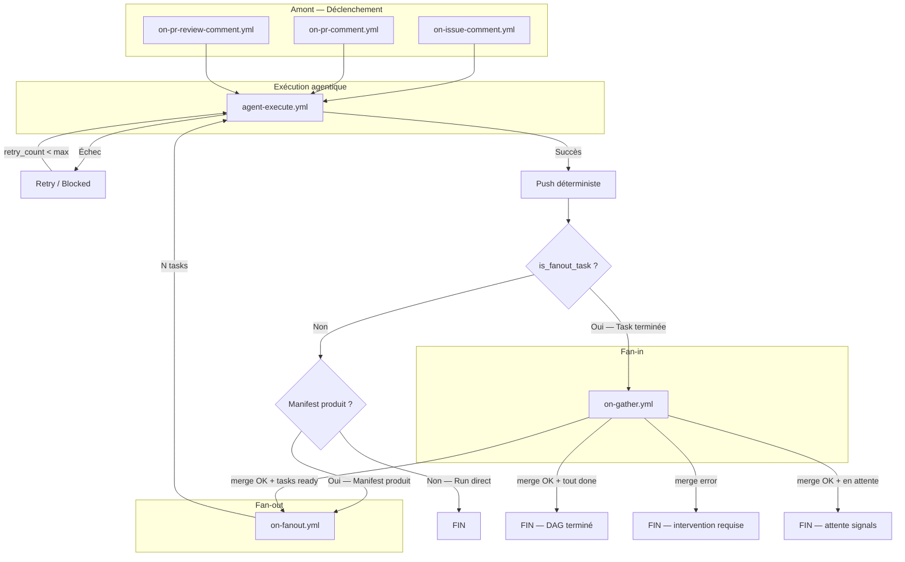

# OneTicket Workflow Specification

## Introduction

Ce document complète le document `oneticket-brief.md`.

Le brief présente la vision générale, les objectifs fonctionnels et les principes d'architecture de OneTicket. Le présent document se concentre uniquement sur l'orchestration GitHub Actions et l'interaction entre les workflows `.yml` et les scripts `.mjs`.

L'objectif est de fournir une vue claire du moteur d'exécution agentique sans entrer dans les détails d'implémentation internes.

---

# Vue simplifiée du workflow

Cette section présente uniquement les workflows GitHub structurants et les scripts principaux qu'ils utilisent.

## Entrées GitHub

```text
on-issue-comment.yml
  → ensure-issue-branch.mjs    (crée feature/issue-N si absente — idempotent)
  → check-prerequisites.mjs    (Gate 0 current_project, init-doc si structure documentaire absente)
  → build-context.mjs          (fetche historique commentaires, formate le contexte prompt)
  → agent-dispatch.mjs         (résout docs_path/app_path, construit prompt, label in progress, dispatche agent-execute.yml)

on-pr-comment.yml
  → build-context.mjs          (fetche historique commentaires PR, formate le contexte prompt)
  → agent-dispatch.mjs         (résout docs_path/app_path, construit prompt, dispatche agent-execute.yml)

on-pr-review-comment.yml
  → build-context.mjs          (fetche diff hunk, ligne, fichier, formate le contexte prompt)
  → agent-dispatch.mjs         (résout docs_path/app_path, construit prompt, dispatche agent-execute.yml)
```

## Exécution agentique

```text
agent-execute.yml
  → oneticket-install.mjs      (copie skills .oneticket/skills/ → .agents/skills/)
  → generate-config.mjs        (génère config opencode depuis config.yml → OPENCODE_CONFIG_CONTENT)
  → anomalyco/opencode         (exécute l'agent — seul step non déterministe)
  → retry-dispatch.mjs         (backoff exponentiel + jitter, label blocked à épuisement)
  → push déterministe de la branche de travail
  → dispatch-fanout.mjs        (si manifest présent — déclenche on-fanout.yml)
  → dispatch-gather.mjs        (si sous-branche task/* — déclenche on-gather.yml)
```

### Interface de `agent-execute.yml`

| Input | Type | Valorisé par | Description |
|---|---|---|---|
| `branch` | string | `agent-dispatch.mjs` ou `agent-launcher.mjs` | Branche de travail (`feature/issue-N` ou `task/issue-N-X`) |
| `issue_number` | string | `agent-dispatch.mjs` ou `agent-launcher.mjs` | Numéro d'issue GitHub |
| `is_fanout_task` | boolean | `agent-launcher.mjs` → `true`, `agent-dispatch.mjs` → `false` | Signal : task FAN-OUT ou invocation directe |
| `prompt` | string | `agent-dispatch.mjs` ou `agent-launcher.mjs` | Prompt système complet injecté dans anomalyco |
| `model` | string | `config.yml` via `agent-dispatch.mjs` | Modèle LLM à utiliser |
| `role` | string | `agent-dispatch.mjs` | Profil agent optionnel (dev, architect, analyst...) |
| `retry_count` | string | `retry-dispatch.mjs` | Nombre de tentatives courantes |
| `retry_max` | string | `config.yml` | Maximum de tentatives autorisées |

## Fan-out

```text
on-fanout.yml  (déclenché par dispatch-fanout.mjs via workflow_dispatch)
  inputs :
    issue_number  — numéro d'issue GitHub
  → launch-fanout.mjs          (setup git, checkout feature/issue-N, lit le manifest)
  → agent-launcher.mjs         (crée task/issue-N-X via API GitHub, dispatche N × agent-execute.yml par batch)
```

## Fan-in

```text
on-gather.yml  (déclenché par dispatch-gather.mjs via workflow_dispatch)
  inputs :
    task_branch  — ex: task/issue-42-A
    branch_base  — ex: feature/issue-42 (calculable depuis task_branch)
  → validate-task-branch.mjs   (guard cross-issue : task/issue-N-X → feature/issue-N uniquement)
  → orchestrate.mjs            (merge task/*, retry optimiste 5x, update manifest, barre progression, ferme task PR, supprime task branch, calcul DAG)
  → agent-launcher.mjs         (dispatche les tasks READY suivantes)
```

## Initialisation de projet

Ces opérations sont déterministes — jamais agentiques. Invoquées par le pipeline ou explicitement par l'utilisateur.

```text
check-prerequisites.mjs <docs_path>
  → appelé par on-issue-comment.yml avant chaque run agentique
  → Gate 0 : vérifie que current_project est défini — sinon notifie et stoppe
  → init-doc : vérifie que docs_path contient la structure standard
               si absente → copie .oneticket/templates/docs/ vers docs_path (idempotent)
  → extensible : d'autres pré-requis déterministes peuvent être ajoutés ici

init-template.mjs <template>
  → déclenché par l'utilisateur via @leaddev init-<template> (ex: @leaddev init-appshell)
  → copie apps/<template>/app/ vers apps/<current_project>/app/
  → personnalise les placeholders (package.json, index.html, écrans)
  → idempotent — si apps/<current_project>/app/ existe déjà, skip
  → templates disponibles : appshell (React+Vite), ...
  → note : la décision d'utiliser un template reste agentique
           (@leaddev détecte la stack et recommande le template adapté)
```

---

# Détail des scripts

## Scripts d'entrée

| Script | Contenu fonctionnel |
|---|---|
| `ensure-issue-branch.mjs` | Crée `feature/issue-N` si absente — idempotent |
| `check-prerequisites.mjs` | Gate 0 (`current_project`), init-doc si structure documentaire absente — extensible |
| `build-context.mjs` | Fetche l'historique des commentaires GitHub (max 10, tronqués à 500 chars), formate le bloc de contexte injecté dans le prompt |
| `agent-dispatch.mjs` | Résout `docs_path`/`app_path`/`current_project`, construit le prompt système (profil agent, contexte projet, contract), applique label `in progress`, dispatche `agent-execute.yml` |

## Scripts d'exécution agentique

| Script | Contenu fonctionnel |
|---|---|
| `oneticket-install.mjs` | Copie les skills `.oneticket/skills/` → `.agents/skills/` et `AGENTS.md` avant chaque run — opencode les découvre nativement |
| `generate-config.mjs` | Génère la config JSON opencode depuis `agent_config.<cli>` dans `config.yml` — injecté via `OPENCODE_CONFIG_CONTENT` |
| `retry-dispatch.mjs` | Re-dispatche `agent-execute.yml` avec backoff exponentiel + jitter (`2^n * 1000ms + [0,500ms]`) — applique label `blocked` à épuisement de `retry_max` |

## Scripts Fan-out

| Script | Contenu fonctionnel |
|---|---|
| `dispatch-fanout.mjs` | Envoie le signal `workflow_dispatch` vers `on-fanout.yml` quand un manifest est détecté |
| `launch-fanout.mjs` | Setup git, checkout `feature/issue-N`, lit le manifest, délègue à `agent-launcher.mjs` |
| `agent-launcher.mjs` | Identifie les tasks ready (DAG), marque `in_progress`, crée les branches `task/issue-N-X` via API GitHub, dispatche N × `agent-execute.yml` par batch de 4 avec délai anti-annulation (2s entre dispatches) |

## Scripts Fan-in

| Script | Contenu fonctionnel |
|---|---|
| `dispatch-gather.mjs` | Envoie le signal `workflow_dispatch` vers `on-gather.yml` depuis les sous-branches task/* |
| `validate-task-branch.mjs` | Guard cross-issue : vérifie que `task/issue-N-X` appartient bien à `feature/issue-N` — rejette tout mismatch de numéro d'issue |
| `orchestrate.mjs` | Merge `task/*` → `feature/issue-N` avec retry optimiste (5 tentatives, backoff exponentiel), marque task `done` ou `merge-failed`, poste barre de progression sur l'issue, ferme la task PR, supprime la task branch, calcul DAG, délègue à `agent-launcher.mjs` |

## Scripts d'initialisation

| Script | Contenu fonctionnel |
|---|---|
| `init-doc.mjs` | Copie `.oneticket/templates/docs/` vers `<docs_path>` — idempotent, ne réécrase pas les fichiers existants. Appelé par `check-prerequisites.mjs`, jamais par un agent |
| `init-template.mjs` | Copie `apps/<template>/app/` vers `apps/<current_project>/app/`, personnalise les placeholders — idempotent. Déclenché sur décision agentique confirmée par l'utilisateur |

## Scripts utilitaires (transverses)

| Script | Contenu fonctionnel |
|---|---|
| `constants.mjs` | Source de vérité des chemins réservés du framework — aucune dépendance |
| `config.mjs` | Lit et parse `.oneticket/config.yml`, expose `loadConfig()` |
| `utils.mjs` | Shell (`run`, `runWithRetry`), git (`setupGit`), manifest (`readManifest`, `writeManifest`), DAG (`areDependenciesSatisfied`), GitHub API (`dispatchWorkflow`, `applyLabel`, `removeLabel`, `createBranch`) — `createBranch(branchName, fromBranch, repo, token)` : POST /repos/{repo}/git/refs, idempotent |
| `print-config.mjs` | Wrapper CLI de `config.mjs` — permet aux workflows YAML de lire une valeur de config sans code inline |

---

# Labels et signaux

| Label | Posé par | Retiré par | Signification |
|---|---|---|---|
| `in progress` | `agent-dispatch.mjs` | `orchestrate.mjs` (quand tout DONE) | Un run agentique est en cours sur cette issue |
| `merge error` | `orchestrate.mjs` | Manuel | Une task branch n'a pas pu être mergée — intervention humaine requise |
| `blocked` | `retry-dispatch.mjs` | Manuel | L'agent a épuisé ses tentatives de retry |
| `ready for review` | — | — | Décision user — jamais posé automatiquement |

> La PR finale est une décision user — jamais créée automatiquement par le pipeline.

---

# Robustesse

- **`notify-failure`** — tous les workflows (`on-issue-comment`, `on-pr-comment`, `on-pr-review-comment`, `agent-execute`, `on-gather`) ont un job `notify-failure` qui poste un commentaire sur l'issue en cas d'échec définitif du workflow
- **Retry optimiste manifest** — `orchestrate.mjs` gère les conflits d'accès concurrent au manifest via reset hard + re-fetch + re-merge (5 tentatives max, `orchestrate_retry_max` dans `config.yml`)
- **Exclude sandbox artefacts** — `agent-execute.yml` injecte `.agents/`, `.opencode/`, `opencode.json` dans `.git/info/exclude` pour que l'agent ne les commite pas accidentellement
- **Guard cross-issue** — `validate-task-branch.mjs` empêche toute task branch de merger dans une feature branch d'une autre issue

---

# Structure du manifest

Le manifest est le contrat entre `@leaddev` et le pipeline d'exécution. Il est produit par l'agent et jamais modifié par un autre agent — uniquement par les scripts déterministes (`orchestrate.mjs`, `agent-launcher.mjs`).

## Format

```json
{
  "issue": 42,
  "tasks": [
    {
      "id": "A",
      "branch": "task/issue-42-A",
      "file": "src/screens/GameScreen.tsx",
      "content": "Instruction complète et autosuffisante pour l'agent exécuteur...",
      "role": "dev",
      "depends_on": [],
      "status": "pending"
    }
  ]
}
```

## Champs

| Champ | Type | Contrainte |
|---|---|---|
| `issue` | entier | Numéro d'issue GitHub exact |
| `tasks` | tableau | Non vide — max `max_tasks` (config.yml) |
| `id` | string | Lettre(s) majuscule(s) unique — A, B, C... |
| `branch` | string | Convention stricte : `task/issue-N-X` |
| `file` | string | Chemin relatif depuis la racine du repo — pas de `/` initial |
| `content` | string | Instruction autosuffisante — l'agent n'a pas d'autre contexte |
| `role` | string | Optionnel — `dev`, `architect`, `analyst`... |
| `depends_on` | tableau | Ids existants dans ce manifest — `[]` si aucune dépendance |
| `status` | string | `pending` \| `in_progress` \| `done` \| `merge-failed` |

> `branch_base` est absent du manifest — c'est un paramètre calculable depuis `issue_number`.

---

# Configuration — `.oneticket/config.yml`

Source de vérité unique des paramètres du framework. Lue par `config.mjs` et injectée dans les scripts et les workflows.

| Paramètre | Rôle dans le pipeline |
|---|---|
| `current_project` | Détermine `docs_path` et `app_path` — vérifié par `check-prerequisites.mjs` (Gate 0) |
| `model` | Modèle LLM utilisé par anomalyco — extrait de `agent_config.<cli>.model` |
| `max_tasks` | Limite le nombre de tasks dans un manifest |
| `retry_max` | Nombre max de retries agent dans `retry-dispatch.mjs` |
| `orchestrate_retry_max` | Nombre max de retries optimistes dans `orchestrate.mjs` |
| `clear_session_cache` | Vide le cache de session opencode avant chaque run |
| `pr_base` | Branche cible des PRs finales (ex: `main`) |
| `oneticket_git_user_name` | Identité git du bot CI |
| `oneticket_git_user_email` | Email git du bot CI |

---

# Workflow complet

## Vue macro



---

# Exemple — 3 tâches séquentielles A → B → C

Cet exemple illustre le cycle de vie complet d'un manifest avec 3 tâches séquentielles.

## Le manifest initial

`@leaddev` produit ce manifest sur `feature/issue-42` :

```json
{
  "issue": 42,
  "tasks": [
    {
      "id": "A",
      "branch": "task/issue-42-A",
      "file": "src/screens/GameScreen.tsx",
      "content": "Crée le composant GameScreen...",
      "role": "dev",
      "depends_on": [],
      "status": "pending"
    },
    {
      "id": "B",
      "branch": "task/issue-42-B",
      "file": "src/utils/collision.ts",
      "content": "Implémente le module de collision AABB...",
      "role": "dev",
      "depends_on": ["A"],
      "status": "pending"
    },
    {
      "id": "C",
      "branch": "task/issue-42-C",
      "file": "src/main.tsx",
      "content": "Ajoute la route /game dans main.tsx...",
      "role": "dev",
      "depends_on": ["B"],
      "status": "pending"
    }
  ]
}
```

---

## Étape 1 — `@leaddev` produit le manifest

**Workflow** : `on-issue-comment.yml` → `agent-execute.yml`

**Scripts** :
- `ensure-issue-branch.mjs` — crée `feature/issue-42` si absente
- `check-prerequisites.mjs` — Gate 0 + init-doc si absente
- `build-context.mjs` — construit le contexte GitHub
- `agent-dispatch.mjs` — dispatche `agent-execute.yml` avec `is_fanout_task: false`

`agent-execute.yml` tourne sur `feature/issue-42` :
- `anomalyco/opencode` produit et commite `manifest.json`
- push `feature/issue-42`
- `is_fanout_task: false` + manifest présent → **"Manifest produit"**
- `dispatch-fanout.mjs` → `on-fanout.yml`

---

## Étape 2 — FAN-OUT initial — lancement de A

**Workflow** : `on-fanout.yml`

**Scripts** :
- `launch-fanout.mjs` — setup git, checkout `feature/issue-42`, lit manifest
- `agent-launcher.mjs` :
  - calcul DAG : seule A est ready (`depends_on: []`)
  - manifest mis à jour :

```json
{ "id": "A", "status": "in_progress" }
{ "id": "B", "status": "pending" }
{ "id": "C", "status": "pending" }
```

  - crée `task/issue-42-A` via API GitHub
  - dispatche `agent-execute.yml` avec `is_fanout_task: true`, `branch: task/issue-42-A`

---

## Étape 3 — Task A s'exécute et termine

**Workflow** : `agent-execute.yml` sur `task/issue-42-A`

**Scripts** :
- `anomalyco/opencode` crée `src/screens/GameScreen.tsx`, commite
- push `task/issue-42-A`
- `is_fanout_task: true` → **"Task terminée"**
- `dispatch-gather.mjs` → `on-gather.yml`

---

## Étape 4 — GATHER de A — lancement de B

**Workflow** : `on-gather.yml`

**Scripts** :
- `validate-task-branch.mjs` — vérifie `task/issue-42-A` → `feature/issue-42` ✅
- `orchestrate.mjs` :
  - merge `task/issue-42-A` → `feature/issue-42` (retry optimiste 5x)
  - manifest mis à jour :

```json
{ "id": "A", "status": "done" }
{ "id": "B", "status": "pending" }
{ "id": "C", "status": "pending" }
```

  - ferme task PR, supprime `task/issue-42-A`
  - poste barre de progression sur l'issue : `█░░  1/3 done`
  - calcul DAG : B est ready (`depends_on: ["A"]`, A=done)
  - `agent-launcher.mjs` :
    - manifest mis à jour :

```json
{ "id": "A", "status": "done" }
{ "id": "B", "status": "in_progress" }
{ "id": "C", "status": "pending" }
```

    - crée `task/issue-42-B` via API GitHub
    - dispatche `agent-execute.yml` avec `is_fanout_task: true`, `branch: task/issue-42-B`

---

## Étape 5 — Task B s'exécute, GATHER, lancement de C

Même séquence que les étapes 3 et 4.

Manifest après GATHER de B :

```json
{ "id": "A", "status": "done" }
{ "id": "B", "status": "done" }
{ "id": "C", "status": "in_progress" }
```

Barre de progression : `██░  2/3 done`

---

## Étape 6 — Task C s'exécute et termine — DAG complet

**Workflow** : `on-gather.yml`

**Scripts** :
- `orchestrate.mjs` :
  - merge `task/issue-42-C` → `feature/issue-42`
  - manifest final :

```json
{ "id": "A", "status": "done" }
{ "id": "B", "status": "done" }
{ "id": "C", "status": "done" }
```

  - barre de progression : `███  3/3 done`
  - `allDone = true` → **FIN — DAG terminé**
  - `feature/issue-42` contient le travail complet des 3 tasks
  - La PR vers `main` est une décision user

---

# Infrastructure requise

## Structure du repo

```
.oneticket/
  config.yml                  ← paramètres du framework (source de vérité)
  AGENTS.md                   ← définition de l'équipe agents
  agents/                     ← profils agents (*.agent.md)
  skills/                     ← skills oneticket (<name>/SKILL.md)
  tasks/                      ← manifests et workflow logs (issue-N/manifest.json)
  templates/
    docs/                     ← template de structure documentaire (copié par init-doc.mjs)

src/                          ← tous les scripts .mjs du framework
.github/
  workflows/                  ← tous les workflows GitHub Actions .yml
.gitattributes                ← règle merge=union pour workflow.md
apps/
  <project>/
    app/                      ← code source de l'application
    docs/                     ← documentation du projet (what/how/ship/run)
```

## Conventions de nommage des branches

| Convention | Format | Exemple |
|---|---|---|
| Branche d'issue | `feature/issue-N` | `feature/issue-42` |
| Branche de task | `task/issue-N-X` | `task/issue-42-A` |

Ces conventions sont **strictes** — `validate-task-branch.mjs` rejette tout écart et `agent-execute.yml` refuse de tourner sur toute branche qui ne correspond pas à ces formats.

## `.gitattributes`

Le fichier `.gitattributes` à la racine du repo doit contenir la règle suivante :

```
.oneticket/tasks/issue-*/workflow.md merge=union
```

`merge=union` garantit que les appends parallèles sur `workflow.md` (log de progression des tasks) ne créent jamais de conflit git — les lignes sont fusionnées automatiquement.

## `workflow.md`

Chaque dossier de tâche `.oneticket/tasks/issue-N/` contient un `workflow.md` qui sert de log append-only de la progression des tasks. Il est mis à jour par chaque agent à la fin de son run et protégé par `merge=union`.

Format d'une entrée :
```
2026-06-01 14:32 | A | apps/breakout/app/src/screens/GameScreen.tsx
```

## Secrets GitHub requis

Deux secrets doivent être configurés dans les settings du repo GitHub (`Settings → Secrets → Actions`) :

| Secret | Description | Droits requis |
|---|---|---|
| `ONETICKET_GH_PAT` | Personal Access Token GitHub du bot | `contents: write`, `issues: write`, `pull-requests: write`, `workflows: write` |
| `OPENCODE_API_KEY` | Clé API opencode / anomalyco | Accès au modèle LLM configuré dans `config.yml` |

Sans ces deux secrets, aucun workflow ne peut s'exécuter.

---

# Philosophie d'architecture

OneTicket applique une séparation stricte entre les opérations agentiques et les opérations déterministes.

## Responsabilités des agents

Les agents sont autorisés à :

```text
- analyser un contexte
- produire du contenu
- modifier des fichiers
- créer un commit local
- publier une réponse GitHub
```

Les agents ne sont pas autorisés à :

```text
- créer des branches
- choisir une branche
- pousser du code
- merger des branches
- créer des Pull Requests
- modifier directement l'orchestration globale
```

## Responsabilités des scripts déterministes

Les scripts `.mjs` sont responsables de :

```text
- la gestion Git
- la gestion des branches
- les push
- les merges
- les manifests
- le calcul du DAG
- le fanout
- le fanin
- les retries
- les interactions GitHub API
```

Cette séparation garantit que l'orchestration reste prédictible, reproductible et contrôlée indépendamment du comportement du modèle d'IA.

## Décisions de conception

- **PR = décision user** — le pipeline ne crée jamais de PR automatiquement. `create-direct-pr.mjs` et `createFinalPR` sont supprimés dans la vision v2
- **Manifest = condition DAG** — c'est la présence du `manifest.json` qui conditionne le déclenchement du Fan-out, pas le nom de la branche
- **Branche toujours créée en amont** — `feature/issue-N` est garantie existante avant tout run agentique (`ensure-issue-branch.mjs`). Les branches `task/issue-N-X` sont créées par `agent-launcher.mjs` via API GitHub avant le dispatch
- **Initialisation déterministe** — `init-doc` et `init-template` sont des scripts déterministes, jamais délégués à un agent. La structure documentaire est garantie par `check-prerequisites.mjs` avant chaque run
- **Gate 0 déterministe** — la vérification de `current_project` est faite par `check-prerequisites.mjs`, jamais par un agent
- **Zéro code inline dans les yml** — toute logique métier est dans des scripts `.mjs`. Les workflows YAML ne contiennent que des appels à ces scripts
- **Décision de template = agentique** — la détection de la stack et la recommandation d'un template restent agentiques. Seule l'exécution de `init-template.mjs` est déterministe, déclenchée sur confirmation explicite de l'utilisateur (`@leaddev init-<template>`)
- **branch_base — paramètre calculable** — la branche parente d'une task est toujours `feature/issue-N`, calculée depuis `issue_number` : `"feature/issue-" + issue_number`. Elle n'est jamais stockée dans le manifest ni passée en paramètre entre workflows
- **switched=true — contrôle du push et des PRs** — le prompt injecte `FIRST ACTION: git checkout <branch>` en première ligne. anomalyco détecte le switch de branche (`switched=true`) et désactive automatiquement le push auto et la création de PR. Le pipeline reprend le contrôle après le run agent via les steps déterministes de `agent-execute.yml`

---

# Glossaire

| Terme | Définition |
|---|---|
| **DAG** | Directed Acyclic Graph — graphe orienté sans cycle. Dans OneTicket, le DAG est le graphe de dépendances entre les tasks d'un manifest. Il détermine l'ordre d'exécution : une task ne peut démarrer que si toutes ses dépendances (`depends_on`) sont à l'état `done`. Le calcul du DAG est fait par `areDependenciesSatisfied()` dans `utils.mjs`. |
| **FAN-OUT** | Dispatchement de N tasks en parallèle depuis un manifest. Déclenché par `on-fanout.yml` lors du premier lancement, puis par `orchestrate.mjs` à chaque fois que de nouvelles tasks sont débloquées. |
| **FAN-IN** | Collecte du signal de complétion d'une task et intégration de son résultat dans la branche d'issue. Géré par `on-gather.yml` → `orchestrate.mjs`. |
| **GATHER** | Signal envoyé par une task terminée pour déclencher le FAN-IN. Envoyé via `dispatch-gather.mjs` → `workflow_dispatch` → `on-gather.yml`. |
| **Manifest** | Fichier JSON produit par `@leaddev` qui décrit le graphe de tâches à exécuter. Stocké dans `.oneticket/tasks/issue-N/manifest.json`. Contient la liste des tasks, leurs dépendances, leurs statuts et les instructions pour chaque agent. |
| **Task branch** | Branche de travail créée pour chaque tâche d'un manifest. Format : `task/issue-N-X`. Créée par `agent-launcher.mjs` via API GitHub, mergée dans `feature/issue-N` après complétion, puis supprimée. |
| **Feature branch** | Branche d'issue principale. Format : `feature/issue-N`. Créée par `ensure-issue-branch.mjs` à la première invocation sur l'issue. Reçoit tous les merges des task branches. |
| **Run direct** | Exécution d'un agent sur `feature/issue-N` sans production de manifest — réponse commentaire, fix, doc, revue. Pas de FAN-OUT ni de GATHER déclenché. |
| **is_fanout_task** | Paramètre booléen passé à `agent-execute.yml`. `true` si la tâche est issue d'un FAN-OUT (valorisé par `agent-launcher.mjs`), `false` pour une invocation directe (valorisé par `agent-dispatch.mjs`). |
| **switched=true** | Mécanisme interne d'anomalyco : quand la première action de l'agent est un `git checkout`, anomalyco désactive le push automatique et la création de PR, laissant le pipeline reprendre le contrôle. |
| **Gate 0** | Vérification déterministe effectuée par `check-prerequisites.mjs` avant tout run agentique : `current_project` défini et structure documentaire présente. Si Gate 0 échoue, le pipeline s'arrête sans invoquer d'agent. |
| **Optimistic lock** | Mécanisme de gestion des conflits d'accès concurrent au manifest dans `orchestrate.mjs` : en cas de push non-fast-forward, reset hard + re-fetch + re-merge jusqu'à `orchestrate_retry_max` tentatives. |
| **current_project** | Paramètre dans `config.yml` qui détermine sur quel projet travaillent les agents. Détermine `docs_path` (`apps/<project>/docs`) et `app_path` (`apps/<project>/app`). |
