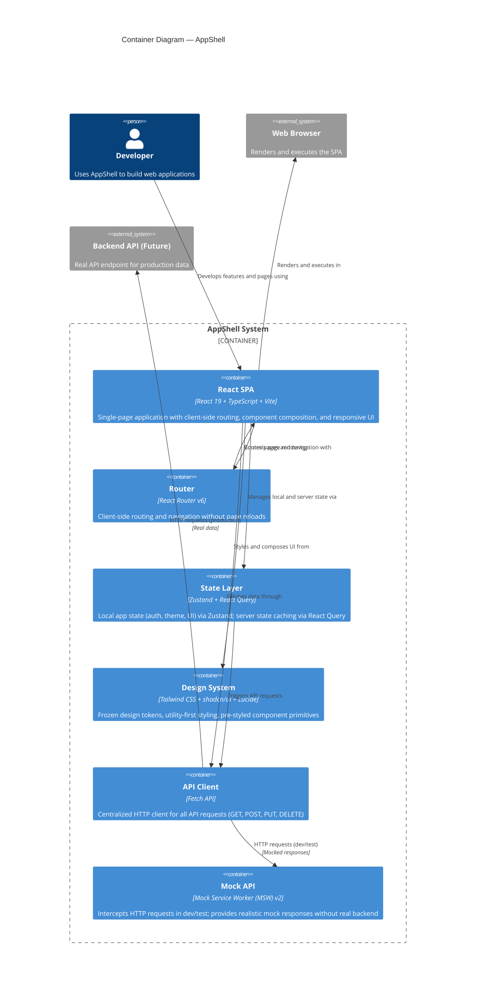

# Container Diagram — AppShell

## Overview

This diagram shows the internal containers of AppShell — the major deployable and runtime components that together form the complete SPA.



## Container Descriptions

| Container | Technology | Purpose | Responsibility |
|-----------|-----------|---------|-----------------|
| **React SPA** | React 19, TypeScript, Vite | Main application shell | Renders pages, components, manages user interactions |
| **Router** | React Router v6 | Client-side routing | Navigates between pages without full reload; manages route state |
| **State Layer** | Zustand + React Query | Local and server state | Zustand: app state (auth, theme); React Query: cache and fetch server data |
| **Design System** | Tailwind CSS, shadcn/ui, Lucide | Frozen design language | Provides utility classes, pre-styled components, 300+ icons; enforces consistency |
| **API Client** | Fetch API | HTTP communication | Single entry point for all API requests; handles request/response shapes |
| **Mock API** | Mock Service Worker v2 | Development/testing | Intercepts HTTP calls in-browser; returns realistic mock data without backend |

## Key Flows

### User Interaction Flow
```
Developer uses SPA → Clicks button (React Component)
  ↓
Component calls hook (useUsers, useCreateUser, etc.)
  ↓
Hook uses React Query or Zustand
  ↓
Router navigates to new page
  ↓
SPA re-renders with new page content
```

### Data Fetching Flow
```
Component requests data (useUsers hook)
  ↓
React Query checks cache
  ↓
If cache miss or stale: API Client makes GET /api/users
  ↓
MSW intercepts (dev/test) or real API handles (production)
  ↓
Response returned to React Query
  ↓
Component re-renders with fresh data
```

### State Management Flow
```
User action in component
  ↓
Zustand store updates local state (theme, auth, UI)
  OR
React Query mutation (createUser, updateUser, deleteUser)
  ↓
Component re-renders with new state
```

## Deployment Strategy

- **Development**: `npm run dev` → Vite dev server on `http://localhost:5173` → MSW mocks all API calls
- **Testing**: `npm run test` → Vitest runner → MSW mocks in test mode
- **Production**: `npm run build` → Static SPA bundled to `dist/` → Deployed to static host (Netlify, Vercel, GitHub Pages, S3)

In production, the API Client makes real HTTP requests to a backend API instead of MSW mocks.

---

## See Also

- [System Context Diagram](./system-context.md) — High-level AppShell in context of users and external systems
- [Architecture](../architecture.md) — Technical design principles, interfaces, and constraints
