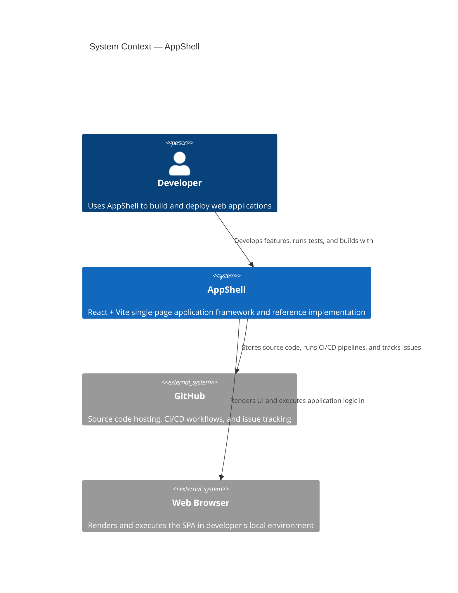

# System Context Diagram — AppShell

## Overview

This diagram shows AppShell as a central system in the context of its users and external systems. It illustrates the interactions between developers (primary users) and the GitHub ecosystem.

## Key Interactions

| Actor | System | Interaction | Purpose |
|-------|--------|-------------|---------|
| **Developer** | AppShell | Develops, tests, deploys | Primary user building applications using the framework |
| **AppShell** | GitHub | Version control, CI/CD, issues | Stores code, runs workflows, integrates with development tools |
| **AppShell** | Web Browser | Renders, executes | Delivers the SPA to end users via static hosting |

## Context Scope

- **System**: AppShell is a canonical React + Vite SPA template with built-in MSW mocking, React Query caching, and Zustand state management
- **Users**: Developers building new OneTicket projects using AppShell as a scaffolding template
- **External systems**: GitHub (code hosting and CI/CD), Web Browser (runtime environment)
- **Out of scope**: Real backend API (AppShell uses MSW mocks in dev/test)

---

## See Also

- [Containers Diagram](./containers.md) — Internal AppShell containers (SPA, Design System, Mock API, State Layer)
- [Architecture](../architecture.md) — Full technical architecture and design principles
