# Components Diagram — AppShell

## Overview

This diagram shows the internal component structure of AppShell's UI layer, breaking down how screens, layout components, and utility hooks interact.

## Diagram

```mermaid
C4Component
  title Components Diagram — AppShell UI Layer

  Container(screens, "Screens", "React Components")
  Container(layout, "Layout", "React Components")
  Container(hooks, "Custom Hooks", "React Logic")
  Container(ui, "UI Primitives", "shadcn/ui Components")
  Container(utils, "Utilities", "Schemas, Query Client")

  Component(homescreen, "HomeScreen", "React", "Renders home page with user list (demo)")
  Component(aboutscreen, "AboutScreen", "React", "Renders about page with AppShell description")
  Component(helpscreen, "HelpScreen", "React", "Renders help page with quickstart guide")

  Component(applayout, "AppLayout", "React", "Wraps all screens with Header, Outlet, Footer")
  Component(header, "Header", "React", "App name, About & Help dropdown, ThemeToggle")
  Component(theme, "ThemeToggle", "React", "Switch between light/dark/system modes")
  Component(footer, "Footer", "React", "Empty footer (structured for future content)")

  Component(usersHook, "useUsers", "React Hook", "Fetches /api/users, returns { data, isLoading, error }")
  Component(queryhook, "useQuery", "React Query Hook", "Server state management with caching")
  Component(themehook, "useTheme", "next-themes Hook", "Read/set theme preference")

  Component(button, "Button", "shadcn/ui", "Reusable button component")
  Component(card, "Card", "shadcn/ui", "Container for grouped content")
  Component(dropdown, "DropdownMenu", "shadcn/ui", "Dropdown menu for navigation")
  Component(form, "Form", "shadcn/ui + React Hook Form", "Form with validation")

  Component(schemas, "Zod Schemas", "Validation", "usersSchema, postsSchema, etc.")
  Component(queryclient, "QueryClient", "React Query", "Singleton query cache config")

  Container_Boundary(screens_boundary, "Screens Layer") {
    Rel(homescreen, hooks, "Calls")
    Rel(aboutscreen, ui, "Uses")
    Rel(helpscreen, ui, "Uses")
  }

  Container_Boundary(layout_boundary, "Layout Layer") {
    Rel(applayout, screens, "Renders screens via Outlet")
    Rel(header, utils, "Uses ThemeToggle")
    Rel(theme, hooks, "Uses useTheme")
  }

  Container_Boundary(hooks_boundary, "Hooks Layer") {
    Rel(usersHook, utils, "Validates with schemas")
    Rel(usersHook, queryhook, "Uses")
    Rel(queryhook, utils, "Reads QueryClient config")
  }

  Container_Boundary(ui_boundary, "UI Components") {
    Rel(button, ui, "shadcn primitive")
    Rel(card, ui, "shadcn primitive")
    Rel(dropdown, ui, "shadcn primitive")
    Rel(form, ui, "shadcn + React Hook Form")
  }

  Rel(homescreen, applayout, "Rendered inside")
  Rel(aboutscreen, applayout, "Rendered inside")
  Rel(helpscreen, applayout, "Rendered inside")

  Rel(header, dropdown, "Uses")
  Rel(header, button, "Uses")
  Rel(theme, button, "Uses")

  Rel(homescreen, card, "Uses")
  Rel(aboutscreen, card, "Uses")

  UpdateLayoutConfig($c4ShapeInRow="2", $c4BoundaryInRow="1")
```



## Component Groups

### Screens Layer
Represents page-level components, each rendering a distinct route.

**HomeScreen**
- Path: `/`
- Demonstrates React Query data fetching
- Calls `useUsers()` hook to fetch `/api/users`
- Renders loading spinner, error message, or list of user cards
- Uses shadcn/ui `Card` and `Button` components

**AboutScreen**
- Path: `/about`
- Describes AppShell purpose, vision, and usage
- Links to documentation and GitHub repository
- Static content; no data fetching

**HelpScreen**
- Path: `/help`
- Provides 7-step quickstart for reusing AppShell
- References runbook and documentation
- Static content; no data fetching

### Layout Layer
Provides the app-wide frame that wraps all screens.

**AppLayout**
- Container component wrapping all routes
- Structure: Header (top) + Outlet (center) + Footer (bottom)
- Passes theme context to children
- Never modified by feature tasks

**Header**
- Left: App name (clickable → `/`)
- Right: "About & Help" dropdown menu + `ThemeToggle`
- Responsive design

**ThemeToggle**
- Three buttons/dropdown options: system, light, dark
- Uses `next-themes` hook to read/set theme
- Persists selection to localStorage
- Triggers reactive CSS custom property updates

**Footer**
- Empty but structured
- Available for projects to add content

### Hooks Layer
Custom React hooks encapsulating data-fetching logic and business logic.

**useUsers Hook**
- Signature: `() => UseQueryResult<User[], Error>`
- Uses React Query's `useQuery()` internally
- Queries endpoint: `GET /api/users`
- Validates response with `usersSchema` (Zod)
- Returns: `{ data: User[], isLoading, error, refetch }`

**useQuery Hook (React Query)**
- Manages server state caching
- Handles loading and error states
- Supports refetching, pagination, and background syncing
- Queries are keyed (e.g., `['users']`) for cache management

**useTheme Hook (next-themes)**
- Reads current theme preference from localStorage
- Returns: `{ theme, setTheme, themes, systemTheme }`
- Integrates with CSS custom properties for reactivity

### UI Primitives Layer
shadcn/ui components pre-installed and ready for use.

**Button**
- Reusable clickable component
- Used in Header, ThemeToggle, form submissions
- Styled with Tailwind; follows design tokens

**Card**
- Container for grouped content
- Used in HomeScreen to display user cards
- Provides consistent spacing and border styling

**DropdownMenu**
- Navigation menu (About & Help dropdown in header)
- Opens on click; closes on selection
- Accessible via keyboard navigation (ARIA)

**Form**
- React Hook Form integration with Zod validation
- Includes form field, error messages, submit handler
- Validates before submission

### Utilities Layer
Shared configuration and validation logic.

**Zod Schemas**
- Location: `src/lib/schemas/`
- Validates API responses: `usersSchema`, `postsSchema`, etc.
- Provides TypeScript inference: `type User = z.infer<typeof userSchema>`
- Ensures type safety across data layers

**QueryClient**
- Singleton instance created in `src/lib/query-client.ts`
- Configured with default options (stale time, retry behavior, etc.)
- Passed to app via `<QueryClientProvider>`
- Never instantiated per-component

## Component Interactions

### 1. Rendering Flow
```
App.tsx (Router)
    ↓
AppLayout wraps all routes
    ├─ Header (fixed)
    │  ├─ App name button
    │  ├─ About & Help dropdown
    │  └─ ThemeToggle
    ├─ Outlet (screens render here)
    │  ├─ HomeScreen (with user cards)
    │  ├─ AboutScreen
    │  └─ HelpScreen
    └─ Footer (fixed)
```

### 2. Data Flow (HomeScreen → Hook → Query)
```
HomeScreen component
    ↓
Calls useUsers() hook
    ↓
Hook calls useQuery({ queryKey: ['users'], queryFn: ... })
    ↓
React Query sends GET /api/users
    ↓
MSW intercepts (dev) or real API responds (prod)
    ↓
Response validated with usersSchema
    ↓
Data cached in QueryClient
    ↓
Hook returns { data: User[], isLoading, error }
    ↓
HomeScreen renders based on state
    ├─ If isLoading → show spinner
    ├─ If error → show error message
    └─ If data → render user cards
```

### 3. Theme Toggle Flow
```
User clicks ThemeToggle button
    ↓
ThemeToggle calls setTheme() (from next-themes)
    ↓
next-themes updates localStorage
    ↓
next-themes updates HTML class (adds/removes `.dark`)
    ↓
CSS custom properties update (CSS Cascade)
    ↓
Tailwind classes reactively apply new colors
    ↓
All UI components using theme tokens update instantly
```

## File Structure

```
src/
├── App.tsx                          # Router config + route definitions
├── main.tsx                         # React entry point, MSW setup guard
├── screens/
│   ├── HomeScreen.tsx
│   ├── AboutScreen.tsx
│   └── HelpScreen.tsx
├── components/
│   ├── AppLayout.tsx
│   ├── Header.tsx
│   ├── ThemeToggle.tsx
│   ├── Footer.tsx
│   └── ui/                          # shadcn/ui components (auto-generated)
│       ├── button.tsx
│       ├── card.tsx
│       ├── dropdown-menu.tsx
│       └── ...
├── hooks/
│   ├── useUsers.ts
│   ├── usePosts.ts
│   └── ...
├── lib/
│   ├── query-client.ts
│   └── schemas/
│       ├── users.ts
│       ├── posts.ts
│       └── ...
├── mocks/
│   ├── browser.ts
│   ├── handlers.ts
│   └── data/
│       ├── users.ts
│       └── ...
├── styles/
│   └── globals.css
└── types/
    └── index.ts                     # Shared TypeScript types
```

## Key Design Patterns

1. **Custom Hooks for Data Logic** — Each feature's data-fetching logic is encapsulated in a single hook file (e.g., `useUsers.ts`). No logic in screen components.

2. **shadcn/ui Primitives Only** — All UI components use pre-installed shadcn/ui primitives. No custom component libraries.

3. **Zod Validation at API Boundary** — All API responses validated against Zod schemas before reaching components. Type safety guaranteed end-to-end.

4. **React Query for Server State** — Server state (remote API data) cached and managed by React Query. No Redux or context needed.

5. **CSS Custom Properties for Theme** — Theme switching is reactive via CSS variables. No component-level theme state management.

6. **File Ownership Exclusivity** — Each screen, hook, and store file owned by exactly one task. No parallel modifications to the same file.

## Related Diagrams

- [Container Diagram](./containers.md) — Shows higher-level decomposition (layer perspective)
- [System Context](./system-context.md) — Shows external systems and actors
