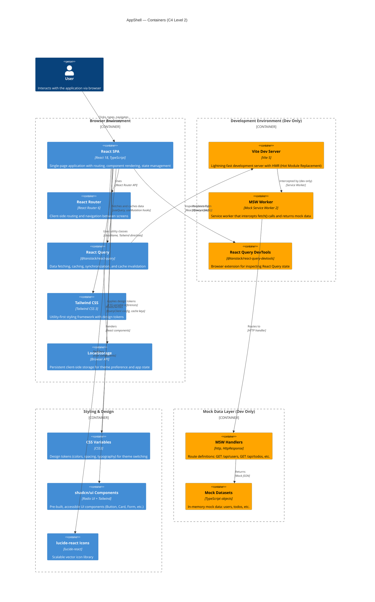

# AppShell — Containers (C4 Level 2)

## Overview

This diagram shows the major containers within the AppShell system — the deployable/executable components that run in the browser and developer environment.



## Container Descriptions

### Browser Environment (Production & Development)

#### React SPA
- **Technology:** React 18, TypeScript
- **Responsibility:** Core single-page application — renders screens (HomeScreen, AboutScreen, HelpScreen), manages component lifecycle, handles user interactions
- **Owned by:** Task 0 (App.tsx, layout, infrastructure) + Feature tasks (screens, hooks)
- **Key Files:** `src/App.tsx`, `src/main.tsx`, `src/screens/`

#### React Router
- **Technology:** React Router 6
- **Responsibility:** Client-side routing, navigation between screens, URL state management
- **Routes:** `/, /about, /help`
- **Owned by:** Task 0 (setup) + Feature tasks (route configuration)
- **Key Files:** `src/App.tsx`

#### React Query
- **Technology:** @tanstack/react-query 5.x
- **Responsibility:** Data fetching, automatic caching, cache invalidation, synchronization
- **Hooks:** `useUsers()`, `useTodos()`, etc.
- **Owned by:** Task 0 (QueryClient setup) + Feature tasks (custom hooks)
- **Key Files:** `src/lib/query-client.ts`, `src/hooks/`

#### Tailwind CSS
- **Technology:** Tailwind CSS 3.x + PostCSS
- **Responsibility:** Utility-first styling, responsive design, design token integration
- **Configuration:** `tailwind.config.ts` (consumes CSS variables)
- **Owned by:** Task 0
- **Key Files:** `tailwind.config.ts`, `src/styles/globals.css`

#### LocalStorage
- **Technology:** Browser LocalStorage API
- **Responsibility:** Persistent client-side storage for theme preference (light/dark/system) and React Query cache keys
- **Owned by:** Task 0 (ThemeToggle component)
- **Key Files:** `src/components/ThemeToggle.tsx`

---

### Development Environment (Dev Only — Tree-Shaken in Production)

#### Vite Dev Server
- **Technology:** Vite 5.x
- **Responsibility:** Lightning-fast development server, Hot Module Replacement (HMR), asset bundling
- **Command:** `npm run dev` starts server on `http://localhost:5173`
- **Owned by:** Task 0
- **Key Files:** `vite.config.ts`

#### MSW Worker
- **Technology:** Mock Service Worker 2.x
- **Responsibility:** Intercepts `fetch()` calls in development, returns mock API responses
- **Activation:** Conditional on `import.meta.env.DEV` in `main.tsx` — not included in production builds
- **Owned by:** Task 0 (setup) + Feature tasks (handlers, mock data)
- **Key Files:** `src/mocks/browser.ts`, `src/mocks/handlers.ts`, `src/mocks/data/`

#### React Query DevTools
- **Technology:** @tanstack/react-query-devtools
- **Responsibility:** Browser DevTools panel for inspecting query state, cache, stale time, request/response payloads
- **Activation:** Conditional on dev mode
- **Owned by:** Task 0
- **Key Files:** `src/App.tsx` or `src/main.tsx`

---

### Styling & Design Layer

#### CSS Variables
- **Technology:** CSS3 custom properties
- **Responsibility:** Design tokens for colors, spacing, typography, reactive theme switching (light/dark)
- **Scope:** Light mode (`:root`), dark mode (`.dark` class on `<html>`)
- **Owned by:** Task 0
- **Key Files:** `src/styles/globals.css`

#### shadcn/ui Components
- **Technology:** shadcn/ui (Radix UI + Tailwind)
- **Responsibility:** Pre-built, accessible UI components: Button, Card, Form, Input, Label, Dropdown, Separator
- **Installation:** One-time setup in Task 0 via `npx shadcn-ui@latest add <component>`
- **Owned by:** Task 0 (installation) + Feature tasks (usage)
- **Key Files:** `src/components/ui/`

#### lucide-react Icons
- **Technology:** lucide-react
- **Responsibility:** Consistent, scalable vector icons
- **Usage:** Imported from `lucide-react`, used in components
- **Owned by:** All tasks (feature tasks use icons in their screens)
- **Example:** `import { Users } from 'lucide-react'`

---

### Mock Data Layer (Dev Only)

#### MSW Handlers
- **Technology:** Mock Service Worker HTTP handlers
- **Responsibility:** Define mock API endpoints, request routing, response construction
- **Examples:** `GET /api/users`, `GET /api/todos`
- **Owned by:** Feature tasks (each task adds its own endpoint handlers)
- **Key Files:** `src/mocks/handlers.ts`

#### Mock Datasets
- **Technology:** TypeScript objects/arrays
- **Responsibility:** In-memory mock data for development — simulates a database
- **Examples:** `mockUsers`, `mockTodos`
- **Owned by:** Feature tasks (each task owns its own data file)
- **Key Files:** `src/mocks/data/users.ts`, `src/mocks/data/todos.ts`, etc.

---

## Data Flow

```
User Input
  ↓
React Component (Screen)
  ↓
React Router (navigation)
  ↓
Custom Hook (useUsers, useTodos, etc.)
  ↓
React Query (fetch, cache, invalidate)
  ↓
Browser fetch() API
  ↓
[Dev Only] MSW Worker intercepts → MSW Handlers → Mock Data
[Prod] Real API endpoint
  ↓
React Query caches response
  ↓
Component re-renders with data
  ↓
Tailwind + shadcn/ui render styled output
```

---

## Key Interfaces Between Containers

| From | To | Protocol | Example |
|------|--|----|---------|
| React SPA | React Router | React Router API | `useNavigate()`, `<Route>`, `<Link>` |
| React SPA | React Query | Hook API | `const { data } = useQuery({ queryKey: ['users'], queryFn })` |
| React Query | Fetch API | HTTP | `fetch('/api/users')` |
| Fetch API | MSW Worker (dev) | Service Worker intercept | HTTP request intercepted, mock response returned |
| MSW Handlers | Mock Data | Function call | `handlers.ts` imports `mockUsers` from `data/users.ts` |
| React SPA | Tailwind | CSS classes | `className="p-4 text-lg font-bold"` |
| React SPA | CSS Variables | CSS property reference | `background: hsl(var(--background))` |
| React SPA | LocalStorage | Browser API | `localStorage.setItem('theme', 'dark')` |
| React SPA | React Query DevTools | Browser extension | Inspect query state in DevTools panel |

---

## Production vs. Development

| Aspect | Development | Production |
|--------|-------------|-----------|
| **Vite Dev Server** | Running on port 5173 | Not running (static files served from CDN/server) |
| **MSW Worker** | Active, intercepts `fetch()` | Tree-shaken, not included in bundle |
| **Mock Data** | Served by MSW | Not included in bundle |
| **DevTools** | React Query DevTools panel visible | Not included in bundle |
| **API Calls** | Intercepted by MSW → mock data | Real API backend |
| **CSS Variables** | Reactive theme switching in browser | Pre-compiled by Tailwind |

---

## Related Diagrams

- **System Context** — AppShell within the oneticket-core ecosystem
- **Components** — Internal React components, hooks, styling architecture (Level 3)
- **Deployment** — GitHub Pages, CDN, build artifacts (Level 4)

---

**Last Updated:** 2026-05-29  
**Status:** Complete  
**Diagram Type:** C4 Container (Level 2)
