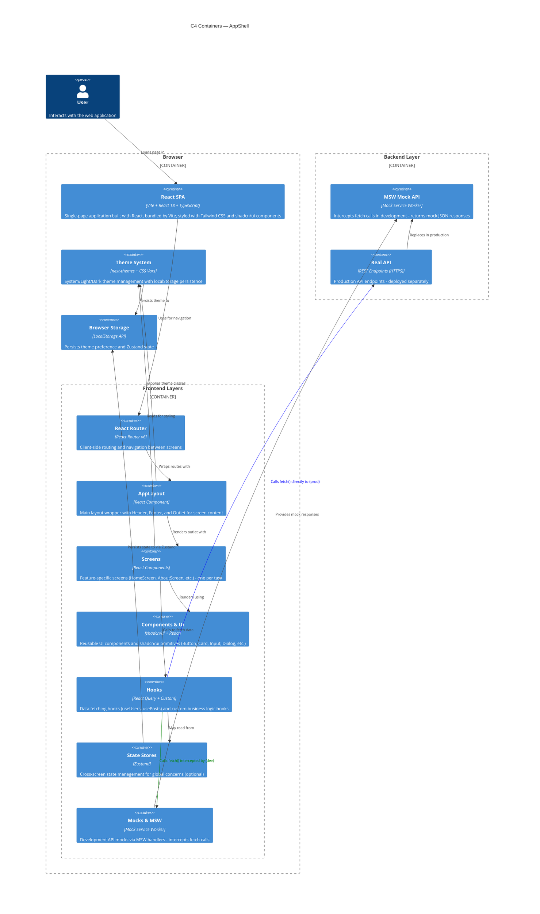

# C4 Containers — AppShell

Container diagram showing the internal structure of the AppShell frontend system and its interactions with external systems.



## Container Descriptions

### Browser Boundary

#### React SPA
- **Technology:** Vite + React 18 + TypeScript
- **Purpose:** Main single-page application container bundled by Vite
- **Contents:** All frontend code, routing, components, state management, styling
- **Styling:** Tailwind CSS for utility-first styling, CSS custom properties for design tokens, shadcn/ui for component primitives
- **Bundle:** Minified and optimized by Vite in production; MSW worker excluded from production build

### Frontend Layers (within SPA)

#### React Router
- **Technology:** React Router v6
- **Purpose:** Client-side routing and navigation
- **Responsibilities:** Routes definition, navigation guards, lazy route loading (future enhancement)

#### AppLayout
- **Technology:** React Component
- **Purpose:** Consistent layout structure across all screens
- **Contents:** Header (navigation, theme toggle), Outlet (route-specific content), Footer (static footer)
- **Ownership:** Task-0 only - frozen, never modified by feature tasks

#### Screens
- **Technology:** React Components
- **Purpose:** Feature-specific page components
- **Convention:** One screen file per task (exclusive ownership)
- **Examples:** HomeScreen.tsx, AboutScreen.tsx, UserListScreen.tsx
- **Pattern:** Each screen imports hooks and components, calls useQuery hooks, renders component tree

#### Components & UI
- **Technology:** shadcn/ui primitives + React
- **Purpose:** Reusable UI component library
- **Baseline Set:** Button, Card, Input, Form, Dialog, Dropdown, Tabs, Badge (frozen at task-0)
- **Styling:** All components styled with Tailwind CSS classes and CSS custom properties
- **Convention:** Components are composed into screens; no inline styles

#### Hooks
- **Technology:** React Query + Custom React hooks
- **Purpose:** Data fetching and business logic encapsulation
- **Convention:** One hook per file (exclusive ownership), e.g., useUsers.ts, usePosts.ts
- **Pattern:** 
  - All hooks use `useQuery` from @tanstack/react-query for server state
  - Each hook defines a `queryKey` and `queryFn` that calls `fetch()`
  - Fetch calls are intercepted by MSW in development; production calls hit real API
  - Components import and call hooks to access data

#### State Stores
- **Technology:** Zustand
- **Purpose:** Cross-screen state management (optional, for global concerns)
- **Use Cases:** Logged-in user context, global notifications, preferences
- **Pattern:** Optional - used only when local component state + React Query caching is insufficient

#### Mocks & MSW
- **Technology:** Mock Service Worker (MSW) v2
- **Purpose:** Development API mocking - intercepts all fetch calls
- **Location:** src/mocks/handlers.ts (HTTP handlers), src/mocks/data/* (fixture files)
- **Pattern:**
  - Defined once at task-0
  - HTTP handlers use `http.get()`, `http.post()`, etc.
  - Feature tasks can add new handlers without modifying existing ones
  - In production, this entire layer is excluded from bundle; fetch calls go to real API

#### Theme System
- **Technology:** next-themes + CSS custom properties
- **Purpose:** System/Light/Dark theme management
- **Persistence:** Theme preference saved to localStorage
- **Pattern:** `useTheme()` hook provides theme state and setters; theme changes apply CSS class to document root + CSS variables update

### Backend Layer

#### MSW Mock API
- **Technology:** Mock Service Worker
- **Purpose:** Intercepts fetch calls in development
- **Behavior:** Returns mock JSON responses matching real API contracts
- **Replacement:** Completely replaced by Real API in production (no code changes needed)

#### Real API
- **Technology:** REST API (HTTPS)
- **Purpose:** Production backend API
- **Endpoints:** Same URL structure as MSW handlers (e.g., `/api/users`, `/api/posts`)
- **Deployment:** Separate from frontend; can be any backend technology (Node.js, Python, Go, etc.)

### Browser Storage

#### LocalStorage
- **Technology:** Browser LocalStorage API
- **Purpose:** Client-side persistence
- **Contents:** Theme preference (via next-themes), Zustand state snapshots
- **Lifecycle:** Persists across browser sessions until cleared

## Data Flow

### Happy Path: Fetch Data (Dev with MSW)
```
1. Component renders
2. Component calls Hook (e.g., useUsers())
3. Hook calls useQuery() from @tanstack/react-query
4. React Query calls Hook's queryFn (async function)
5. queryFn calls fetch('/api/users')
6. MSW intercepts the fetch call
7. MSW handler returns HttpResponse.json(mockData)
8. React Query receives response, caches it
9. Component re-renders with data
10. User sees data in UI
```

### Production: Fetch Data (No MSW)
```
1. Component renders
2. Component calls Hook (e.g., useUsers())
3. Hook calls useQuery() from @tanstack/react-query
4. React Query calls Hook's queryFn (async function)
5. queryFn calls fetch('/api/users')
6. Fetch goes directly to real API server (MSW not in bundle)
7. API server returns JSON response
8. React Query receives response, caches it
9. Component re-renders with data
10. User sees data in UI
```

**No code changes required between dev and prod.**

## Theme Management Flow

```
1. User clicks theme toggle in Header
2. Theme toggle calls setTheme('dark') from useTheme()
3. next-themes applies 'dark' class to <html>
4. CSS custom properties update (CSS var --color-* values change)
5. Theme preference saved to localStorage
6. All components re-render with new CSS variables
7. UI instantly reflects light/dark appearance
```

## Design Token Flow

```
1. Tailwind config (tailwind.config.ts) defines tokens (colors, spacing, typography)
2. globals.css defines CSS custom properties (--color-background, --color-text, etc.)
3. Components use Tailwind classes (@apply, bg-surface, text-foreground)
4. CSS custom properties interpolate based on theme class on <html>
5. Design system updates centralized → all components reflect token changes
```

## Key Interfaces

### Hook-to-React Query Interface
```typescript
export function useUsers() {
  return useQuery({
    queryKey: ['users'],
    queryFn: async () => {
      const res = await fetch('/api/users');
      return res.json();
    },
  });
}
```

### MSW Handler Interface
```typescript
export const handlers = [
  http.get('/api/users', async () => {
    return HttpResponse.json(mockUsers);
  }),
];
```

### Theme Hook Interface
```typescript
const { theme, setTheme } = useTheme();
setTheme('dark'); // Updates class + localStorage + CSS vars
```

## Architectural Constraints

1. **Exclusive File Ownership** — Each feature task owns one screen file or one hook file; no shared modifications
2. **No Inline Styles** — All styling via Tailwind classes and CSS custom properties
3. **MSW Handler Convention** — All mocks in src/mocks/handlers.ts
4. **Hook Isolation** — Hooks fetch data; components never call fetch() directly
5. **Frozen Baseline (Task-0)** — After initial setup, package.json, vite.config.ts, tsconfig.json, tailwind.config.ts, shadcn/ui components are frozen
6. **MSW Development Parity** — Same code runs on dev (MSW mocks) and prod (real API) with zero changes

## References

- See [Architecture](../architecture.md) for detailed design principles and data architecture
- See [System Context](./system-context.md) for broader system scope and external actors (if available)
