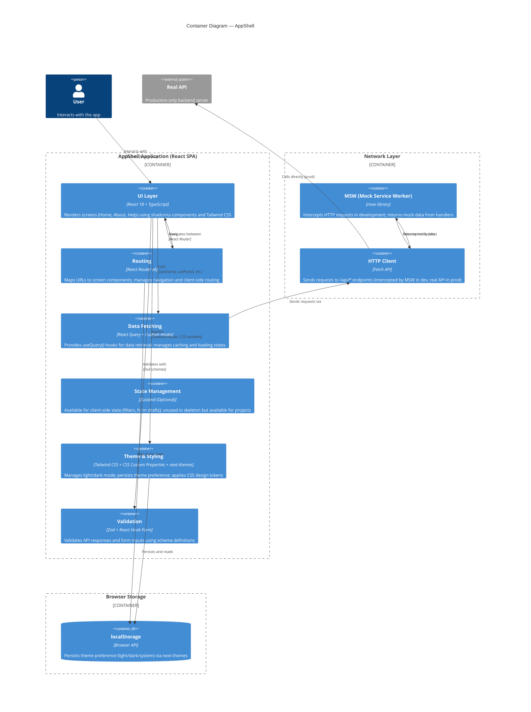

# Container Diagram — AppShell

## Overview

This diagram shows the internal structure of AppShell, breaking it down into its main containers: the React SPA, the MSW mock layer, styling system, and routing configuration.

## Diagram



## Containers

### 1. UI Layer
**Technology:** React 18, TypeScript, shadcn/ui, Tailwind CSS

**Responsibilities:**
- Render screen components (HomeScreen, AboutScreen, HelpScreen)
- Use shadcn/ui primitives (Button, Card, DropdownMenu, Form, etc.)
- Apply Tailwind classes for styling
- Display loading states, error messages, and success UI
- Emit user interactions

**Key Components:**
- `AppLayout` — Wraps all screens with Header + Outlet + Footer
- `Header` — Navigation and theme toggle
- `screens/HomeScreen`, `screens/AboutScreen`, `screens/HelpScreen`
- shadcn/ui component library

### 2. Routing
**Technology:** React Router v6

**Responsibilities:**
- Map URL paths to screen components
- Manage client-side navigation
- Provide nested route outlets
- Handle programmatic navigation (e.g., clicking header logo → `/`)

**Key Files:**
- `src/App.tsx` — Centralized route definitions

### 3. Data Fetching
**Technology:** React Query, Custom Hooks

**Responsibilities:**
- Encapsulate data retrieval logic in custom hooks (e.g., `useUsers()`)
- Manage `useQuery()` calls with caching and staleness policies
- Return `{ data, isLoading, error, refetch }` objects
- Handle retry logic and error states

**Key Files:**
- `src/hooks/useUsers.ts`, `src/hooks/usePosts.ts`, etc.
- `src/lib/query-client.ts` — QueryClient singleton configuration

### 4. State Management (Optional)
**Technology:** Zustand

**Responsibilities:**
- Store client-side state (filters, form drafts, UI state)
- Provide hooks to read/update state
- Persist to localStorage if needed

**Status in AppShell:** Unused in skeleton. Projects add stores under `src/stores/` as needed.

### 5. Theme & Styling
**Technology:** Tailwind CSS, CSS Custom Properties, next-themes

**Responsibilities:**
- Define CSS custom properties for light and dark modes
- Configure Tailwind design tokens
- Provide theme toggle component
- Persist theme preference to localStorage
- Update theme reactively without page reload

**Key Files:**
- `src/styles/globals.css` — CSS custom properties and global styles
- `tailwind.config.ts` — Tailwind token configuration
- `src/components/ThemeToggle.tsx` — Theme toggle UI

### 6. Validation
**Technology:** Zod, React Hook Form

**Responsibilities:**
- Validate API response shapes against schemas
- Validate form inputs before submission
- Provide typed data to components
- Handle validation error messages

**Key Files:**
- `src/lib/schemas/` — Zod schema definitions
- Form components using `react-hook-form` + Zod resolver

### 7. MSW (Mock Service Worker)
**Technology:** msw library

**Responsibilities:**
- Intercept HTTP requests in development
- Return mock data from handlers
- Ensure dev-only activation via `import.meta.env.DEV` guard
- Enable full development without a backend

**Key Files:**
- `src/mocks/browser.ts` — MSW setup with `setupWorker()`
- `src/mocks/handlers.ts` — Request handlers (GET /api/users, POST /api/posts, etc.)
- `src/mocks/data/` — Mock data objects

### 8. HTTP Client
**Technology:** Fetch API (native browser)

**Responsibilities:**
- Send HTTP requests to `/api/*` endpoints
- Provide request/response headers
- Handle network errors

**Usage:** Called by React Query hooks; requests are intercepted by MSW in dev or reach real API in prod.

### 9. localStorage
**Technology:** Browser localStorage API

**Responsibilities:**
- Persist theme preference (light/dark/system)
- May store other client state (filters, form drafts, etc.)

**Managed by:** `next-themes` for theme; projects may add custom keys.

### 10. Real API (External System, Production Only)
**Technology:** Backend server (Node.js, Python, etc. — implementation-agnostic)

**Responsibilities:**
- Serve actual data endpoints in production
- Handle authentication, authorization, business logic
- Database persistence

**Active:** Only when `import.meta.env.DEV` is false.

## Data Flows

### 1. User Interaction → UI Update
```
User clicks button
    ↓
UI component event handler
    ↓
Call hook (e.g., useUsers())
    ↓
Hook triggers useQuery()
    ↓
HTTP request sent
    ↓
MSW intercepts (dev) / Real API responds (prod)
    ↓
Data cached by React Query
    ↓
Component re-renders with new data
```

### 2. Theme Toggle
```
User clicks theme toggle button
    ↓
ThemeToggle component updates next-themes
    ↓
next-themes saves preference to localStorage
    ↓
CSS custom properties updated (light/dark values)
    ↓
Tailwind classes reactively apply new colors
    ↓
UI updates instantly (no page reload)
```

### 3. Navigation
```
User clicks link (e.g., header logo)
    ↓
React Router intercepts navigation
    ↓
URL changes (no page reload)
    ↓
App.tsx detects route change
    ↓
Outlet renders corresponding screen component
    ↓
Screen loads data via hooks
    ↓
UI displays new page
```

## Key Architectural Decisions

1. **React Query over Redux:** Server state is cached and managed by React Query. No centralized Redux store; each hook manages its own query.

2. **MSW for Development:** Full mock API layer eliminates backend dependency during development. Real API integration is transparent.

3. **CSS Custom Properties for Theme:** Theme changes are reactive via CSS variables. No page reload needed; smooth UX.

4. **Centralized Routing:** All routes defined in `App.tsx`. Screens do not define their own routes; enables single source of truth.

5. **Optional Zustand:** State management is available but unused in skeleton. Projects adopt it only if needed.

6. **File Ownership:** Each screen, hook, and store file is exclusively owned by a single task. No parallel modifications to the same file.

## Related Diagrams

- [System Context](./system-context.md) — Wider view showing external systems
- [Components](./components.md) — Detailed view of UI component hierarchy (optional)
