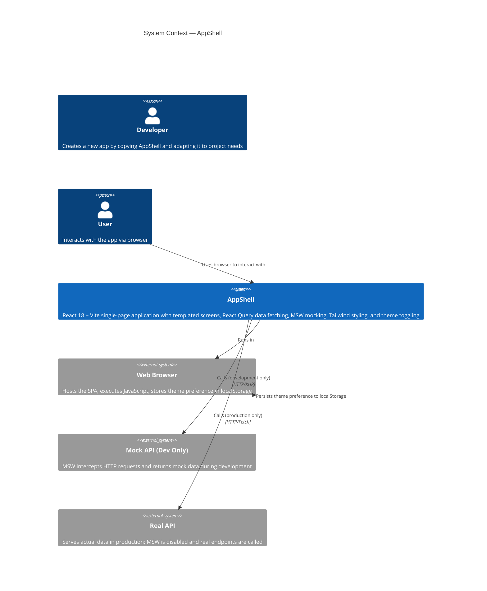

# System Context — AppShell

## Overview

AppShell is the reference skeleton for all React/Vite app projects in oneticket-core. It establishes a clean, reusable foundation that any new project can copy and adapt in minutes.

## Diagram

## Elements

### Person: Developer
A developer creating a new app project by copying `apps/appshell/app/` and adapting screens, hooks, and routes to project-specific needs.

### Person: User
An end user interacting with the deployed app via web browser.

### System: AppShell (This System)
A complete, production-grade React SPA providing:
- **Three built-in routes** (`/`, `/about`, `/help`)
- **Responsive layout** (Header + Outlet + Footer)
- **Theme switching** (light/dark mode with persistence)
- **Data fetching** via React Query + MSW
- **Component library** pre-configured with shadcn/ui
- **Type safety** via TypeScript strict mode
- **Development tools** (ESLint, Prettier, Vitest)

### External System: Web Browser
Executes AppShell JavaScript, renders UI, persists theme preference in localStorage. No backend involvement.

### External System: Mock API (Development Only)
Mock Service Worker (MSW) intercepts HTTP requests during development and returns mock data. Active only when `import.meta.env.DEV` is true.

### External System: Real API (Production Only)
Live backend API serving actual data in production. MSW is disabled, and real HTTP endpoints are called.

## Relationships

- **User ↔ AppShell:** User opens the app in a browser and interacts with UI components.
- **AppShell ↔ Browser:** AppShell runs as client-side JavaScript in the browser.
- **AppShell → Mock API:** During development, React Query sends requests to `/api/*` endpoints, which MSW intercepts.
- **AppShell → Real API:** In production, requests reach the real backend.
- **Browser ↔ localStorage:** AppShell persists theme preference using browser's localStorage.

## Key Assumptions

1. **Client-Side Only:** AppShell is a pure SPA. No server-side rendering or Node.js backend required.
2. **Static Hosting:** AppShell deploys to any static host (GitHub Pages, Vercel, Netlify, etc.).
3. **Dev/Prod Separation:** MSW is dev-only via `import.meta.env.DEV` guard. Production uses real API endpoints.
4. **Copy & Adapt Pattern:** New projects copy AppShell and customize it; AppShell itself is not modified for specific projects.

## Related Diagrams

- [Container Diagram](./containers.md) — Shows internal structure (screens, hooks, mocks, routing)
- [Components Diagram](./components.md) — Details UI component hierarchy (if needed)
