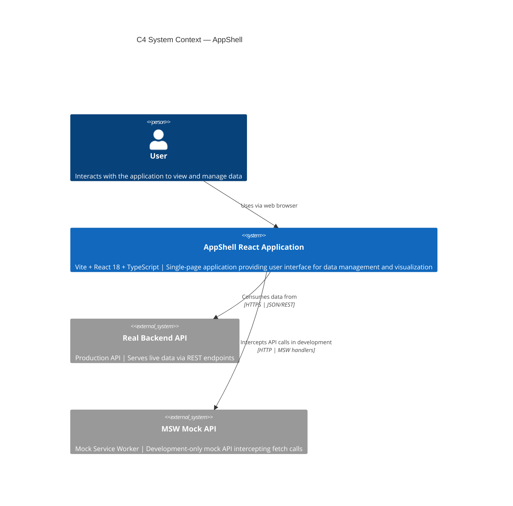

# C4 System Context — AppShell

## System Context Diagram



## Overview

AppShell is a reference single-page application (SPA) built with **Vite, React 18, and TypeScript**. It establishes architectural conventions for routing, data fetching, state management, and component organization.

### Key Elements

1. **User** — End user interacting with AppShell via web browser
2. **AppShell React Application** — The SPA itself, powered by:
   - **Vite** — Fast build tool and dev server
   - **React 18** — UI framework
   - **TypeScript** — Type-safe development
   - **React Router v6** — Client-side routing
   - **React Query** — Server state management and caching
   - **Zustand** — Optional cross-screen state
   - **React Hook Form + Zod** — Form handling and validation
   - **shadcn/ui** — UI component primitives
   - **Tailwind CSS** — Styling via design tokens

3. **Real Backend API** — Production API providing live data
   - Used in production deployments
   - All requests via HTTPS with JSON/REST protocol
   - Token-based authentication (JWT/Bearer)

4. **MSW Mock API** — Mock Service Worker intercepting fetch calls
   - Development-only (excluded from production bundle)
   - Allows full development without server dependencies
   - Enables concurrent frontend and backend development
   - Zero code changes required to switch from dev to prod

## Data Flow

```
User Browser Request
    ↓
AppShell (React Router matches route)
    ↓
Screen Component calls Custom Hook
    ↓
Hook uses @tanstack/react-query (useQuery)
    ↓
fetch('/api/endpoint')
    ↓
    ├─ Dev: MSW intercepts → returns mock data
    └─ Prod: Real API responds → returns live data
    ↓
React Query caches response
    ↓
Component re-renders with data
```

## Architecture Principles

1. **Exclusive File Ownership** — Each feature task owns exactly one file or directory
2. **Design Token Inheritance** — All styling via Tailwind and CSS custom properties
3. **MSW Development Parity** — Seamless dev/prod API switching without code changes
4. **React Query Caching** — Server state managed centrally; components are data-agnostic
5. **Lazy Layout** — AppLayout defined once, never modified by feature tasks
6. **Testable by Default** — All components, hooks, and screens testable in isolation

## Related Documentation

- [Architecture Details](../architecture.md) — Full technical design decisions
- [Container Diagram](./containers.md) — Application containers and internal systems
- [Component Diagram](./components.md) — Internal component structure (if applicable)
- [Deployment Diagram](./deployment.md) — Production infrastructure and deployment nodes
