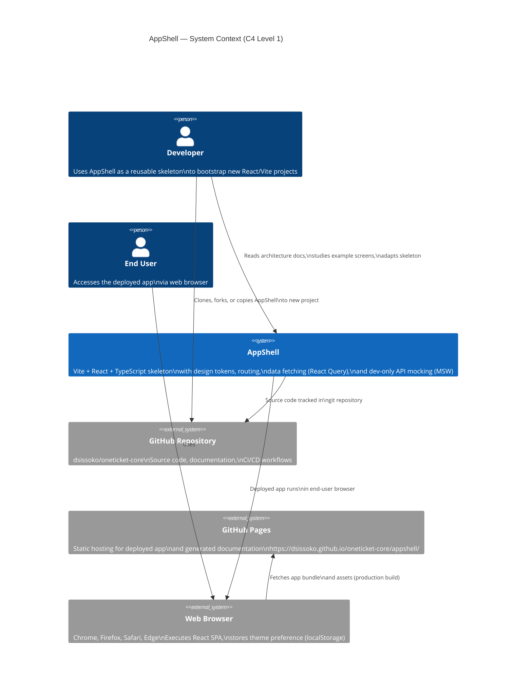

# AppShell — System Context (C4 Level 1)

## Overview

AppShell is a reference skeleton for building React + Vite single-page applications with a consistent design system, data-fetching patterns, and zero-merge-conflict parallel development.

This diagram shows AppShell as a software system and its interactions with external systems and human actors.

## System Context Diagram

## Key Interactions

### 1. Developer → AppShell
Developers use AppShell as a **copy-paste template** to bootstrap new React/Vite projects. They:
- Read the architecture documentation
- Study example screens (HomeScreen, AboutScreen, HelpScreen)
- Copy the skeleton structure
- Adapt components, hooks, and mock data for their specific domain

### 2. Developer → GitHub Repository
Developers access the source code to:
- Review the implementation
- Copy files to their own project
- Contribute improvements back to the template

### 3. AppShell → GitHub Repository
AppShell source code is version-controlled in GitHub. The repository includes:
- Application code (`apps/appshell/app/src/`)
- Architecture and design documentation
- CI/CD workflows for automated testing and deployment

### 4. AppShell → Web Browser
The production build of AppShell is deployed to the browser. In production:
- MSW (Mock Service Worker) is tree-shaken; no mock code runs
- Real API calls would go to a backend (not yet implemented in skeleton)
- React Query manages data caching and synchronization
- CSS variables and Tailwind tokens control styling

### 5. End User → Web Browser
End users access the deployed AppShell application running in their browser. They:
- View the home page (list of users from mock data)
- Navigate to About (learn about AppShell)
- Navigate to Help (see the reuse quickstart guide)
- Switch between light/dark themes (preference saved to localStorage)

### 6. Web Browser → GitHub Pages
The browser fetches the production build from GitHub Pages:
- Static assets (JS, CSS, HTML)
- No backend server required (currently)
- Fast CDN delivery

## Architectural Principles

| Principle | Implementation |
|---|---|
| **Single-Page Application** | Built with React 18, deployed as static HTML + JS + CSS |
| **Design Token Centralization** | CSS custom properties + Tailwind config ensure consistent styling |
| **Zero-Merge-Conflict Development** | Exclusive file ownership; parallel feature tasks don't overlap |
| **Minimal, Reusable Template** | AppShell is intentionally simple and unopinionated for easy adaptation |
| **Development Velocity** | Dev server (Vite), hot reload, React Query DevTools for debugging |
| **Production Safety** | MSW dev-only guarded by `import.meta.env.DEV`; zero runtime overhead in prod |

## Related Documentation

- **[Architecture](../architecture.md)** — Detailed technical decisions, file structure, and design patterns
- **[Container Diagram](./containers.md)** — Frontend layers and technical stack breakdown (C4 Level 2)
- **[Component Diagram](./components.md)** — React components, hooks, and their relationships (C4 Level 3)
- **[Deployment Diagram](./deployment.md)** — Infrastructure, GitHub Actions, and GitHub Pages (C4 Deployment)

---

**Status:** Complete (Task E — C4 System Context)  
**Last Updated:** 2026-05-29  
**Maintained By:** @architect
