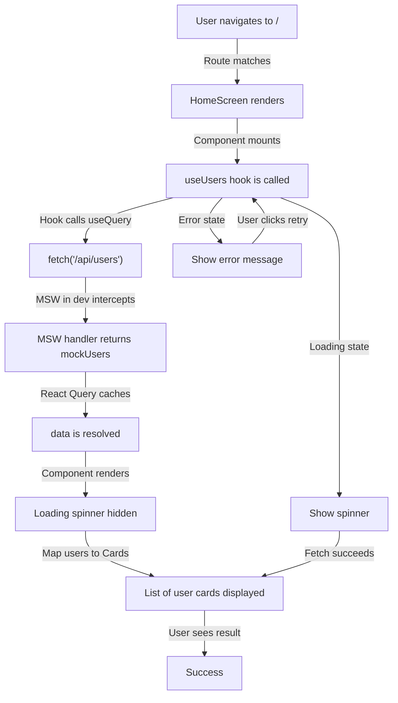

# US-003 — Implémenter les trois écrans d'exemple (HomeScreen, AboutScreen, HelpScreen)

## Story

En tant que développeur utilisant AppShell, je veux voir trois écrans d'exemple fonctionnels et complets pour comprendre comment structurer de nouvelles pages, intégrer la récupération de données (React Query + MSW), et naviguer entre les routes.

## Expected Behavior

### HomeScreen (`/`)
- Affiche une page d'accueil qui démontre l'intégration de React Query et MSW
- Appelle le hook personnalisé `useUsers()` pour récupérer une liste d'utilisateurs via `/api/users`
- Affiche un spinner de chargement pendant que les données se récupèrent
- Affiche un message d'erreur si la récupération échoue
- Affiche une liste d'utilisateurs en **Cards** (composant shadcn/ui `Card`)
  - Chaque card affiche : avatar (optionnel), nom, email
  - Les cards utilisent des classes Tailwind pour le styling
- Les données sont fournies par MSW en développement (mocks/data/users.ts)

### AboutScreen (`/about`)
- Affiche une description complète d'AppShell
- Explique la vision : skeleton réutilisable, modèle de propriété exclusive de fichiers, qualité de conception par contrainte
- Fournit des liens directs vers :
  - La documentation produit (`docs/what/product-spec.md`)
  - La documentation architecture (`docs/how/architecture.md`)
  - Le dépôt GitHub
- Utilise des composants shadcn/ui (Card, Button) pour la présentation
- Structuré de manière claire et lisible avec des paragraphes et des rubriques

### HelpScreen (`/help`)
- Affiche un guide complet en 7 étapes pour réutiliser AppShell
  - **Étape 1** : Copier `apps/appshell/app/` vers `apps/{project}/app/`
  - **Étape 2** : Mettre à jour `.env.example` avec le nom du projet
  - **Étape 3** : Adapter `tailwind.config.ts` avec les tokens spécifiques au projet
  - **Étape 4** : Personnaliser AboutScreen avec la description du projet
  - **Étape 5** : Personnaliser HelpScreen avec la documentation du projet
  - **Étape 6** : Mettre à jour les routes dans `App.tsx` pour les écrans du projet
  - **Étape 7** : Exécuter `npm install && npm run dev`
- Affiche un espace réservé (placeholder) pour un runbook détaillé
- Fournit des liens vers la documentation complète
- Utilise une liste ou une timeline pour les étapes

### Routes
- `/` → HomeScreen
- `/about` → AboutScreen
- `/help` → HelpScreen
- Toutes les routes sont centralisées dans `App.tsx`

## Acceptance Criteria

### HomeScreen
- [ ] Le composant `HomeScreen` existe dans `src/screens/HomeScreen.tsx`
- [ ] Appelle le hook `useUsers()` et gère les états loading/error/success
- [ ] Affiche un spinner (ex: "Chargement...") pendant le chargement
- [ ] Affiche un message d'erreur avec un bouton de retry si l'appel échoue
- [ ] Affiche une liste de cards avec les utilisateurs (minimum 3 utilisateurs dans les mocks)
- [ ] Les cards affichent avatar (optionnel), nom, email de chaque utilisateur
- [ ] Pas de styles inline ; uniquement des classes Tailwind
- [ ] TypeScript strict mode : pas de `any` types injustifiés
- [ ] Les mocks pour `GET /api/users` retournent une liste de 3-5 utilisateurs

### AboutScreen
- [ ] Le composant `AboutScreen` existe dans `src/screens/AboutScreen.tsx`
- [ ] Affiche une description d'AppShell en clair
- [ ] Explique le concept de skeleton réutilisable
- [ ] Explique le modèle de propriété exclusive de fichiers
- [ ] Fournit des liens vers product-spec.md
- [ ] Fournit des liens vers architecture.md
- [ ] Fournit un lien vers le dépôt GitHub
- [ ] Utilise des composants shadcn/ui (Card, Button) pour la structure
- [ ] Formatage clair avec titres et paragraphes
- [ ] Pas de styles inline

### HelpScreen
- [ ] Le composant `HelpScreen` existe dans `src/screens/HelpScreen.tsx`
- [ ] Affiche 7 étapes numérotées pour réutiliser AppShell
- [ ] Chaque étape est courte et actionnable
- [ ] Inclut un espace réservé pour un runbook complet
- [ ] Fournit des liens vers la documentation
- [ ] Format clair et lisible (liste ou timeline)
- [ ] Utilise des composants shadcn/ui
- [ ] Pas de styles inline

### Routing & Navigation
- [ ] La route `/` rend HomeScreen
- [ ] La route `/about` rend AboutScreen
- [ ] La route `/help` rend HelpScreen
- [ ] Toutes les routes sont définies dans `App.tsx` (aucune route définie dans les composants d'écran)
- [ ] La navigation fonctionne correctement via les liens du Header
- [ ] Les URLs correspondent exactement aux routes spécifiées

### Qualité de code
- [ ] Tous les fichiers compilent sans erreurs TypeScript
- [ ] Pas d'avertissements TypeScript dans les trois écrans
- [ ] Noms de composants et fichiers en PascalCase
- [ ] Code formaté selon prettier.config.js
- [ ] Pas de code mort ou commenté
- [ ] Fichiers uniques pour chaque écran (HomeScreen.tsx, AboutScreen.tsx, HelpScreen.tsx)

### Data Fetching (HomeScreen uniquement)
- [ ] Le hook `useUsers()` existe dans `src/hooks/useUsers.ts`
- [ ] Utilise `useQuery()` de @tanstack/react-query
- [ ] L'endpoint mocké est `GET /api/users`
- [ ] MSW intercept la requête en développement
- [ ] Les données retournées correspondent au schéma Zod (users.ts)
- [ ] Le hook retourne `{ data, isLoading, error, refetch }`

## Related Epic

[Epic 0 — AppShell Complete Skeleton Setup](../epic.md)

Cette user story est une sous-partie critique de l'epic-0-mvp. Elle délivre les trois écrans d'exemple qui démontrent les patterns clés : routing, data fetching avec React Query + MSW, et utilisation de composants shadcn/ui.

## Related Slices

À remplir par `@architect` après production des slices d'implémentation.

---

## Domain Analysis — AppShell Example Screens

### Actors
- **Developer using AppShell** — Learns how to build screens by reading example code
- **Project Lead** — Copies examples as templates for new projects
- **QA / Reviewer** — Validates that routes, theme, and data fetching work end-to-end

### Entities

| Entity | Key Attributes | Lifecycle States |
|--------|---------------|------------------|
| **User** | id, name, email, avatar | Fetched from MSW → Displayed in Card |
| **Screen** | path, title, content | Rendered at route, responds to navigation |
| **Route** | path, component | Registered in App.tsx, matches URL |
| **Hook (useUsers)** | queryKey, queryFn | Initializes on first render → Caches result → Refetches on demand |

### Relationships
- **Screen** renders in `<Outlet />` of AppLayout (established in task 0)
- **Route** maps path to **Screen** (centralized in App.tsx)
- **Screen** calls **Hook** to fetch data
- **Hook** calls MSW handler via `fetch('/api/users')`
- **MSW** intercepts `/api/users` and returns **User** list from mock data

### Business Rules

1. **One Screen per File** — HomeScreen, AboutScreen, HelpScreen are each in their own file (`screens/{Name}Screen.tsx`). No screen logic is split across multiple files.

2. **MSW is Dev-Only** — MSW is guarded by `import.meta.env.DEV` in main.tsx. In production, requests reach real endpoints.

3. **One Hook per Feature** — `useUsers()` is defined in `src/hooks/useUsers.ts`. One hook per file.

4. **Routes are Centralized** — All routes (including future ones) are defined in `App.tsx`. Screens do not define their own routes.

5. **File Ownership is Exclusive** — Each screen file is owned by exactly one task. No two parallel tasks modify the same screen file. HomeScreen, AboutScreen, HelpScreen can be implemented in parallel.

6. **Data Validation** — `useUsers()` validates API responses using Zod schema (`lib/schemas/users.ts`). Invalid data is rejected before rendering.

7. **No Inline Styles** — All styling is done via Tailwind classes. No `style` prop or inline CSS.

8. **TypeScript Strict Mode** — All code compiles with `strict: true`. No implicit `any` types.

### Process Flow (happy path)

### Gaps Identified

**None identified** — The request is precise and complete. The domain model (screens, routes, data fetching) aligns perfectly with the AppShell product specification and architecture documentation. All acceptance criteria are testable and measurable.

---

## Notes for Implementation

1. **HomeScreen Mock Data** — Use realistic user objects with avatar URLs (can be placeholder images like `https://i.pravatar.cc/...`).

2. **Error Handling** — Show a card with error message + "Retry" button that triggers `refetch()`.

3. **Loading State** — Simple spinner or "Chargement..." text is sufficient.

4. **About & Help Links** — AboutScreen and HelpScreen links should point to actual documentation files (use `window.open()` or links to GitHub).

5. **Styling** — Use design tokens from `tailwind.config.ts` for colors, spacing, typography. No custom CSS needed.

6. **Testing** — Optional but recommended: Write Vitest tests for HomeScreen (verify loading/error/success states) using MSW.
