# Components — Breakout Game

```mermaid
C4Component
  title Component Diagram — Breakout Game Physics and Collision

  Container(gameState, "Game State", "JavaScript", "Holds lives, bricks, ball, paddle, speed")

  Container_Boundary(physics_subsystem, "Physics Engine") {
    Component(ball_position_update, "Ball Position Update", "JavaScript", "Updates ball x, y each frame based on velocity")
    Component(wall_bounce, "Wall Bounce", "JavaScript", "Reverses vx on left/right boundary collision")
    Component(ceiling_bounce, "Ceiling Bounce", "JavaScript", "Reverses vy on top boundary collision")
    Component(paddle_bounce, "Paddle Bounce", "JavaScript", "Reverses vy and adjusts vx based on paddle hit location")
    Component(speed_multiplier, "Speed Multiplier", "JavaScript", "Applies slider-based magnitude multiplier to velocity")
  }

  Container_Boundary(collision_subsystem, "Collision Detector") {
    Component(brick_collision, "Brick Collision", "JavaScript", "Detects ball-brick contact and marks bricks destroyed")
    Component(boundary_collision, "Boundary Collision", "JavaScript", "Detects wall, ceiling, bottom boundary contacts")
    Component(paddle_collision, "Paddle Collision", "JavaScript", "Detects ball-paddle contact and calculates hit location")
  }

  Container_Boundary(input_subsystem, "Input Handler") {
    Component(keyboard_listener, "Keyboard Listener", "DOM Events", "Listens to keydown/keyup for arrow keys")
    Component(paddle_movement, "Paddle Movement", "JavaScript", "Updates paddle x position within bounds")
    Component(input_state, "Input State", "JavaScript", "Tracks which keys are currently pressed")
  }

  Container_Boundary(render_subsystem, "Renderer") {
    Component(canvas_clear, "Canvas Clear", "Canvas 2D", "Clears canvas each frame")
    Component(board_draw, "Board Draw", "Canvas 2D", "Draws game board background and boundaries")
    Component(ball_draw, "Ball Draw", "Canvas 2D", "Draws ball circle at current position")
    Component(paddle_draw, "Paddle Draw", "Canvas 2D", "Draws paddle rectangle at current x position")
    Component(brick_draw, "Brick Draw", "Canvas 2D", "Draws active bricks only")
    Component(ui_draw, "UI Draw", "Canvas 2D", "Draws lives counter, brick count, speed slider")
    Component(state_draw, "State Draw", "Canvas 2D", "Renders Menu, Win, Loss screens")
  }

  Container_Boundary(state_subsystem, "State Machine") {
    Component(state_tracker, "State Tracker", "JavaScript", "Holds current game state")
    Component(transition_validator, "Transition Validator", "JavaScript", "Validates allowed state changes")
    Component(condition_checker, "Condition Checker", "JavaScript", "Checks win/loss conditions each frame")
  }

  Rel(gameState, ball_position_update, "Reads ball, writes updated position")
  Rel(gameState, wall_bounce, "Reads bounds, writes velocity")
  Rel(gameState, ceiling_bounce, "Reads bounds, writes velocity")
  Rel(gameState, paddle_bounce, "Reads paddle, writes velocity")
  Rel(gameState, speed_multiplier, "Reads speed slider, normalizes velocity")
  Rel(gameState, brick_collision, "Reads bricks, ball; writes destroyed state")
  Rel(gameState, boundary_collision, "Reads bounds, ball; flags out-of-bounds")
  Rel(gameState, paddle_collision, "Reads paddle, ball; detects contact")
  Rel(gameState, paddle_movement, "Reads input state, writes paddle x")
  Rel(gameState, paddle_draw, "Reads paddle position")
  Rel(gameState, ball_draw, "Reads ball position")
  Rel(gameState, brick_draw, "Reads bricks array")
  Rel(gameState, ui_draw, "Reads lives, brick count, speed")
  Rel(gameState, condition_checker, "Reads lives, brick count; detects win/loss")
  Rel(keyboard_listener, input_state, "Updates key pressed state")
  Rel(input_state, paddle_movement, "Provides input to movement logic")
```



## Component Detail

### Physics Engine

#### Ball Position Update
- **Technology**: JavaScript
- **Responsibility**: Update ball position each frame
- **Algorithm**: `x += vx; y += vy`
- **Dependencies**: Game State (ball object)
- **Triggers**: Wall Bounce, Ceiling Bounce, Paddle Bounce on collision detection

#### Wall Bounce (Left/Right)
- **Technology**: JavaScript
- **Responsibility**: Handle ball collision with left or right boundary
- **Algorithm**: Reverse `vx` when `x < radius` or `x > canvas_width - radius`
- **Input**: Bounds, ball position/velocity
- **Output**: Updated ball velocity

#### Ceiling Bounce (Top)
- **Technology**: JavaScript
- **Responsibility**: Handle ball collision with top boundary
- **Algorithm**: Reverse `vy` when `y < radius`
- **Input**: Bounds, ball position/velocity
- **Output**: Updated ball velocity

#### Paddle Bounce
- **Technology**: JavaScript
- **Responsibility**: Handle ball collision with paddle and apply angle adjustment
- **Algorithm**:
  - Reverse `vy`
  - Calculate hit location: `hitOffset = ball.x - paddle.x`
  - Adjust `vx` based on hit location:
    - Left third: deflect left (max negative vx)
    - Center third: minimal change (vx ≈ 0)
    - Right third: deflect right (max positive vx)
- **Input**: Ball position/velocity, paddle position/width
- **Output**: Updated ball velocity

#### Speed Multiplier
- **Technology**: JavaScript
- **Responsibility**: Apply speed slider to ball velocity magnitude
- **Algorithm**:
  1. Get speed multiplier from slider (0.5x to 3x)
  2. Calculate current velocity magnitude: `magnitude = sqrt(vx² + vy²)`
  3. Calculate angle: `angle = atan2(vy, vx)`
  4. Apply new magnitude: `vx = newMagnitude * cos(angle)`, `vy = newMagnitude * sin(angle)`
- **Input**: Slider value (0–100), current ball velocity
- **Output**: Updated ball velocity with new magnitude

### Collision Detector

#### Brick Collision
- **Technology**: JavaScript (Axis-Aligned Bounding Box)
- **Responsibility**: Detect ball-brick contact
- **Algorithm**: Check if ball bounding box overlaps any active brick bounding box
- **Output**: Brick index if collision detected, null otherwise
- **Side Effect**: Mark brick as destroyed, flag collision for ball bounce

#### Boundary Collision
- **Technology**: JavaScript
- **Responsibility**: Detect ball contact with walls and ceiling
- **Algorithm**: 
  - Left wall: `ball.x - radius < 0`
  - Right wall: `ball.x + radius > canvas_width`
  - Ceiling: `ball.y - radius < 0`
- **Output**: Boundary type and collision point

#### Paddle Collision
- **Technology**: JavaScript (AABB)
- **Responsibility**: Detect ball-paddle contact and hit location
- **Algorithm**: Check if ball bounding box overlaps paddle bounding box
- **Output**: Hit location percentage (0–1, where 0 = left edge, 1 = right edge)
- **Used by**: Paddle Bounce component to calculate deflection angle

### Input Handler

#### Keyboard Listener
- **Technology**: DOM Event API (keydown, keyup)
- **Responsibility**: Capture keyboard input
- **Events Handled**: `keydown` and `keyup` for ArrowLeft, ArrowRight
- **Output**: Updates Input State

#### Paddle Movement
- **Technology**: JavaScript
- **Responsibility**: Update paddle position based on input
- **Algorithm**:
  - If left arrow pressed: `paddle.x -= paddleSpeed`
  - If right arrow pressed: `paddle.x += paddleSpeed`
  - Clamp to bounds: `paddle.x = clamp(paddle.x, 0, canvas_width - paddle.width)`
- **Input**: Input State (which keys pressed), paddle position, canvas bounds
- **Output**: Updated paddle position

#### Input State
- **Technology**: JavaScript Object
- **Responsibility**: Maintain current keyboard state
- **Data**: `{ leftPressed: boolean, rightPressed: boolean }`
- **Scope**: Valid only when game is in Active state

### Renderer

#### Canvas Clear
- **Technology**: Canvas 2D API
- **Responsibility**: Clear entire canvas for next frame
- **Operation**: `ctx.fillStyle = bgColor; ctx.fillRect(0, 0, width, height)`

#### Board Draw
- **Technology**: Canvas 2D API
- **Responsibility**: Draw game board background and boundaries
- **Elements**: Background fill, boundary lines (optional)

#### Ball Draw
- **Technology**: Canvas 2D API
- **Responsibility**: Draw ball circle at current position
- **Operation**: `ctx.beginPath(); ctx.arc(ball.x, ball.y, ball.radius, 0, 2π); ctx.fill()`

#### Paddle Draw
- **Technology**: Canvas 2D API
- **Responsibility**: Draw paddle rectangle at current x position
- **Operation**: `ctx.fillRect(paddle.x, paddle.y, paddle.width, paddle.height)`

#### Brick Draw
- **Technology**: Canvas 2D API
- **Responsibility**: Draw all active (non-destroyed) bricks
- **Loop**: Iterate over brick array, skip destroyed bricks
- **Operation**: `ctx.fillRect(brick.x, brick.y, brick.width, brick.height)` for each active brick

#### UI Draw
- **Technology**: Canvas 2D API + Text Rendering
- **Responsibility**: Draw on-screen UI elements
- **Elements**:
  - Lives counter: `Lives: 3`
  - Brick count: `Bricks: 35`
  - Speed slider: Visual slider control with label

#### State Draw
- **Technology**: Canvas 2D API + Text Rendering
- **Responsibility**: Render state-specific screens
- **Menu State**: Title, "Start Game" button, speed slider
- **Active State**: (no overlay; game board visible)
- **Win State**: "You Won!" message, "Play Again" button
- **Loss State**: "Game Over" message, "Try Again" button

### State Machine

#### State Tracker
- **Technology**: JavaScript
- **Responsibility**: Hold current game state
- **States**: `Menu`, `Active`, `Pause`, `Win`, `Loss`
- **Operations**: Get current state, set state (with validation)

#### Transition Validator
- **Technology**: JavaScript
- **Responsibility**: Enforce allowed state transitions
- **Allowed Transitions**:
  - `Menu` → `Active` (start button clicked)
  - `Active` → `Pause` (spacebar or button)
  - `Pause` → `Active` (resume)
  - `Pause` → `Menu` (quit to menu)
  - `Active` → `Win` (all bricks destroyed)
  - `Active` → `Loss` (lives = 0)
  - `Win` → `Menu` (play again)
  - `Loss` → `Menu` (try again)

#### Condition Checker
- **Technology**: JavaScript
- **Responsibility**: Check game ending conditions each frame
- **Win Condition**: `brickCount === 0`
- **Loss Condition**: `lives === 0`
- **Executes**: Automatic state transition if condition met

## Component Interactions

### Frame Update Sequence
```
1. Input Handler (keyboard listener) → Input State updated
2. Paddle Movement → Paddle x updated from input
3. Ball Position Update → Ball x, y updated from velocity
4. Boundary Collision → Detects wall/ceiling/bottom contact
5. Paddle Collision → Detects paddle contact
6. Brick Collision → Detects brick contact
7. Wall/Ceiling/Paddle Bounce → Ball velocity reversed/adjusted
8. Speed Multiplier → Ball velocity magnitude adjusted (if slider changed)
9. Condition Checker → Win/loss conditions evaluated
10. State Tracker → State transition if needed
11. Canvas Clear → Canvas cleared
12. Board/Ball/Paddle/Brick/UI/State Draw → All elements rendered
```

### State Transition Sequence (Menu → Active)
```
1. Player clicks "Start Game" button
2. Game Engine triggers: gameState.mode = "Active"
3. State Tracker updates: currentState = "Active"
4. Game loop (requestAnimFrame) starts or resumes
5. Input Handler begins listening to keyboard
6. Physics Engine begins moving ball
7. Renderer draws active game board
```

## Related Documentation

See [Architecture](../architecture.md) for high-level design and [Containers](containers.md) for component relationships.
