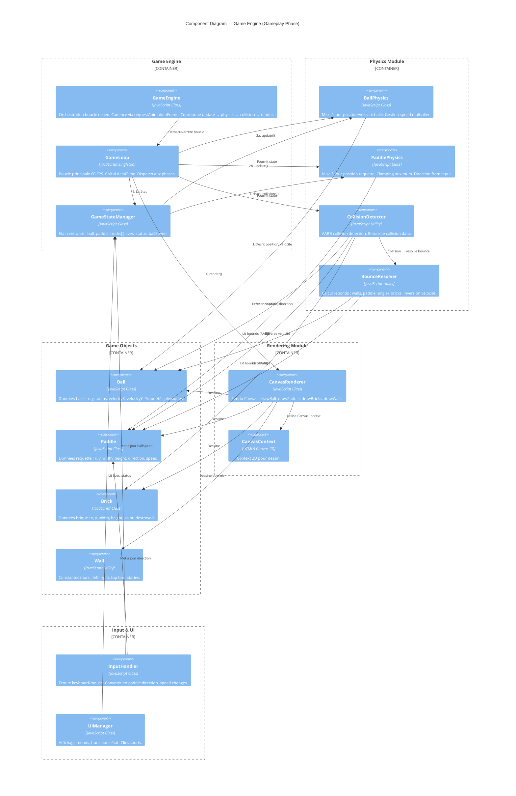

# Components — Game Engine Container

## Overview

Diagramme des composants C4 du **Game Engine Container** — décomposition interne en classes et modules.



## Composants détaillés

### Game Engine Core

#### GameEngine
**Responsabilité** : Orchestration principale de la boucle de jeu

**Interface** :
```javascript
class GameEngine {
  constructor(canvas, gameState)
  
  start()           // Lance requestAnimationFrame
  pause()           // Met en pause (stop gameLoop)
  resume()          // Reprend (restart gameLoop)
  
  update(deltaTime) // Phase de mise à jour
  render()          // Phase de rendu
  
  reset()           // Réinitialise tout
  onCollision(collision) // Traite collisions
}
```

**Dépendances** : GameLoop, GameStateManager, Physics, Renderer

#### GameLoop
**Responsabilité** : Boucle de jeu cadencée

**Interface** :
```javascript
const GameLoop = {
  start(callback)   // Démarre requestAnimationFrame
  stop()            // Arrête
  getPreviousTime() // Dernier timestamp
  getDeltaTime()    // Temps écoulé depuis frame précédente
}
```

#### GameStateManager
**Responsabilité** : Source unique de vérité pour l'état du jeu

**Interface** :
```javascript
class GameState {
  // Entities
  ball: Ball
  paddle: Paddle
  bricks: Brick[]
  
  // Game control
  lives: number
  status: 'menu' | 'speedControl' | 'playing' | 'won' | 'lost'
  ballSpeed: number // 0.5 à 2.0 multiplicateur
  
  // Methods
  reset()
  resetBall(x, y)
  loseLife()        // lives--
  destroyBrick(index)
  isGameWon()       // bricks.length === 0
  isGameLost()      // lives === 0
}
```

### Physics Module

#### BallPhysics
**Responsabilité** : Simulation mouvement balle

**Interface** :
```javascript
class BallPhysics {
  static updatePosition(ball, deltaTime) {
    // ball.x += ball.velocityX * deltaTime * ball.speed
    // ball.y += ball.velocityY * deltaTime * ball.speed
  }
  
  static isOutOfBounds(ball, playfield) {
    // Retourne true si ball.y > playfield.bottom
  }
}
```

#### PaddlePhysics
**Responsabilité** : Simulation mouvement raquette

**Interface** :
```javascript
class PaddlePhysics {
  static updatePosition(paddle, deltaTime, playfield) {
    // Applique direction (1, 0, -1)
    // Clamp à playfield.left et playfield.right
  }
}
```

#### CollisionDetector
**Responsabilité** : Détection des collisions AABB

**Interface** :
```javascript
class CollisionDetector {
  static checkBallCollisions(ball, paddle, bricks, walls) {
    // Retourne { type, target, data }
  }
  
  static isRectColliding(rect1, rect2) {
    // AABB collision test
  }
  
  static getBallBounds(ball) {
    // Retourne { x, y, width, height } pour AABB
  }
}
```

#### BounceResolver
**Responsabilité** : Calcul des rebonds et direction post-collision

**Interface** :
```javascript
class BounceResolver {
  static reflectOnWall(ball, wall) {
    // Inverse velocityX ou velocityY selon le mur
  }
  
  static reflectOnPaddle(ball, paddle) {
    // Calcul angle selon position contact sur raquette
    // Rebond vers le haut + angle (gauche/centre/droite)
  }
  
  static reflectOnBrick(ball) {
    // Inversion simple (vertical ou horizontal selon arête)
  }
}
```

### Game Objects

#### Ball
**Responsabilité** : Représentation de la balle

**Interface** :
```javascript
class Ball {
  constructor(x, y, radius, velocityX, velocityY, speed = 1.0)
  
  x: number
  y: number
  radius: number
  velocityX: number
  velocityY: number
  speed: number // Multiplicateur
  
  getBounds() // AABB pour collisions
  reset(x, y)
}
```

#### Paddle
**Responsabilité** : Représentation de la raquette

**Interface** :
```javascript
class Paddle {
  constructor(x, y, width, height, speed = 300)
  
  x: number
  y: number
  width: number
  height: number
  speed: number      // px/s
  direction: -1|0|1  // -1: left, 0: stop, 1: right
  
  getBounds() // AABB pour collisions
  clamp(minX, maxX)
  moveLeft()
  moveRight()
  stop()
}
```

#### Brick
**Responsabilité** : Représentation d'une brique

**Interface** :
```javascript
class Brick {
  constructor(x, y, width, height, color = '#FF0000')
  
  x: number
  y: number
  width: number
  height: number
  color: string
  destroyed: boolean
  
  getBounds() // AABB pour collisions
  destroy()
  isDestroyed()
}
```

#### Wall
**Responsabilité** : Définition des limites du playfield

**Interface** :
```javascript
const Wall = {
  LEFT: 0,
  RIGHT: 800,      // Largeur canvas
  TOP: 0,
  BOTTOM: 600,     // Hauteur canvas
  PADDLE_BOTTOM: 550
}
```

### Rendering Module

#### CanvasRenderer
**Responsabilité** : Rendu graphique 2D

**Interface** :
```javascript
class CanvasRenderer {
  constructor(canvas)
  
  render(gameState) {
    // Effacement canvas
    // Dessin walls, bricks, paddle, ball
  }
  
  drawBall(ball)
  drawPaddle(paddle)
  drawBricks(bricks)
  drawWalls()
  drawLives(lives) // Optionnel, peut être dans UI
  
  clear()
}
```

### Input & UI

#### InputHandler
**Responsabilité** : Capture et conversion des entrées

**Interface** :
```javascript
class InputHandler {
  constructor(gameState)
  
  onKeyDown(event)    // Capture flèches
  onKeyUp(event)      // Fin saisie
  onMouseClick(event) // Boutons, slider
  
  getPaddleDirection() // -1, 0, 1
}
```

#### UIManager
**Responsabilité** : Gestion de l'affichage des menus

**Interface** :
```javascript
class UIManager {
  constructor(gameState)
  
  showMainMenu()
  showSpeedControl()
  showWinScreen()
  showLoseScreen()
  hideAllMenus()
  
  updateLivesDisplay(lives)
  updateSpeedSlider(value)
}
```

## Flux de données à chaque frame

```
Frame start
  │
  ├─ DeltaTime = currentTime - lastTime
  │
  ├─ Input Handler
  │  └─ Read keyboard/mouse
  │     └─ Update GameState (paddle.direction, ballSpeed)
  │
  ├─ Ball Physics
  │  └─ ball.x += ball.velocityX * deltaTime * ball.speed
  │  └─ ball.y += ball.velocityY * deltaTime * ball.speed
  │
  ├─ Paddle Physics
  │  └─ paddle.x += paddle.direction * paddle.speed * deltaTime
  │  └─ paddle.x = clamp(paddle.x, 0, canvasWidth - paddleWidth)
  │
  ├─ Collision Detection
  │  ├─ Check Ball vs Walls
  │  ├─ Check Ball vs Paddle
  │  ├─ Check Ball vs Bricks
  │  └─ Check Ball vs BottomBoundary (lose life)
  │
  ├─ Bounce Resolution
  │  └─ For each collision:
  │     ├─ Reverse velocities
  │     ├─ Update GameState (lives, bricks destroyed)
  │     └─ If win/loss: transition state
  │
  ├─ Renderer
  │  ├─ Clear canvas
  │  ├─ Draw walls
  │  ├─ Draw bricks
  │  ├─ Draw paddle
  │  ├─ Draw ball
  │  └─ Flush to screen
  │
  └─ lastTime = currentTime
```

## Testing Strategy

Chaque composant peut être testé indépendamment :

| Composant | Test Type | Exemple |
|-----------|-----------|---------|
| BallPhysics | Unit | updatePosition → position change |
| PaddlePhysics | Unit | moveLeft → x decreases |
| CollisionDetector | Unit | isRectColliding → true/false |
| BounceResolver | Unit | reflectOnWall → velocity inverted |
| GameStateManager | Unit | loseLife → lives-- |
| CanvasRenderer | Integration | render → canvas modified |
| GameEngine | Integration | Full game loop → gameplay |
