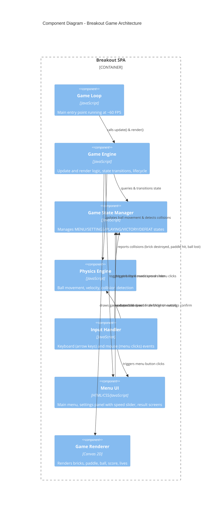
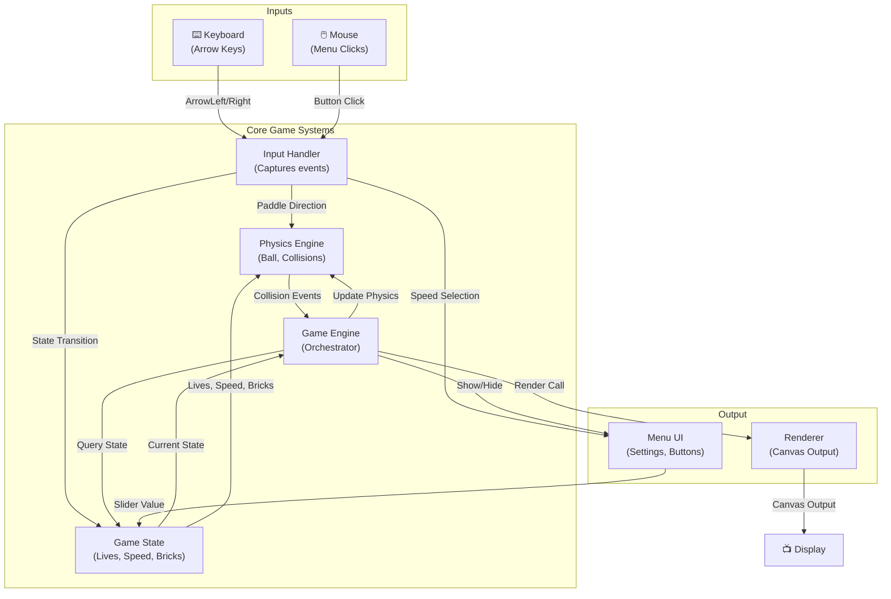

# Breakout — C4 Components Diagram

## Overview

This component diagram decomposes the core modules and subsystems of the Breakout game engine. It shows how the Game Engine, Physics Engine, Input Handler, Menu UI, and Game State Manager interact within the Single-Page Application container.

## Component Diagram



## Component Responsibilities

### Game Loop
- **Purpose**: Main entry point of the application
- **Responsibility**: Orchestrates the game tick at ~60 FPS using `requestAnimationFrame`
- **Frequency**: Runs every frame (~16.7ms at 60 FPS)
- **Calls**: `gameEngine.update(deltaTime)` → `gameEngine.render(canvas)`

### Game Engine
- **Purpose**: Central orchestrator of all game systems
- **Responsibilities**:
  - Manages state transitions (MENU → SETTINGS → PLAYING → VICTORY/DEFEAT)
  - Coordinates physics updates, collision checks, and renderer calls
  - Handles game lifecycle: setup, reset, end-game conditions
  - Checks win/lose conditions (bricks destroyed = victory, lives exhausted = defeat)
  - Resets ball position when it reaches the bottom

### Game State Manager
- **Purpose**: Single source of truth for game state
- **Maintains**:
  - Current state (MENU, SETTINGS, PLAYING, VICTORY, DEFEAT)
  - Lives remaining (3 → 0)
  - Ball speed setting (from slider)
  - List of active bricks
  - Ball position and velocity
  - Paddle position
  - Score (optional V1)

### Physics Engine
- **Purpose**: Simulates ball movement and collision detection
- **Responsibilities**:
  - **Ball Movement**: Updates ball position based on velocity and deltaTime
  - **Boundary Collisions**: Detects and handles bounces on left/right walls and ceiling
  - **Paddle Collision**: Detects ball-paddle contact, reverses ball direction
  - **Brick Collision**: Detects ball-brick contact, flags brick for destruction, reverses ball direction
  - **Bottom Detection**: Detects when ball reaches the bottom (y > canvas.height), signals life loss
- **Returns**: List of collisions (type, actor involved)

### Input Handler
- **Purpose**: Captures and translates user input
- **Listens to**:
  - Keyboard: `ArrowLeft`, `ArrowRight` (game controls)
  - Mouse: Click events on menu buttons
- **Maintains**: Current paddle direction state (LEFT, NEUTRAL, RIGHT)
- **Triggers**:
  - State transitions on menu button clicks
  - Paddle movement signals during gameplay
  - Slider value changes in settings

### Menu UI
- **Purpose**: Renders all non-game screens and controls
- **Components**:
  - **Main Menu Screen**: "Start Game", "Settings", "Quit" buttons
  - **Settings Panel**: Speed slider (Very Slow → Very Fast)
  - **Victory Screen**: "Replay", "Quit" buttons
  - **Defeat/Game Over Screen**: "Replay", "Quit" buttons
- **Interactions**:
  - Shows/hides based on game state
  - Exposes speed slider value to Game State Manager
  - Emits click events to Input Handler

### Game Renderer
- **Purpose**: Visual output to the player
- **Renders**:
  - **Game Area**: Canvas background (typically dark)
  - **Bricks**: 5 rows of destructible bricks (colored rectangles)
  - **Paddle**: Bottom-center horizontal bar (white/colored rectangle)
  - **Ball**: Small circle, position relative to physics state
  - **HUD**: Lives counter (top-left), current speed indicator
  - **Overlays**: State-specific overlays (pause, victory, defeat text)

## Data Flow Diagram



## Interfaces

### Game Engine
```javascript
// Core game loop interface
interface IGameEngine {
  update(deltaTime: number): void;          // Called every frame
  render(canvas: HTMLCanvasElement): void;  // Render current state
  reset(): void;                            // Reset game after victory/defeat
}
```

### Physics Engine
```javascript
interface IPhysicsEngine {
  updateBall(deltaTime: number): void;      // Update ball position
  detectCollisions(): Collision[];          // Return all collisions this frame
  reset(): void;                            // Reset ball and paddle positions
}

type Collision = {
  type: 'wall' | 'paddle' | 'brick' | 'bottom';
  brickIndex?: number;  // Only if type === 'brick'
}
```

### Game State Manager
```javascript
interface IGameStateManager {
  getState(): GameState;                    // Current game state
  setState(state: GameState): void;         // Transition state
  getLives(): number;                       // Remaining lives
  setLives(lives: number): void;
  getBallSpeed(): number;                   // Current ball speed
  setBallSpeed(speed: number): void;
  reset(): void;                            // Full reset
}

type GameState = 'MENU' | 'SETTINGS' | 'PLAYING' | 'VICTORY' | 'DEFEAT';
```

### Input Handler
```javascript
interface IInputHandler {
  onKeyDown(key: string): void;
  onKeyUp(key: string): void;
  onMouseClick(x: number, y: number): void;
  getPaddleDirection(): 'LEFT' | 'NEUTRAL' | 'RIGHT';
}
```

### Menu UI
```javascript
interface IMenuUI {
  show(screen: 'MAIN' | 'SETTINGS' | 'RESULT'): void;
  hide(): void;
  getSpeedSliderValue(): number;            // 0.5 to 2.0
  on(event: 'startClick' | 'settingsClick' | 'playClick' | 'replayClick' | 'quitClick', callback: Function): void;
}
```

### Game Renderer
```javascript
interface IGameRenderer {
  render(state: GameState, gameData: GameData): void;  // Full render
}

type GameData = {
  bricks: Brick[];
  ball: Ball;
  paddle: Paddle;
  lives: number;
  speed: number;
}
```

## Key Interactions

### 1. Game Start (MENU → SETTINGS → PLAYING)
```
Player clicks "Start Game"
  → Input Handler triggers 'startClick' event
  → Game State transitions to SETTINGS
  → Menu UI shows Settings panel with speed slider

Player adjusts speed slider and clicks "Play"
  → Menu UI reads slider value, updates Game State
  → Game State transitions to PLAYING
  → Menu UI hides
  → Game Loop begins rendering canvas
```

### 2. Gameplay (Ball Physics & Collision)
```
Game Loop (60 FPS)
  → Physics Engine: updateBall(deltaTime)
    - Update ball position: x += vx * deltaTime, y += vy * deltaTime
  → Physics Engine: detectCollisions()
    - Check ball vs walls, ceiling, paddle, bricks, bottom
    - Return collision list
  → Game Engine: processCollisions(collisions)
    - For each collision:
      - If brick: remove brick from state, reverse ball
      - If paddle: reverse ball
      - If wall/ceiling: reverse ball velocity component
      - If bottom: decrement lives, reset ball position
  → Game Engine: render(canvas)
    - Renderer draws all entities to canvas
```

### 3. Game End Conditions
```
Victory: All bricks destroyed
  → Game Engine detects bricks.length === 0
  → Game State transitions to VICTORY
  → Menu UI shows Victory screen

Defeat: Lives exhausted
  → Game Engine detects lives === 0
  → Game State transitions to DEFEAT
  → Menu UI shows Game Over screen
```

## Performance Considerations

- **Frame Budget**: ~16.7ms per frame at 60 FPS
- **Physics Updates**: Lightweight (ball position update, rectangle intersection tests)
- **Collision Detection**: O(bricks.length) per frame
- **Canvas Rendering**: Full screen redraw required each frame
- **Optimization**: Use `requestAnimationFrame` for synchronized timing, clear canvas efficiently

## Error Handling

- **Invalid State Transitions**: Prevent invalid state changes (e.g., MENU → PLAYING without SETTINGS)
- **Boundary Conditions**: Handle ball escaping canvas boundaries gracefully
- **Paddle Bounds**: Constrain paddle to canvas width
- **Division by Zero**: Avoid in velocity calculations
- **No try-catch required**: Input validation happens at component boundaries

## Testing Strategy

- **Unit Tests**: Physics engine collision detection, state transitions
- **Integration Tests**: Game loop orchestration, state propagation
- **Manual Tests**: Gameplay feel, paddle controls, collision behavior, menu navigation
