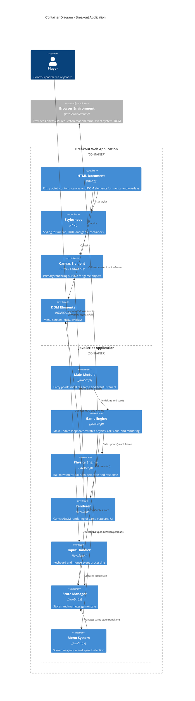

# Container Diagram — Breakout Game

## Overview

This diagram shows the internal containers (deployable units and functional modules) of the Breakout application and how they interact.

## C4 Container Diagram



## Container Descriptions

### HTML Document
- Entry point for the application
- Contains `<canvas>` element for primary rendering
- Contains hidden DOM elements for menu screens and overlays
- Links to CSS stylesheet and JavaScript modules

### Stylesheet (CSS)
- Styles menu screens (speed selector, title, win/lose screens)
- Styles HUD elements (lives counter, brick count)
- Defines color scheme and layout for non-canvas elements

### JavaScript Application Modules

#### Main Module (`main.js`)
- Boots the application on page load
- Initializes Game Engine with initial state
- Sets up event listeners for keyboard/mouse
- Starts the main game loop

#### Game Engine (`gameEngine.js`)
- **Orchestrator** of the game loop
- Calls `update()` each frame (via requestAnimationFrame)
- Calls `physics.update()` to move objects and detect collisions
- Checks win/lose conditions
- Calls `renderer.render()` to display state
- Manages state transitions (menu → playing → won/lost)

#### Physics Engine (`physics.js`)
- Updates ball position based on velocity and elapsed time
- Performs collision detection (AABB against paddle, bricks, walls)
- Applies collision response (bounce/deflection)
- Detects out-of-bounds conditions (lost life)
- **Does not modify state directly**; returns collision info to Game Engine

#### Renderer (`renderer.js`)
- Reads game state (ball position, paddle, bricks, lives, gameState)
- Draws to Canvas: game objects (rectangles, circles)
- Updates DOM elements: HUD (lives, brick count), menu overlays
- Manages visual screen states (title, menu, gameplay, win, lose)

#### Input Handler (`input.js`)
- Listens to `keydown` and `keyup` events
- Maintains key press state in memory
- Provides current input (paddle direction) to Game Engine
- Handles menu navigation (arrow keys, Enter for selection)
- Provides mouse click coordinates for menu buttons

#### State Manager (`state.js`)
- **Single source of truth** for game state
- Stores: gameState, lives, speedLevel, speedMultiplier, paddle position, ball position, brick array
- Provides `getState()` and `setState(updates)` methods
- Handles state initialization and resets
- Ensures all state changes flow through this container

#### Menu System (`menu.js`)
- Manages screen transitions (title → speed menu → game → win/lose → menu)
- Handles speed level selection (0-4, corresponding to 0.5x, 0.75x, 1.0x, 1.5x, 2.0x)
- Provides UI elements for speed slider or buttons
- Communicates selected speed to State Manager

### Canvas Element
- Primary rendering target for game objects
- Provides 2D drawing context via Canvas API
- Cleared and redrawn each frame by Renderer

### DOM Elements
- Container divs for menu screens (initially hidden)
- HUD elements: lives counter, brick count display
- Overlay screens: title, speed menu, win screen, lose screen

## Data Flow

### Per-Frame Cycle

```
1. requestAnimationFrame callback (Game Engine)
   ↓
2. Input Handler → State Manager (update input state)
   ↓
3. Game Engine → Physics Engine (update positions, detect collisions)
   ↓
4. Physics Engine → State Manager (write new positions and state changes)
   ↓
5. Game Engine → Check Win/Lose Conditions
   ↓
6. Game Engine → State Manager (update gameState if needed)
   ↓
7. Game Engine → Renderer (render current state)
   ↓
8. Renderer → Canvas + DOM (draw/update visual elements)
```

### Menu Navigation Flow

```
1. Player clicks speed level or presses arrow keys
   ↓
2. Input Handler captures event
   ↓
3. Menu System processes selection
   ↓
4. Menu System → State Manager (update speedLevel and speedMultiplier)
   ↓
5. Menu System → State Manager (set gameState = "playing")
   ↓
6. Game Engine detects state change
   ↓
7. Game loop begins rendering gameplay
```

## Deployment Unit

All containers are deployed as a **single static artifact**:
- `index.html` (HTML + inline CSS or linked CSS)
- `src/main.js` or bundled JavaScript (all modules concatenated or imported via ES6 `<script type="module">`)
- `src/styles.css`

**No build step required** for MVP (pure vanilla JS). Future versions could use a bundler for optimization.

## Rationale

- **Canvas-centric rendering** enables 60 FPS performance on high-end and mid-range devices
- **Modular JavaScript** separates concerns and improves testability
- **State Manager as central hub** reduces coupling and simplifies debugging
- **No external dependencies** eliminates version conflicts and build complexity
- **Single HTML/CSS/JS file** simplifies deployment to static hosting
