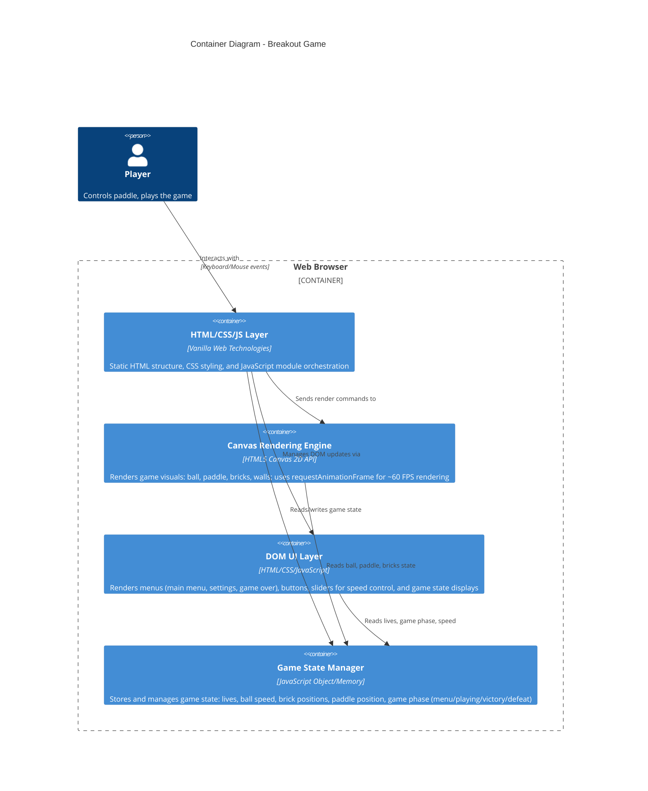

# C4 Container Diagram — Breakout

## Overview

This diagram decomposes the Breakout game system into its core containers. The application is a **single-page frontend application** (SPA) running entirely in the browser, with no backend dependencies.

## Diagram



## Container Descriptions

### 1. HTML/CSS/JS Layer
**Technology**: Vanilla Web Technologies (ES6+ JavaScript, HTML5, CSS3)

**Responsibility**:
- Main application orchestrator
- Event listener attachment (keyboard, mouse)
- Game loop management via `requestAnimationFrame`
- Input processing → state updates → rendering pipeline

**Key Interfaces**:
- `gameLoop(timestamp)` - Main update cycle
- `handleKeyDown(event)`, `handleKeyUp(event)` - Keyboard input
- `handleMouseClick(x, y)` - Menu interaction

### 2. Canvas Rendering Engine
**Technology**: HTML5 Canvas 2D API

**Responsibility**:
- Render game graphics at ~60 FPS
- Draw ball, paddle, bricks, walls
- Apply transformations and animations
- Optimize for performance (clear canvas, batch draws)

**Key Interfaces**:
- `render(canvas, gameState)` - Draw current frame
- `clearCanvas(canvas)` - Reset canvas
- `drawBall(canvas, ball)`, `drawPaddle(canvas, paddle)`, `drawBricks(canvas, bricks)`, `drawWalls(canvas)` - Element rendering

### 3. DOM UI Layer
**Technology**: HTML/CSS/JavaScript

**Responsibility**:
- Render static menus (main, settings, game over)
- Display interactive elements (buttons, speed slider)
- Show game stats (lives, ball speed)
- Manage visibility based on game phase

**Key Interfaces**:
- `showMenu(menuType)` - Display a specific menu
- `hideMenu(menuType)` - Hide a menu
- `updateLivesDisplay(lives)` - Update lives counter
- `getSpeedSliderValue()` - Read user speed selection
- `onStartButtonClick()`, `onSettingsButtonClick()`, etc. - Menu callbacks

### 4. Game State Manager
**Technology**: JavaScript Object (in-memory state)

**Responsibility**:
- Centralized state store
- Tracks: lives, ball position/velocity, paddle position, brick states, ball speed, game phase
- Provides state read/write operations
- Resets state on game start/restart

**Key Data Structure**:
```javascript
{
  phase: 'MENU' | 'SETTINGS' | 'PLAYING' | 'VICTORY' | 'DEFEAT',
  lives: 3,
  ballSpeed: 300, // pixels/second
  ball: { x, y, vx, vy, radius },
  paddle: { x, y, width, height },
  bricks: [ /* array of brick objects */ ],
  score: 0
}
```

**Key Interfaces**:
- `getState()` - Read entire state
- `setState(newState)` - Update state
- `reset()` - Reinitialize for new game

## Data Flow

1. **Input** → Player presses keyboard/mouse
2. **Event Handler** → HTML/CSS/JS layer captures and processes input
3. **State Update** → Game State Manager updates based on input and game physics
4. **Render Canvas** → Canvas Engine reads state, draws frame
5. **Render DOM** → DOM Layer reads state, updates menu/UI displays

## Constraints & Notes

- **No Backend**: All state is in-memory; no API calls or database access
- **Single Player**: No multiplayer or networking
- **No External Dependencies**: Vanilla JavaScript only
- **Performance Target**: 60 FPS for smooth gameplay
- **Responsive Canvas**: Canvas size adapts to browser window (defined in architecture.md open questions)

## Related Architecture

See [Architecture](../architecture.md) for full technical design and component interfaces.
