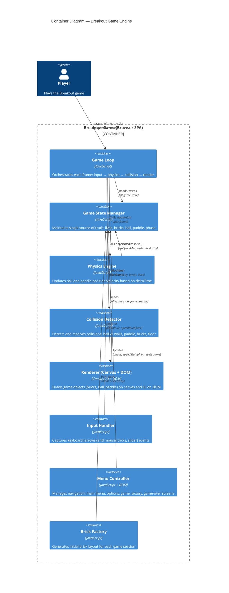

# C4 Containers Diagram — Breakout Game Engine

## Overview

This diagram shows the major containers (deployable units and subsystems) of the Breakout game engine. All containers run within a single browser instance as a vanilla JavaScript single-page application.

## C4 Container Diagram

## Container Descriptions

| Container | Technology | Responsibility |
|-----------|-----------|-----------------|
| **Game Loop** | JavaScript | Synchronizes all subsystems each frame: input processing, physics update, collision detection, rendering, win/loss checking |
| **Game State Manager** | JavaScript | Single source of truth for all game data: phase, lives, ball state, paddle state, bricks array, speed multiplier |
| **Physics Engine** | JavaScript | Calculates ball and paddle motion using deltaTime; applies speed multiplier; enforces screen bounds on paddle |
| **Collision Detector** | JavaScript | Detects ball collisions (walls, ceiling, paddle, bricks, floor) in priority order; resolves one collision per frame |
| **Renderer (Canvas + DOM)** | Canvas 2D + DOM | Draws game objects on canvas; renders UI (lives counter, speed gauge) and menus on DOM |
| **Input Handler** | JavaScript | Listens to keyboard (arrow keys) and mouse (clicks, slider) events; updates game state accordingly |
| **Menu Controller** | JavaScript + DOM | Manages screen transitions (main menu → options → game → victory/gameover); persists speed preference in memory |
| **Brick Factory** | JavaScript | Generates initial 5×5 brick layout; creates brick objects with id, position, dimensions, color |

## Data Flow

1. **Input Flow** — Player keyboard/mouse → Input Handler → Game State (paddle velocity, speed multiplier)
2. **Physics Flow** — Game Loop → Physics Engine → Game State (ball position, paddle position)
3. **Collision Flow** — Game Loop → Collision Detector → Game State (ball velocity, destroyed bricks, lives)
4. **Render Flow** — Game Loop → Renderer → Canvas/DOM (visual game state)
5. **Menu Flow** — Player clicks → Menu Controller → Game State (phase transitions, resets)

## Key Architectural Properties

- **Single Page Application** — All containers run in one JavaScript execution context (no server/backend)
- **Frame-Driven Architecture** — Game Loop orchestrates all updates at 60 FPS using `requestAnimationFrame`
- **Immutable State Transitions** — Game state changes flow unidirectionally: input → state update → render
- **No External Dependencies** — Pure vanilla HTML5, CSS3, ES6 JavaScript
- **Single Collision Per Frame** — Prevents ball tunneling by resolving only one collision per frame

## Deployment Model

All containers are packaged as a single `index.html` file with embedded or linked JavaScript modules, served directly to the browser with no build step required.

---

**See also:** [Architecture](../architecture.md) | [System Context](./system-context.md) *(planned)*
