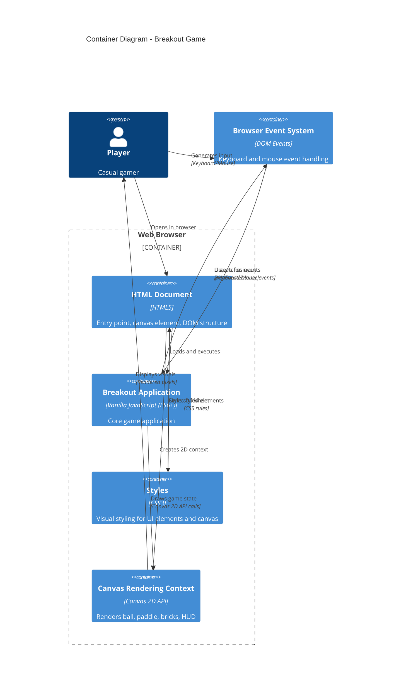

# C4 Container — Breakout Game

## Container Diagram



## Container Descriptions

### 1. HTML Document (index.html)

**Technology**: HTML5

**Responsibility**: 
- Entry point for browser
- Defines canvas element and DOM structure
- Links JavaScript and CSS resources

**Key Elements**:
- `<canvas id="gameCanvas">` — Game rendering surface
- Menu div (start button, speed slider, quit button)
- Game info div (lives, score, bricks)
- Game over div (outcome message, replay/quit buttons)

**Dependency**: Loaded by browser first; bootstraps application

---

### 2. Breakout Application (js/)

**Technology**: Vanilla JavaScript (ES6+)

**Responsibility**: 
- Core game logic and orchestration
- Game loop management
- State transitions
- Component coordination

**Key Modules**:

#### 2.1 Main Entry Point (main.js)
- Initializes Game instance
- Attaches event listeners
- Starts game loop

#### 2.2 Game Orchestrator (game.js)
- Manages game life cycle
- Coordinates between engine, UI, input
- Implements game state transitions
- Runs main loop with requestAnimationFrame

#### 2.3 Game State (gameState.js)
- Immutable state object
- Tracks: phase, lives, score, ballSpeed, bricksRemaining
- State transitions: menu → playing → gameOver/victory → menu

#### 2.4 Engine (engine/)

**ball.js** — Ball entity
- Position, velocity, radius, speed
- Movement update logic
- Draw method for canvas rendering
- Collision detection helpers

**paddle.js** — Paddle entity
- Position, dimensions, movement speed
- Keyboard input binding (ArrowLeft, ArrowRight)
- Movement update logic
- Screen boundary constraints
- Draw method

**brick.js** — Brick entity
- Position, dimensions, color
- Destruction state tracking
- Draw method (invisible if destroyed)
- Factory for creating brick grids

**collisions.js** — Collision detection system
- AABB (Axis-Aligned Bounding Box) collision detection
- Detects: ball↔brick, ball↔paddle, ball↔walls, ball↔bounds
- Returns collision normal for reflection

**physics.js** — Physics calculations
- Vector reflection (dot product, cross product)
- Ball velocity updates after collisions
- Paddle contact angle calculation

#### 2.5 UI (ui/)

**renderer.js** — Canvas rendering
- Single canvas context
- Draws background, paddle, ball, bricks
- Draws HUD (lives, score, bricks remaining)
- Handles canvas clear and frame buffering

**menu.js** — Menu UI logic
- Renders menu: title, speed slider, buttons
- Handles button clicks (Start, Quit)
- Slider event listeners for ball speed config

**gameScreen.js** — Active game UI
- Renders HUD (lives, score, bricks)
- Pause state indicator
- Score updates per frame

**gameOverScreen.js** — End game UI
- Displays outcome (GAME OVER / VICTORY)
- Shows final score and lives
- Buttons (Replay, Quit)

#### 2.6 Input (input/)

**keyboard.js** — Keyboard event handling
- Listens for ArrowLeft, ArrowRight (paddle movement)
- Listens for P key (pause)
- Sets input flags on GameState

**mouse.js** — Mouse event handling
- Listens for click events on menu buttons
- Listens for range slider input (ball speed)
- Updates GameState on user actions

---

### 3. Styles (styles.css)

**Technology**: CSS3

**Responsibility**:
- Visual styling for HTML elements
- Canvas styling (border, background)
- Button and menu styles
- Font, colors, layout (flexbox/grid)
- Dark/retro theme (arcade aesthetic)

**Key Selectors**:
- `#gameCanvas` — Canvas element styling
- `.menu` — Menu container
- `.button` — Menu buttons
- `.slider` — Ball speed range slider
- `.hud` — Game HUD display
- `.gameOverScreen` — End game overlay

---

### 4. Canvas Rendering Context

**Technology**: Canvas 2D API (Browser native)

**Responsibility**:
- Low-level pixel rendering
- 2D drawing primitives (rect, circle, text)
- Frame buffer management

**Usage**:
- Clears canvas each frame
- Draws ball (fillCircle)
- Draws paddle (fillRect)
- Draws bricks (fillRect per brick)
- Renders text for HUD

---

## Component Interactions

### Game Loop Flow

```
requestAnimationFrame
  ↓
game.update(deltaTime)
  ├─ Input: Read keyboard/mouse state
  ├─ Update: Ball, paddle, collisions, state
  └─ Render: Canvas + HUD

Repeat 60x per second
```

### State Transition Flow

```
Menu (phase = 'menu')
  ↓ Click "Start Game"
Playing (phase = 'playing')
  ├─ Loop: Update, collisions, render
  └─ Check end condition
      ↓ All bricks destroyed
      Victory (phase = 'victory')
      
      ↓ Lives = 0
      GameOver (phase = 'gameOver')
  ↓ Click "Replay" or "Quit"
Menu
```

### Collision Resolution

```
Ball.update()
  ↓
collisions.checkBallBrickCollisions()
  ├─ If collision: reflect ball, destroy brick
collisions.checkBallPaddleCollision()
  ├─ If collision: reflect ball with angle
collisions.checkBallWallCollisions()
  ├─ If collision: reflect ball
collisions.checkBallOutOfBounds()
  ├─ If out: decrement lives
```

---

## Dependencies Between Containers

| From | To | Reason |
|------|----|---------
| HTML | JavaScript | index.html loads script tags |
| HTML | CSS | index.html links stylesheet |
| JavaScript | Canvas API | Renders via canvas context |
| JavaScript | DOM Events | Listens for input |
| Input handlers | GameState | Update state from events |
| Game loop | Engine | Update entities and collisions |
| Renderer | Canvas API | Draw primitives |
| Game | Input handlers | Check input state |

---

## Data Flow

### Per Frame

```
Input Events
    ↓
Input Handlers (keyboard.js, mouse.js)
    ↓ Update GameState
Game Orchestrator (game.js)
    ↓ Update entities
Engine (ball.js, paddle.js, collisions.js, physics.js)
    ↓ Calculate state
GameState mutations
    ↓ Read state
Renderer (ui/renderer.js)
    ↓ Draw
Canvas 2D API
    ↓
Browser renders pixels
```

---

## Technology Stack

| Layer | Technology | Purpose |
|-------|-----------|---------|
| **Client** | HTML5, CSS3, Vanilla JS (ES6+) | Application |
| **Rendering** | Canvas 2D API | 2D graphics |
| **Input** | DOM Events (keyboard, mouse) | User interaction |
| **Runtime** | Browser (Chrome, Firefox, Safari, Edge) | Execution environment |
| **Build** | None (no bundler needed) | Simplicity |

---

## Deployment Model

```
Developer → Git repository
             ↓
           GitHub Pages / Static hosting
             ↓
           index.html served via HTTP/HTTPS
             ↓
           Browser loads HTML, CSS, JS
             ↓
           Game runs entirely in browser
```

**No server-side components required.** Game is entirely client-side.

---

## Quality Attributes Per Container

| Container | Performance | Reliability | Maintainability |
|-----------|-----------|-------------|-----------------|
| HTML | Fast load | High (static) | High (simple) |
| JavaScript | 60 FPS target | High (no deps) | High (modular) |
| CSS | <1ms render | High (static) | High (simple) |
| Canvas API | Native browser | High | Browser managed |

---

## Related Documents

- [System Context Diagram](system-context.md) — External view
- [Architecture](../architecture.md) — Detailed code structure
- [Product Specification](../../what/product-spec.md) — Requirements
