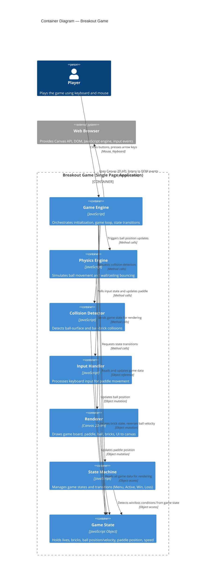

# Containers — Breakout Game



## Container Summary

The Breakout Game is implemented as a single-page application (SPA) with seven key containers:

### 1. Game Engine
- **Technology**: JavaScript
- **Responsibility**: Orchestrates the entire game lifecycle
- **Duties**:
  - Initializes canvas and 2D rendering context
  - Creates and manages game loop (requestAnimFrame)
  - Coordinates between physics, collision, input, and renderer
  - Triggers state transitions
  - Manages game reset and replay

### 2. Physics Engine
- **Technology**: JavaScript
- **Responsibility**: Simulates ball motion and elastic bounces
- **Duties**:
  - Updates ball position each frame based on velocity
  - Detects and handles bounces off walls (left/right)
  - Detects and handles bounces off ceiling (top)
  - Detects and handles bounces off paddle with angle adjustment
  - Flags out-of-bounds events (bottom boundary)

### 3. Collision Detector
- **Technology**: JavaScript
- **Responsibility**: Detects all collisions in the game world
- **Duties**:
  - Detects ball-wall collisions
  - Detects ball-ceiling collisions
  - Detects ball-paddle collisions and determines hit location
  - Detects ball-brick collisions
  - Returns collision information (type, surface normal, affected brick)

### 4. Input Handler
- **Technology**: JavaScript (DOM Event API)
- **Responsibility**: Captures player input and applies it to game entities
- **Duties**:
  - Listens to keydown/keyup events for ArrowLeft and ArrowRight
  - Maintains input state (which keys are currently pressed)
  - Updates paddle position based on input
  - Only processes input when game is in Active state

### 5. Renderer
- **Technology**: Canvas 2D API + JavaScript
- **Responsibility**: Visualizes all game state on screen
- **Duties**:
  - Clears canvas each frame
  - Draws game board background
  - Draws paddle, ball, bricks
  - Draws UI elements (lives, brick count, speed slider)
  - Renders state-specific screens (Menu, Win, Loss)

### 6. State Machine
- **Technology**: JavaScript
- **Responsibility**: Manages game state transitions and enforces rules
- **Duties**:
  - Tracks current game state (Menu, Active, Pause, Win, Loss)
  - Validates and executes state transitions
  - Detects win condition (all bricks destroyed)
  - Detects loss condition (lives = 0)
  - Resets game state for new games

### 7. Game State
- **Technology**: JavaScript Object
- **Responsibility**: Central data store for all game information
- **Data**:
  - `lives` (0–3)
  - `brickCount` (0–40)
  - `bricks` (array of brick objects with position and active/destroyed state)
  - `ball` (position x, y and velocity vx, vy)
  - `paddle` (x position, width, height)
  - `speed` (0.5x to 3x multiplier for ball velocity)
  - Canvas dimensions (width, height)

## Data Flows

### Game Loop Frame (60 FPS)
```
1. Input Handler polls keyboard state → updates paddle position
2. Physics Engine updates ball position based on velocity
3. Collision Detector detects all collisions
4. Game State mutations applied (brick destruction, ball bounce, life loss)
5. State Machine checks win/loss conditions
6. Renderer draws current game state to canvas
7. (Next frame triggered by requestAnimFrame)
```

### Speed Adjustment Flow
```
Player moves slider → Input Handler captures mouse event
→ Game State updated with new speed multiplier
→ Physics Engine uses new speed on next frame
→ Ball velocity magnitude changes immediately
```

### State Transition Example (Menu → Active)
```
Player clicks "Start" → Game Engine requested to start()
→ State Machine transitions from Menu to Active
→ Game State reset (lives=3, bricks reinitialized, ball reset)
→ Game loop starts (requestAnimFrame)
→ Physics begins moving ball from starting position
```

## Related Documentation

See [Architecture](../architecture.md) for component interface contracts and design decisions.
