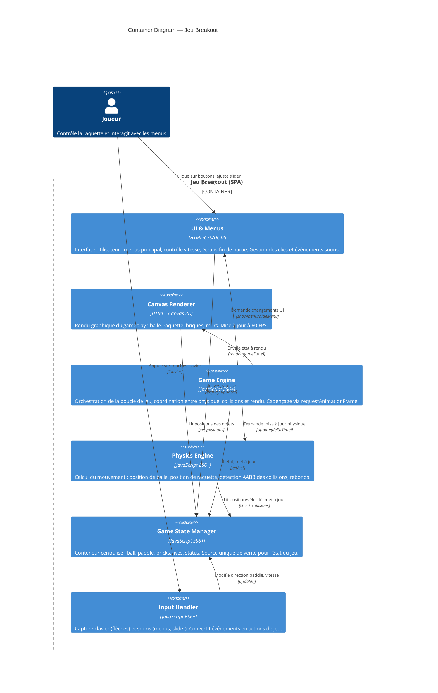

# Containers — Jeu Breakout

## Overview

Diagramme des conteneurs C4 du jeu Breakout — architecture interne en modules.



## Conteneurs détaillés

### 1. UI & Menus (DOM)

**Responsabilité** : Interface utilisateur, menus, interaction souris

**Inclut** :
- Menu principal (Start, Quit)
- Écran contrôle vitesse (Slider)
- Écrans fin de partie (Win, Loss)
- Affichage lives counter

**Technologie** : HTML, CSS, DOM JavaScript

**Liens** :
- **Entrée** : Clics souris du joueur
- **Sortie** : Commandes vers Game State Manager (changement d'état, vitesse)

### 2. Canvas Renderer

**Responsabilité** : Rendu graphique du gameplay

**Inclut** :
- Dessin de la balle (cercle)
- Dessin de la raquette (rectangle)
- Dessin des briques (grille de rectangles)
- Dessin des murs (lignes/rectangles)
- Rendu à 60 FPS

**Technologie** : HTML5 Canvas 2D API

**Liens** :
- **Entrée** : État du jeu (positions, bricks, status)
- **Sortie** : Affichage visuel sur canvas

### 3. Game Engine

**Responsabilité** : Orchestration de la boucle de jeu

**Inclut** :
- Boucle de jeu via `requestAnimationFrame`
- Cadençage et deltaTime
- Coordination des phases : Update → Collision → Render
- Gestion des transitions d'état (menu → playing → win/loss)

**Technologie** : JavaScript ES6+

**Liens** :
- **Entrée** : DeltaTime, événements d'input
- **Sortie** : Appels à Physics, State, Canvas, UI

### 4. Physics Engine

**Responsabilité** : Calcul du mouvement et collisions

**Inclut** :
- Mise à jour position balle (velocity + position)
- Mise à jour position raquette (direction + vitesse)
- Détection collision AABB (ball vs walls, paddle, bricks)
- Calcul rebonds (inversion vélocité, angle sur raquette)

**Technologie** : JavaScript ES6+

**Liens** :
- **Entrée** : État du jeu, deltaTime
- **Sortie** : Collisions détectées, nouvelles vélocités

### 5. Game State Manager

**Responsabilité** : Gestion centralisée de l'état du jeu

**Inclut** :
- Données : ball, paddle, bricks[], lives, status, ballSpeed
- Méthodes : reset(), resetBall(), loseLife(), destroyBrick(), isGameWon(), isGameLost()
- Pattern : Source unique de vérité (single source of truth)

**Technologie** : JavaScript ES6+ (classe ou objet)

**Liens** :
- **Entrée** : Mises à jour depuis Physics, Input, UI
- **Sortie** : État lu par Canvas, UI, Engine

### 6. Input Handler

**Responsabilité** : Gestion des entrées utilisateur

**Inclut** :
- Écoute clavier (keydown, keyup) → flèches gauche/droite
- Écoute souris (click) → boutons, slider
- Conversion en actions de jeu (paddle direction, speed change)
- Maintien de l'état actuel (quelle touche est enfoncée)

**Technologie** : JavaScript ES6+ (Event listeners)

**Liens** :
- **Entrée** : Événements clavier/souris du joueur
- **Sortie** : Mises à jour direction paddle, changements de vitesse

## Flux de communication

```
Joueur
  │
  ├─→ [Input Handler] ──→ Clavier/Souris events
  │        │
  │        ├─→ [Game State] (paddle direction, speed)
  │        └─→ [UI] (menu clicks)
  │
  └─→ [Game Engine] (boucle de jeu)
       │
       ├─→ [Physics Engine] (update positions, collisions)
       │     │
       │     └─→ [Game State] (balle position, lives, bricks)
       │
       ├─→ [Canvas Renderer] (affichage gameplay)
       │     │
       │     └─← [Game State] (positions, bricks, status)
       │
       └─→ [UI Manager] (state transitions)
             │
             └─← [Game State] (lives, status)
```

## Dépendances entre conteneurs

| De | Vers | Type | Description |
|----|------|------|-------------|
| Input Handler | Game State | Écriture | Modifie paddle direction, speed |
| Input Handler | UI | Appel | Demande changement d'écran |
| Game Engine | Physics | Appel | update(deltaTime) |
| Game Engine | Game State | Lecture/Écriture | Consulte et met à jour état |
| Game Engine | Canvas | Appel | render(gameState) |
| Game Engine | UI | Appel | showWinScreen, showLoseScreen |
| Physics | Game State | Lecture/Écriture | Lit positions, met à jour collisions |
| Canvas | Game State | Lecture | Lit positions, bricks, status |
| UI | Game State | Lecture | Lit lives, speed, status |

## Isolation et testing

Chaque conteneur peut être testé indépendamment :
- **Physics** : Tests unitaires des collisions (pas de dépendances UI)
- **Game State** : Tests d'état sans engine (pas de rendering)
- **Input Handler** : Simulation d'événements clavier/souris
- **Canvas** : Rendu en mémoire (pas de browser nécessaire)
- **Engine** : Intégration de tous les composants
