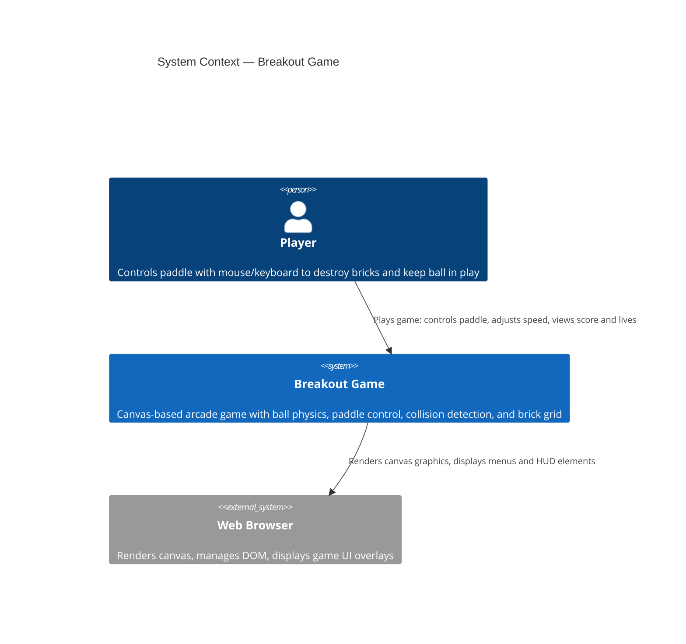

# System Context — Breakout Game

This diagram shows the Breakout Game system at the highest level, depicting the relationship between the player and the game application running in a web browser.

## C4 Context Diagram

## Key Interactions

### Player ↔ Breakout Game
- **Input:** Mouse movement and slider adjustments for ball speed
- **Output:** Visual feedback on canvas (ball, paddle, bricks, lives counter, speed display)

### Breakout Game ↔ Web Browser
- **Rendering:** All graphics drawn to HTML5 Canvas 2D context
- **DOM:** Menu overlays rendered as HTML elements (start screen, game-over, victory screens)
- **Frame Loop:** Uses `requestAnimationFrame` for smooth 60 FPS rendering

## System Scope

The Breakout Game system encompasses:
- **Game Logic** — Ball physics, collision detection (AABB), brick destruction tracking
- **State Management** — Game phases (menu, playing, paused, gameOver, victory)
- **Input Handling** — Mouse position for paddle control, slider for speed adjustment
- **Rendering** — Canvas 2D drawing for all game objects and HUD elements
- **User Interface** — Overlays for menu navigation (start, pause, restart)

**Out of Scope:**
- Persistent data storage (no database or localStorage for MVP)
- Multiplayer or networking
- Account management or authentication
- External API integrations

## Related Diagrams

- [Container Diagram](./containers.md) — Internal decomposition of the Breakout Game system
- [Component Diagram](./components.md) — React components and game engine modules (if detailed design is needed)

## Architecture Reference

See [Architecture — Breakout Game](../architecture.md) for full technical details.
