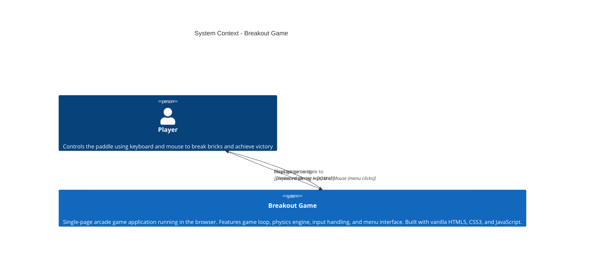

# C4 System Context — Breakout

## Overview

This diagram shows the Breakout game as a system within its environment. The system is a client-side, single-page application (SPA) that runs entirely in the player's web browser. There are no external systems or backend dependencies in V1.

## Diagram

## Key Elements

### Player
- **Role**: User controlling the paddle to destroy bricks and win the game
- **Interactions**: 
  - Keyboard input: Left/Right arrow keys to move paddle
  - Mouse input: Clicks for menu navigation (Start, Settings, Replay, Quit)
  - Receives visual feedback: Canvas game rendering + UI menus

### Breakout System
- **Type**: Client-side Single-Page Application (SPA)
- **Technology Stack**: HTML5, CSS3, JavaScript (vanilla)
- **Key Responsibilities**:
  - Game loop execution (~60 FPS)
  - Physics simulation (ball movement, collisions)
  - Input handling (keyboard + mouse)
  - Game state management (menu, playing, victory, defeat)
  - Rendering (Canvas 2D for game, DOM for UI)
  - Difficulty adjustment (ball speed slider)

### Communication
- **Player → System**: Keyboard events (arrow keys) and mouse events (clicks)
- **System → Player**: 
  - Canvas rendering showing game state (paddle, ball, bricks)
  - DOM elements for menus and UI controls
  - Real-time visual feedback during gameplay

## Architecture Notes

**No External Systems**: The Breakout game v1 has no external dependencies or integrations:
- ✅ No backend server or API calls
- ✅ No database or data persistence
- ✅ No third-party libraries or frameworks
- ✅ No network communication
- ✅ No multiplayer synchronization

The system operates entirely within the browser's JavaScript runtime environment using native HTML5 Canvas for rendering and DOM APIs for menu interfaces.

## Related C4 Diagrams

- [Container Diagram](./containers.md) — Shows internal application structure
- [Component Diagram](./components.md) — Details game engine components
- [Architecture](../architecture.md) — Technical architecture decisions

## Open Questions

1. Should the game be responsive to different screen sizes?
2. Are there any planned integrations in future versions (V2+)?
3. Should gameplay data be persisted (localStorage)?
