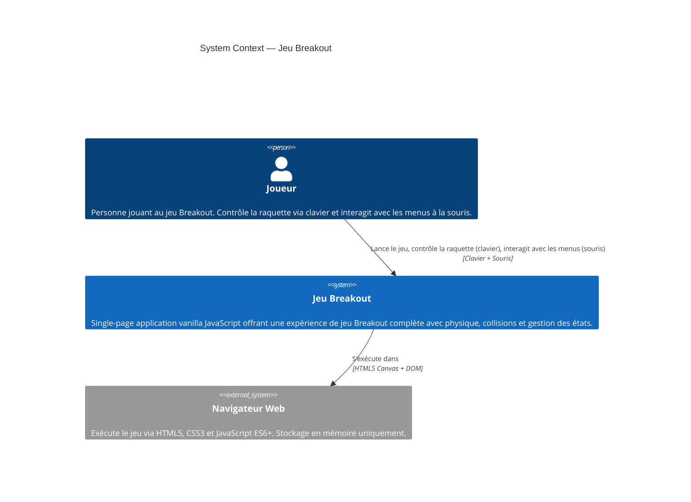

# System Context — Jeu Breakout

## Overview

Diagramme de contexte C4 du jeu Breakout — système clos sans dépendances externes.



## Description détaillée

### Acteurs

| Acteur | Rôle | Interaction |
|--------|------|-------------|
| **Joueur** | Utilisateur du jeu | Clavier (flèches), Souris (menus, slider) |
| **Navigateur** | Plateforme d'exécution | HTML5, CSS3, JavaScript ES6+ |

### Limites du système

- **Inclus** : Jeu complet, menus, physique, détection de collisions, gestion d'état
- **Exclus** : Persistance réseau, base de données, authentification, multijoueur
- **Pas de dépendances externes** : Vanilla JavaScript uniquement

### Flux principaux

1. **Initialisation** : Joueur ouvre le jeu → affichage du menu principal
2. **Configuration** : Joueur sélectionne la vitesse via slider
3. **Gameplay** : Joueur contrôle la raquette → ball physics → collision detection → rendu
4. **Fin de partie** : Victoire ou défaite → écran de fin → replay ou menu

## Environnement

```
┌─────────────────────────────┐
│   Navigateur Web (Browser)  │
│                             │
│  ┌───────────────────────┐  │
│  │  Jeu Breakout (SPA)  │  │
│  │                      │  │
│  │ - Canvas 2D         │  │
│  │ - DOM (Menus)       │  │
│  │ - Game Logic        │  │
│  │ - Physics           │  │
│  │ - Collisions        │  │
│  │ - State Management  │  │
│  └───────────────────────┘  │
│                             │
└─────────────────────────────┘
         ▲          │
    Clavier       Affichage
     Souris       Canvas/DOM
         │          ▼
    ┌─────────────────┐
    │    Joueur       │
    │                 │
    │  Contrôle       │
    │  Observation    │
    └─────────────────┘
```
