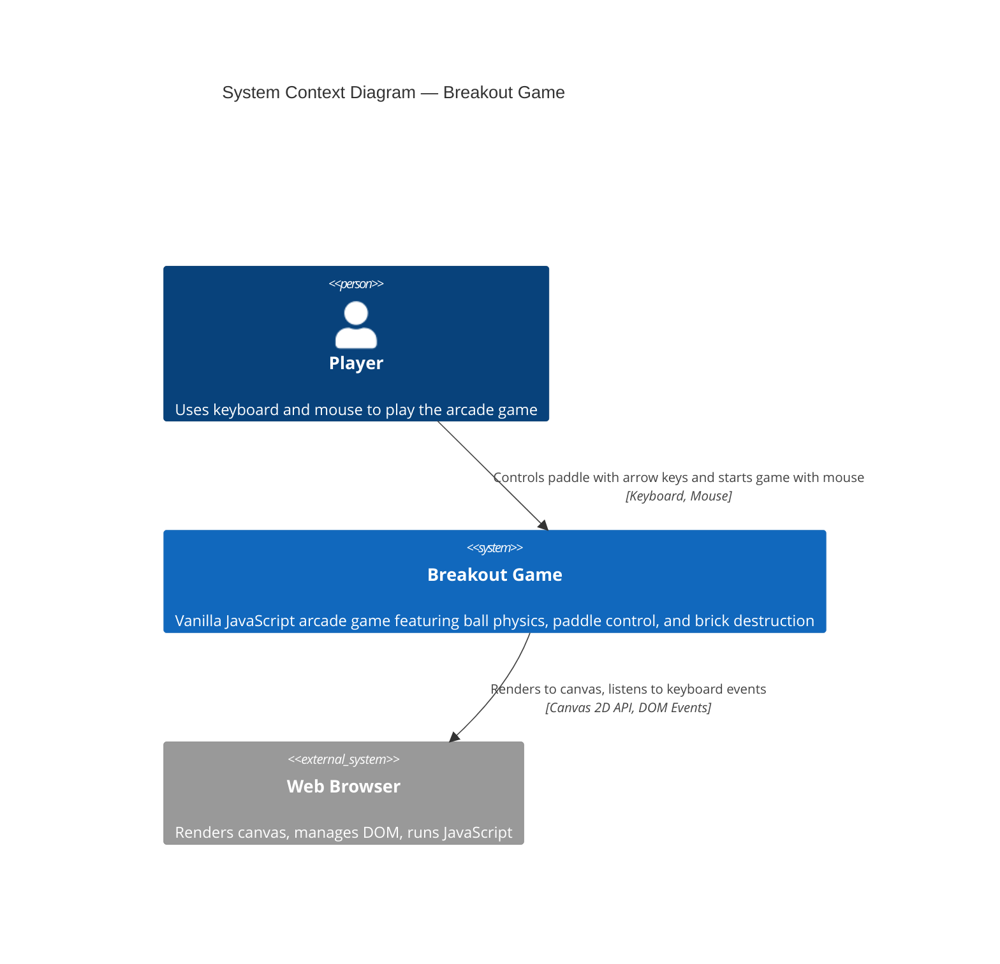

# System Context — Breakout Game

## Context Summary

The **Breakout Game** is a self-contained single-page application running entirely within a web browser. The player interacts with the game using keyboard input (arrow keys) to move the paddle left and right, and mouse input to click menu buttons (Start Game, Play Again, Quit). The game engine renders all graphics to an HTML5 Canvas element and manages the complete game lifecycle: initialization, physics simulation, collision detection, state transitions, and victory/defeat conditions.

### Key Actors

- **Player** — End user engaging with the game; provides input and observes game state
- **Web Browser** — Runtime environment providing Canvas API, DOM, JavaScript execution, and input event handling

### System Boundaries

The Breakout Game system includes:
- Game board initialization and rendering
- Physics engine for ball movement
- Collision detection for walls, ceiling, paddle, bricks
- Input handling for keyboard and UI controls
- State machine for Menu, Active, Pause, Win, Loss states
- UI rendering for score, lives, speed control, and state-specific screens

**Out of scope**:
- Server communication or backend services
- High score storage or persistent data
- Audio or sound effects
- Mobile touch controls
- Network multiplayer

### Related Documentation

See [Architecture](../architecture.md) for technical component details and design decisions.
