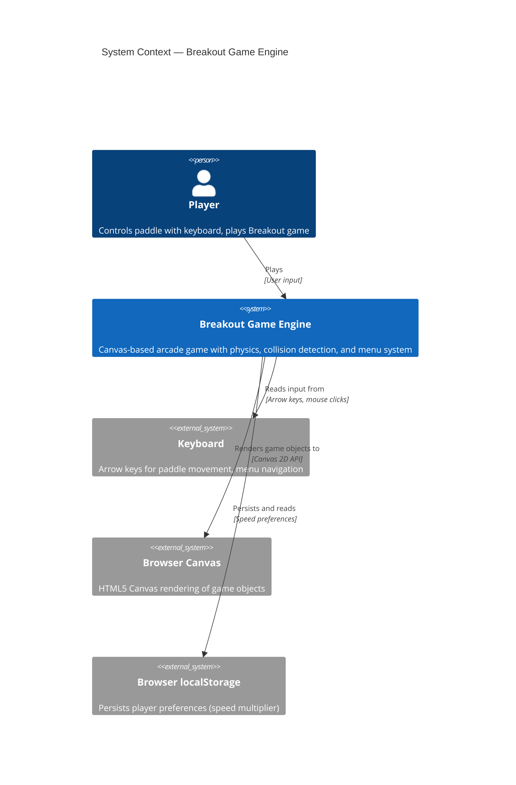

# System Context — Breakout Game

## Overview

The Breakout game system consists of a single-page canvas-based game where a player controls a paddle to bounce a ball and destroy bricks. The game runs entirely in the browser with no external dependencies.

## System Context Diagram

## Elements

### Player
- **Type:** Person
- **Responsibility:** Interacts with the game by controlling the paddle via keyboard and navigating menus with mouse clicks
- **Concerns:** Game difficulty, quick feedback, winning/losing conditions

### Breakout Game Engine
- **Type:** Software System
- **Responsibility:** Orchestrates game logic including physics simulation, collision detection, state management, rendering, and menu navigation
- **Technologies:** Vanilla JavaScript (ES6), HTML5, CSS3
- **Key Boundaries:**
  - Game Loop — Orchestrates 60 FPS frame updates
  - Game State Manager — Maintains game phase, lives, bricks, ball, paddle state
  - Physics Engine — Updates ball and paddle positions based on velocity and time delta
  - Collision Detector — Detects and resolves collisions between ball, paddle, bricks, and walls
  - Renderer — Draws game objects on canvas and manages UI/menu display
  - Input Handler — Captures keyboard (arrow keys) and mouse (menu clicks) events
  - Menu Controller — Manages navigation between menu screens, options, and game screens

### Keyboard
- **Type:** External System (Browser Input)
- **Responsibility:** Provides user input to the game
- **Input Types:**
  - Arrow keys (left/right) → Paddle movement during gameplay
  - Mouse clicks → Menu navigation and speed slider adjustment

### Browser Canvas
- **Type:** External System (Browser API)
- **Responsibility:** Renders visual output of the game
- **Output Targets:**
  - Game objects (bricks, ball, paddle, background)
  - Lives counter
  - Speed indicator
  - Menu screens (start, options, victory, game-over)

### Browser localStorage
- **Type:** External System (Browser Storage)
- **Responsibility:** Persists player preferences across sessions
- **Data Stored:**
  - Speed multiplier preference (0.5x to 2.0x) — *planned for future implementation*
  - Player settings and options

## Key Interactions

1. **Player Controls Paddle:** Player uses arrow keys → Input Handler captures → Game State updated → Physics updates paddle position → Renderer displays new position

2. **Ball Physics & Collision:** Physics Engine updates ball position each frame → Collision Detector checks for impacts → Ball reflects or brick destroyed → Renderer shows updated state

3. **Menu Navigation:** Player clicks buttons/slider → Input Handler routes to Menu Controller → Game State changes (phase, speed multiplier) → Renderer displays appropriate screen

4. **Preference Persistence:** Speed slider changed → Menu Controller updates state → Storage module writes to localStorage → On next session, preference is restored

## Design Principles

- **Single Responsibility:** Each component (physics, collision, rendering, input) handles one concern
- **Unidirectional Data Flow:** Input → State Update → Render
- **Frame-Driven:** All updates synchronized to 60 FPS game loop via `requestAnimationFrame`
- **No External Dependencies:** Pure vanilla JavaScript, no frameworks or libraries
- **Deterministic Physics:** Predictable ball behavior using fixed delta-time handling

## Related Diagrams

- [Container Diagram](./containers.md) — Details internal containers and component structure
- [Component Diagram](./components.md) — Details game engine components and their interactions
- [Deployment Diagram](./deployment.md) — Shows runtime environment and deployment topology

---

**See also:** [Architecture — Breakout Game Engine](../architecture.md)
