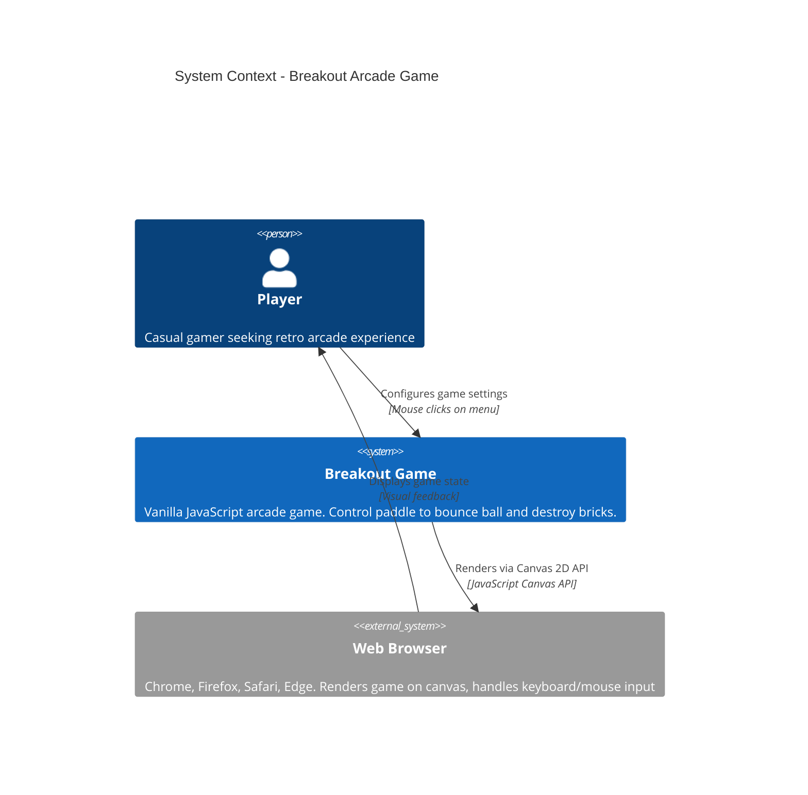

# C4 System Context — Breakout Game

## System Context Diagram



## Context Description

The **Breakout Game** is a standalone web application that implements the classic arcade breakout game mechanics using vanilla JavaScript (HTML/CSS/JS with zero external dependencies).

### Players & Interactions

- **Primary Actor**: Player (casual gamer)
  - Interacts via keyboard (arrow keys for paddle movement)
  - Interacts via mouse (menu navigation, speed slider configuration)
  - Receives visual feedback via browser rendering

### System Scope

The Breakout Game system includes:
- **Game Engine**: Ball physics, collision detection, game state management
- **Rendering**: Canvas-based 2D graphics for ball, paddle, bricks, UI
- **Input Handling**: Keyboard controls (arrow keys, P for pause) and mouse events (menu, slider)
- **UI**: Menu screen, game screen, game over / victory screens

### External Dependencies

- **Web Browser**: Provides Canvas 2D API, DOM, event system, requestAnimationFrame
- **Player Input Devices**: Keyboard and mouse

### Technology Stack

- Language: Vanilla JavaScript (ES6+)
- Rendering: HTML5 Canvas 2D
- No external frameworks, libraries, or build tools required

### Key Constraints

- Vanilla JavaScript only (zero npm dependencies)
- 60 FPS target on standard hardware
- Single-level, single-session gameplay (no persistence)
- No network connectivity required

---

## Workflow Overview

### Main Game Flow

1. **Menu Phase**: Player opens game, sees menu with ball speed slider, clicks "Start Game"
2. **Playing Phase**: Ball bounces, player controls paddle with arrow keys, breaks bricks
3. **End Game Phase**: Player wins (all bricks destroyed) or loses (all lives exhausted)
4. **Restart**: Player clicks "Replay" to return to menu, "Quit" to close application

### Key Interactions

| Actor | System | Interaction | Purpose |
|-------|--------|-------------|---------|
| Player | Breakout | Press ArrowLeft / ArrowRight | Move paddle left/right |
| Player | Breakout | Press P | Pause/resume gameplay |
| Player | Breakout | Click "Start Game" button | Begin new game session |
| Player | Breakout | Adjust ball speed slider | Configure difficulty |
| Player | Breakout | Click "Replay" or "Quit" | Control game end flow |
| Breakout | Browser | Render canvas frame | Display game state |
| Breakout | Browser | Listen for input events | Detect player commands |

---

## Data Flow

```
Player Input (keyboard/mouse)
       ↓
 Input Handlers (input/)
       ↓
 Game State (gameState.js)
       ↓
 Game Engine (engine/, game.js)
       ↓
 Renderer (ui/renderer.js)
       ↓
 Browser Canvas
       ↓
 Visual Display to Player
```

---

## Quality Attributes

| Attribute | Target | Rationale |
|-----------|--------|-----------|
| **Performance** | 60 FPS | Smooth arcade game feel |
| **Responsiveness** | <16ms input latency | Immediate paddle control |
| **Reliability** | 100% uptime (no external APIs) | Self-contained application |
| **Simplicity** | Zero dependencies | Lightweight, no build process |
| **Accessibility** | Keyboard controls primary | Inclusive gameplay |

---

## Related Documents

- [Container Diagram](containers.md) — Details internal containers and deployment
- [Architecture](../architecture.md) — Code structure and component design
- [Product Specification](../../what/product-spec.md) — Requirements and user stories
