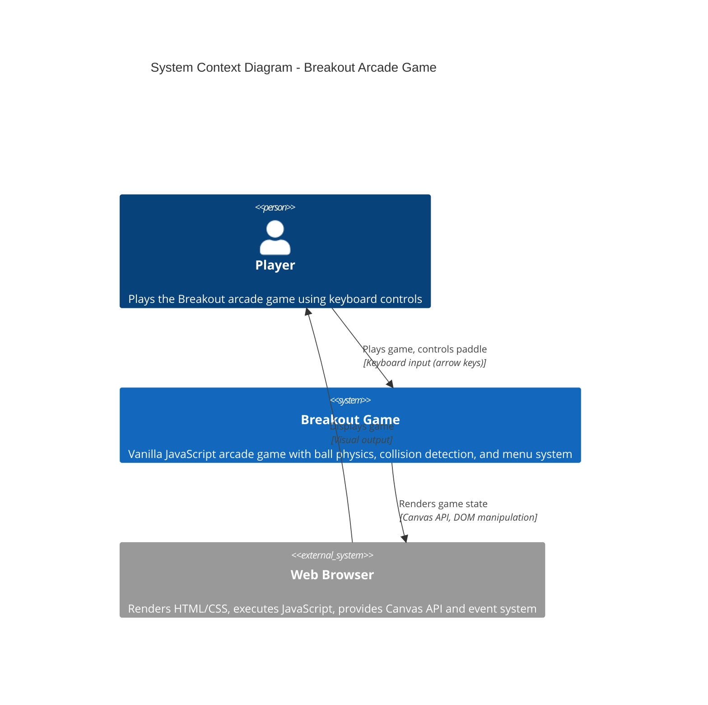

# System Context Diagram — Breakout Game

## Overview

This diagram shows Breakout as a complete system and its interactions with external actors (players and their browser environment).

## C4 System Context Diagram

## System Boundaries

### Breakout System (In Scope)

The Breakout game application encompasses:

- **Game Engine** — Main update loop and state orchestration
- **Physics Engine** — Ball movement and collision detection
- **Renderer** — Canvas/DOM rendering of game state
- **Input Handler** — Keyboard event processing
- **Menu System** — Navigation between game screens
- **State Manager** — Game state and configuration

### External Systems (Out of Scope)

- **Web Browser** — Provides Canvas API, requestAnimationFrame, DOM, event listeners
- **Operating System** — Provides keyboard input via browser
- **Network** — Not used; zero backend calls

## Interactions

### Player → Breakout Game

**Input**: Keyboard events (arrow keys, Enter)
- Paddle control (left/right movement)
- Menu navigation (speed selection)
- Game start/restart

### Breakout Game → Browser

**Output**: Visual rendering
- Canvas draw calls (ball, paddle, bricks, walls)
- DOM updates (HUD, menus, overlays)

**Input**: Event system
- `keydown` / `keyup` events
- `mouseclick` events
- `requestAnimationFrame` callbacks

### Player ← Browser

**Output**: Visual display of rendered game state
- Game board and objects
- Score and lives counter
- Menu screens
- Win/lose notifications

## Rationale

Breakout is a **client-only application** with:
- No server dependency
- No network latency
- No data persistence to backend
- Complete gameplay in a single browser tab

This simplifies deployment and eliminates external failure points.
