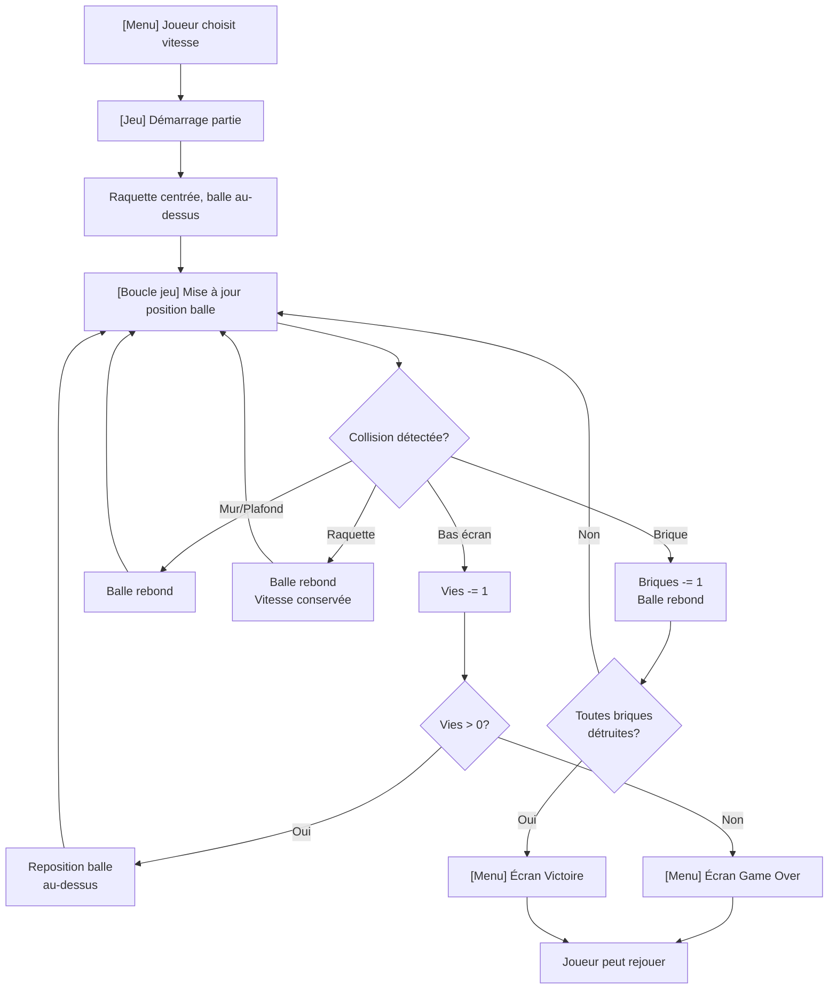

# Breakout — Jeu Arcade Frontend

<!-- Un jeu arcade classique en JavaScript vanilla où le joueur contrôle une raquette pour rebondir une balle et détruire un mur de briques. -->

## 1. Vision

Recréer l'expérience classique du jeu arcade Breakout en tant qu'application web frontend pure JavaScript vanilla (HTML/CSS/JS). Un jeu simple, accessible et jouable directement dans le navigateur, offrant une mécanique de jeu addictive avec gestion des collisions physiques, système de vies, et menu de navigation.

## 2. Users and Actors

### Utilisateurs principaux
- **Joueur casual** — Cherche une expérience de jeu simple et nostalgique, jouable rapidement sans installation
- **Joueur d'arcade** — Apprécie les mécaniques classiques, cherche à optimiser sa performance et survivre le plus longtemps possible

### Acteurs techniques
- **Application frontend** — Moteur de jeu responsable de la physique, collisions, et rendu
- **Système d'affichage** — Canvas ou DOM pour le rendu graphique

## 3. Problems to Solve

1. **Nostalgie arcade limitée** — Absence de jeu arcade classique et accessible en ligne
2. **Expérience de jeu simple** — Besoin d'un jeu sans dépendances externes, pur JavaScript
3. **Engagement du joueur** — Manque de progression visible (vies, score, vitesse ajustable)
4. **Contrôle intuitif** — Nécessité de contrôles fluides et réactifs au clavier et à la souris

## 4. Product Goals

- Créer un jeu Breakout jouable, fonctionnel et sans dépendances externes
- Implémenter une mécanique de collision robuste pour balle, raquette, murs et briques
- Fournir une progression claire (système de 3 vies, victoire/défaite)
- Permettre au joueur d'ajuster la difficulté via un menu de réglage de vitesse
- Offrir une interface intuitive avec navigation par menu et contrôles clavier/souris

## 5. Out of Scope

- Système de niveaux ou progression par étapes
- Persistance de scores ou classement (leaderboard)
- Sons et musiques
- Animations avancées ou particules
- Versions mobiles tactiles optimisées
- Multiplayer ou jeu en réseau
- Thèmes visuels alternatifs ou modes spéciaux
- Système de puissances ou bonus

## 6. Business Concepts

### Entités de domaine

| Concept | Description |
|---------|-------------|
| **Balle** | Projectile qui rebondit sur les murs, la raquette et les briques. Possède une position, une vélocité et une taille. |
| **Raquette** | Contrôlée par le joueur, intercepte la balle. Peut se déplacer horizontalement. |
| **Brique** | Élément du mur à détruire. Occupé par la balle, disparaît du jeu. |
| **Mur de briques** | Grille de 5 lignes de briques à l'écran. Objectif principal à détruire pour gagner. |
| **Vie** | Compteur représentant les tentatives restantes. Le joueur commence avec 3 vies. |
| **État du jeu** | Menu, en cours, gagné, perdu, pausé (potentiel futur). |
| **Vitesse de balle** | Paramètre ajustable depuis le menu (très lente à très rapide). |

### Règles métier fondamentales

1. Le joueur dispose de **3 vies** au démarrage
2. La **balle rebondit** sur :
   - Les murs latéraux et le plafond
   - La raquette (réflexion basée sur le point d'impact)
   - Les briques (destruction de la brique et inversion de direction)
3. Le joueur **perd une vie** quand la balle franchit le bas de l'écran (y > hauteur_écran)
4. **Victoire** = destruction de toutes les briques de la grille
5. **Défaite (Game Over)** = épuisement des 3 vies
6. La **vitesse de la balle** est réglable dans le menu avant le démarrage
7. Les **contrôles** :
   - Flèche gauche / Flèche droite = déplacement horizontal raquette
   - Souris = navigation dans les menus

## 7. Product Capabilities

### V1 — Minimum Viable Product

1. **Jeu jouable**
   - Rendu graphique simple (Canvas ou DOM) de la balle, raquette et briques
   - Balle lancée au démarrage du jeu
   - Raquette contrôlable avec flèches gauche/droite

2. **Système de collision**
   - Détection collision balle-raquette
   - Détection collision balle-briques (destruction et rebond)
   - Détection collision balle-murs (rebond)
   - Détection collision balle-bas écran (perte de vie)

3. **Gestion des vies**
   - Affichage des 3 vies initiales
   - Décrément une vie quand balle atteint le bas
   - Relance de la balle au centre si vie restante
   - Affichage état "Game Over" si 0 vies

4. **Menu de navigation**
   - Écran titre avec bouton "Jouer"
   - Menu de réglage de vitesse (curseur ou boutons : très lente, lente, normal, rapide, très rapide)
   - Écran victoire (avec score/stats)
   - Écran défaite (avec option rejouer)

5. **Architecture technique**
   - Vanilla JavaScript (HTML/CSS/JS uniquement)
   - Zéro dépendances externes
   - Logique de jeu isolée de l'affichage
   - Boucle d'animation simple (requestAnimationFrame)

## 8. High-Level Workflows

### Workflow principal — Partie de jeu

### Workflow menu — Réglage vitesse

1. Joueur arrive au menu
2. Affichage des 5 niveaux de vitesse avec indicateur courant
3. Joueur sélectionne vitesse (flèches ou clic)
4. Confirmation avec bouton "Jouer"
5. Lancement du jeu avec vitesse choisie

## 9. Business Rules

### Vitesse et physique
- BR-001: La vitesse de balle doit être réglable en 5 niveaux (très lente, lente, normal, rapide, très rapide)
- BR-002: La vitesse affecte la magnitude du vecteur de vélocité de la balle
- BR-003: La raquette se déplace à une vitesse constante (indépendante de la vitesse balle)

### Collision et physique
- BR-004: La balle rebondit toujours (pas de perte de vies sur collision objet)
- BR-005: La rebond sur mur latéral inverse la composante X de vélocité
- BR-006: La rebond sur plafond inverse la composante Y de vélocité
- BR-007: La rebond sur brique détruit la brique et inverse la composante Y ou X selon angle
- BR-008: La rebond sur raquette inverse la composante Y et peut modifier angle selon point d'impact

### Vies et états
- BR-009: Chaque partie commence avec 3 vies
- BR-010: Une vie est perdue si la balle franchit y > hauteur_écran
- BR-011: La balle relancée au centre-haut si vie restante
- BR-012: Le jeu se termine en défaite (Game Over) si vies = 0
- BR-013: Le jeu se termine en victoire si toutes briques détruites

### Mur de briques
- BR-014: Le mur est organisé sur 5 lignes horizontales
- BR-015: Chaque brique a une taille uniforme
- BR-016: Une brique disparaît du jeu immédiatement après collision
- BR-017: Le nombre total de briques est déterminé (ex: 10 par ligne × 5 = 50)

### Menu et contrôles
- BR-018: Les flèches gauche/droite contrôlent la raquette uniquement en jeu
- BR-019: Les flèches gauche/droite naviguent les menus (vitesse, options)
- BR-020: Un bouton/touche "Jouer" ou Entrée lance la partie
- BR-021: La souris est réservée à la navigation future (touchpoints menus)

## 10. Success Criteria

- ✓ Jeu jouable du début à la fin (victoire/défaite possible)
- ✓ Mécanique de collision fonctionnelle et prévisible
- ✓ Système de 3 vies visible et fonctionnel
- ✓ Menu avec réglage de vitesse (5 niveaux min)
- ✓ Aucune dépendance externe (vanilla JS uniquement)
- ✓ Affichage clair des états (score, vies, menu, victoire, défaite)
- ✓ Contrôles réactifs au clavier
- ✓ Code source lisible et facilement extensible

## 11. Open Questions

1. **Format de rendu** — Canvas HTML5 ou rendu DOM ? (Recommandation : Canvas pour performance)
2. **Persistance locale** — Stocker le score/record local avec localStorage ?
3. **Réglage vitesse** — Comment visualiser les 5 niveaux ? (Curseur, boutons, indicateur texte)
4. **Aspect graphique initial** — Existe-t-il une palette de couleurs/style de référence ?
5. **Position raquette** — La raquette reste-elle au bas de l'écran ou mobile verticalement aussi ?
6. **Taille mur** — Nombre exact de briques par ligne et nombre de lignes ?
7. **Trajectoire balle** — Rebond réaliste (optique) ou simplement inverse direction ?
8. **Feedback utilisateur** — Sons ou vibrations (mobile) pour collisions ?
