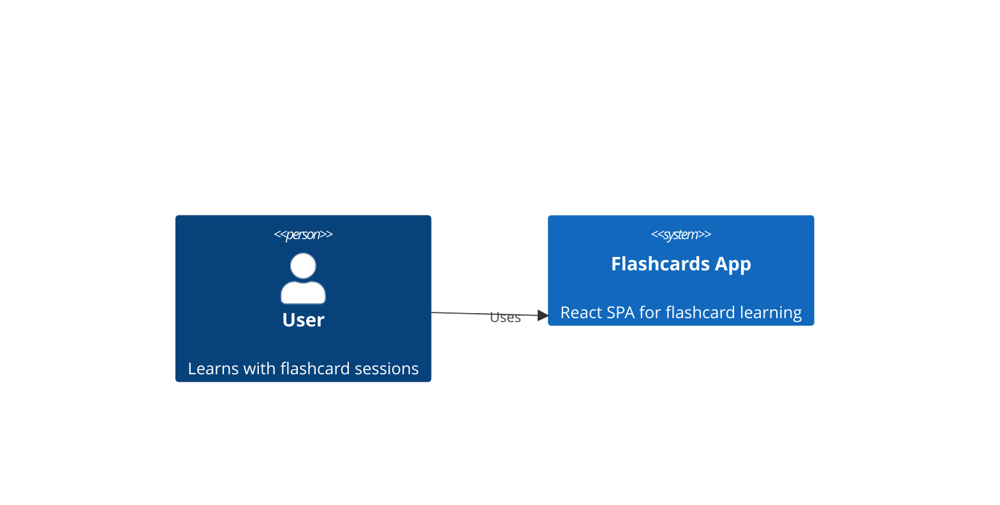
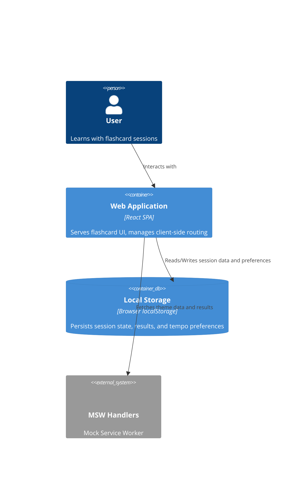

# Container C4 Diagram — Flashcards App

## System Context



## Container Diagram



## Component Details

### React SPA Container

**Technology:** React + Vite + TypeScript + MSW + VexFlow + Tone.js

**Client-side routes:**
- `/` — HomeScreen (theme picker, mode selector, Start button)
- `/session` — SessionScreen (flashcard display, progress, score buttons)
- `/results` — ResultsScreen (session score, replay, back to home)

**State management:**
- React Context for session state (current card, progress, score, tempo)
- localStorage for persistence across sessions

**MSW handlers:**
- Theme data: card decks with front/back pairs + score data for solfège
- Session results: stores/retrieves per-session outcomes

### Components

| Component | Responsibility |
|---|---|
| `HomeScreen` | Theme picker, mode selector, Start button |
| `SessionScreen` | Flashcard display, progress bar, score buttons |
| `ResultsScreen` | Session score display, replay, back to home |
| `FlashcardDisplay` | Renders card front/back with flip animation (text themes) |
| `ScoreCard` | Renders VexFlow SVG on front, triggers Tone.js playback on flip (solfège) |
| `PlaybackControls` | Pause, replay, skip, progress indicator (animated mode) |
| `TempoSelector` | Tempo selection (directive + BPM) |
| `ThemePicker` | Selects from available themes |
| `ModeSelector` | Chooses learning mode (flip, spaced-repetition, animated) |
| `ProgressBar` | Shows session advancement (X/Y) |
| `ScoreButtons` | "I knew it" / "I didn't know" post-flip |

### Engine Layer

| Engine | Responsibility |
|---|---|
| `TextEngine` | Default RenderEngine — renders plain text into DOM target |
| `MarkdownEngine` | RenderEngine — renders markdown as HTML into DOM target |
| `ScoreEngine` | RenderEngine — renders VexFlow SVG score (solfège questions) |
| `ScoreAudioEngine` | RenderEngine — renders VexFlow SVG + Tone.js audio (solfège answers); implements `precompute()` |
| `RenderEngine` registry | Resolves engine by `renderEngineId` — defaults to `TextEngine` |

### Hooks

| Hook | Responsibility |
|---|---|
| `useSession` | Session state, results, localStorage persistence |
| `useTheme` | Theme data, card loading |
| `useLearningMode` | Flip timing, spaced-repetition scheduling |
| `useAudioPlayback` | Tone.js context, play/stop (non-animated) |
| `useAnimatedPlayback` | Audio + highlight sync, pause/resume/skip/jump |
| `useScorePreloader` | Triggers `precompute()` on next card's back side after question displayed |

### External Integrations

| External | Purpose |
|---|---|
| Local Storage | Persist session results, user preferences, tempo settings |
| MSW | Serve flashcard theme data |
| VexFlow | Renders musical notation as SVG for score display |
| Tone.js | Synthesizes audio playback via Web Audio API |

## Score Rendering Pipeline

The `ScoreCard` component renders musical notation on the front of a flashcard using VexFlow:

1. **`renderScore(data)`** — Accepts score data (notes, clef, key signature, time signature) from the card deck.
2. **VexFlow SVG** — VexFlow translates the score data into an SVG representation of standard musical notation.
3. **DOM injection** — The generated SVG is injected into the `ScoreCard` container element, replacing any previous rendering.

```
renderScore(data) → VexFlow SVG → DOM injection
```

This pipeline runs on card mount and on every flip to the front side.

## Audio Playback Pipeline

The `ScoreCard` component triggers audio playback when the card is flipped, using Tone.js:

1. **`playScore(data)`** — Accepts the same score data and extracts pitch/duration sequences.
2. **Tone.js synth** — Tone.js creates a synthesizer (default: polyphonic synth) and schedules note events.
3. **Web Audio API** — Tone.js routes the synthesized audio through the browser's Web Audio API graph.
4. **Browser speakers** — Audio output reaches the user through the default audio output device.

```
playScore(data) → Tone.js synth → Web Audio API → browser speakers
```

This pipeline is triggered on card flip (front → back transition) and can be replayed via a dedicated play button.

## Animated Score Pipeline (planned)

For animated solfège mode (Epic 2), the playback pipeline is extended:

1. **`useAnimatedPlayback`** orchestrates synchronized audio + visual highlight
2. **`highlightNote()`** applies CSS highlight to SVG element with `data-note-index`
3. **Tempo control** adjusts note duration: `getDurationMs(noteDuration, bpm)`
4. **Playback controls** enable pause, resume, skip, replay, click-to-jump

```
playScore(data) → Tone.js + highlightNote() → CSS transition → browser speakers
                      ↑
              tempo (BPM/directive)
```