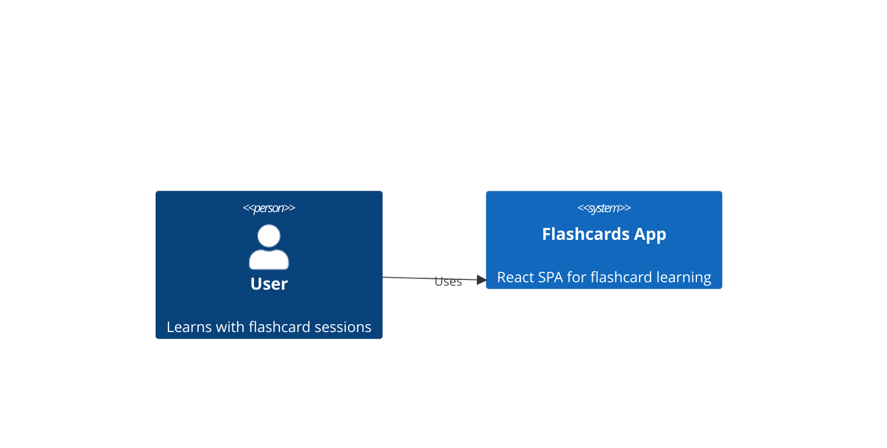
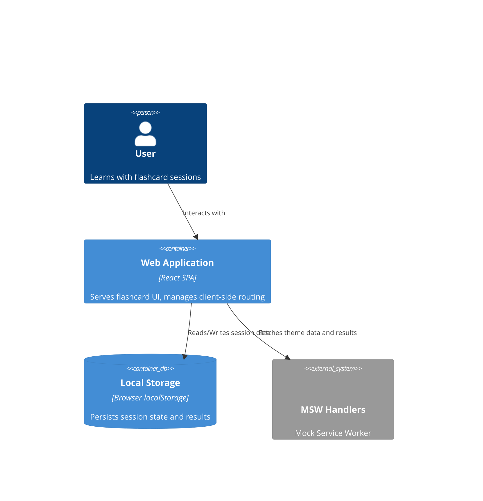
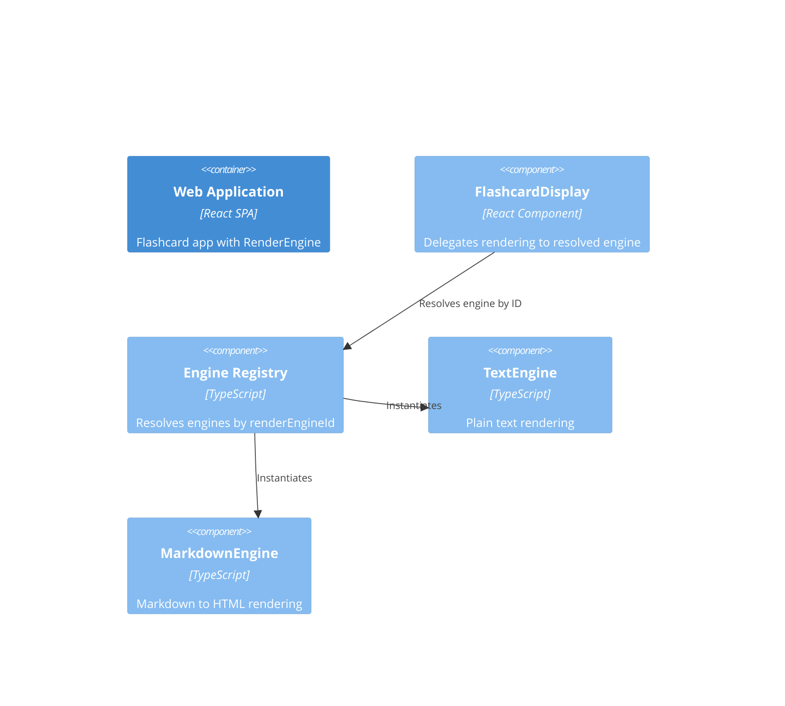

# Container C4 Diagram — Flashcards App

## System Context

## Container Diagram

## Component Details

### React SPA Container

**Technology:** React + Vite + TypeScript + MSW

**Client-side routes:**
- `/` — HomeScreen (theme picker, mode selector, Start button)
- `/session` — SessionScreen (flashcard display, progress, score buttons)
- `/results` — ResultsScreen (session score, replay, back to home)

**State management:**
- React Context for session state (current card, progress, score)
- localStorage for persistence across sessions

**MSW handlers:**
- Theme data: `world-capitals.json` (card deck with front/back pairs)
- Session results: stores/retrieves per-session outcomes

### Components

| Component | Responsibility |
|---|---|
| `HomeScreen` | Theme picker, mode selector, Start button |
| `SessionScreen` | Flashcard display, progress bar, score buttons |
| `ResultsScreen` | Session score display, replay, back to home |
| `FlashcardDisplay` | Renders card front/back with flip animation |
| `ThemePicker` | Selects from available themes |
| `ModeSelector` | Chooses learning mode (flip, spaced-repetition) |
| `ProgressBar` | Shows session advancement (X/Y) |
| `ScoreButtons` | "I knew it" / "I didn't know" post-flip |

### External Integrations

| External | Purpose |
|---|---|
| Local Storage | Persist session results and user preferences |
| MSW (world-capitals.json) | Serve flashcard theme data |
| MSW (session results) | Mock storage for session outcomes |

## RenderEngine Layer

### Rendering Architecture

### Engine Resolution Flow

1. CardSide is normalized: plain string → `{ data, renderEngineId: 'text' }`
2. EngineRegistry resolves the engine by `renderEngineId`
3. FlashcardDisplay calls `engine.render(data, targetElement)`
4. If engine supports `precompute`, SessionScreen calls it during question display

### Components Updated

| Component | Change |
|---|---|
| `FlashcardDisplay` | Now delegates rendering to resolved RenderEngine instead of direct text rendering |
| `SessionScreen` | Implements precompute lifecycle for async engines |