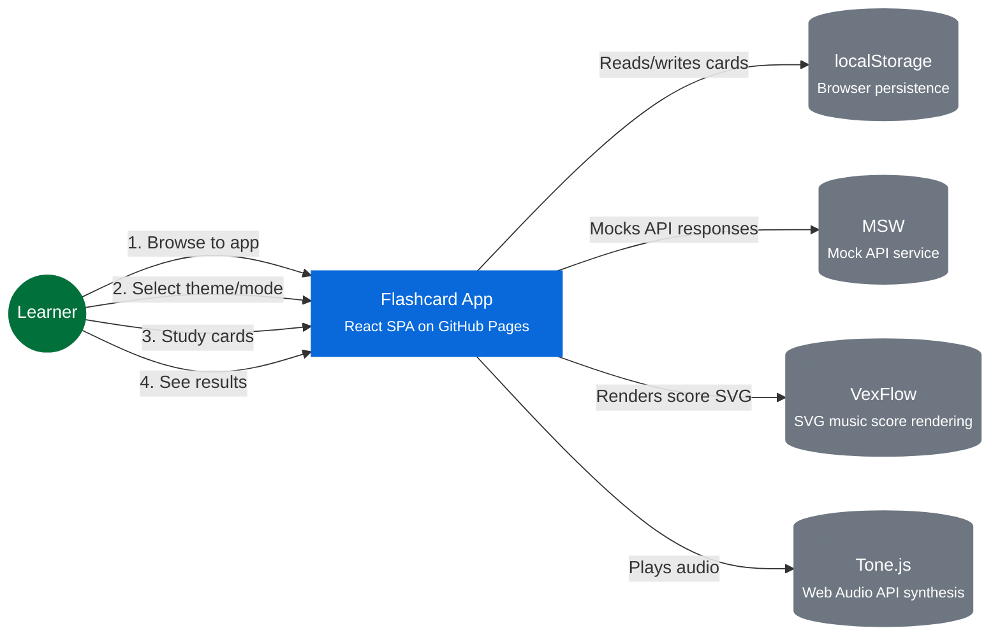

# System Context — Flashcard App

## Interactions

1. **Browse to app** — Learner navigates to the Flashcard App URL
2. **Select theme/mode** — Learner picks a theme and learning mode on the home screen
3. **Study cards** — Learner flips through cards, marking known/unknown
4. **See results** — Learner views session score and can replay or return home
5. **Score rendering** — Flashcard App renders the session score as an SVG music score using VexFlow
6. **Audio playback** — Flashcard App plays audio feedback and musical cues using Tone.js

## External Dependencies

| External | Purpose |
|---|---|
| `localStorage` | Persists theme selection, session results, and progress across visits |
| `MSW` | Intercepts and mocks API calls for consistent offline/demo behavior |
| `VexFlow` | OSS, MIT — SVG music score rendering for visual score display |
| `Tone.js` | OSS, MIT — Web Audio API synthesis for audio playback and musical cues |
