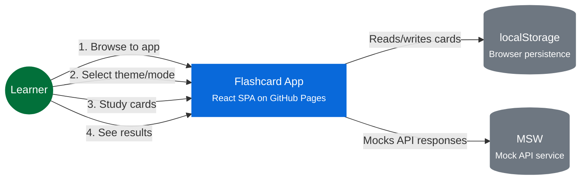

# System Context — Flashcard App

## Interactions

1. **Browse to app** — Learner navigates to the Flashcard App URL
2. **Select theme/mode** — Learner picks a theme and learning mode on the home screen
3. **Study cards** — Learner flips through cards, marking known/unknown
4. **See results** — Learner views session score and can replay or return home

## External Dependencies

| External | Purpose |
|---|---|
| `localStorage` | Persists theme selection, session results, and progress across visits |
| `MSW` | Intercepts and mocks API calls for consistent offline/demo behavior |
| `VexFlow (bundled)` | SVG music notation rendering — used by ScoreEngine and ScoreAudioEngine |
| `Tone.js (bundled)` | Web Audio API abstraction — used by ScoreAudioEngine for note playback |