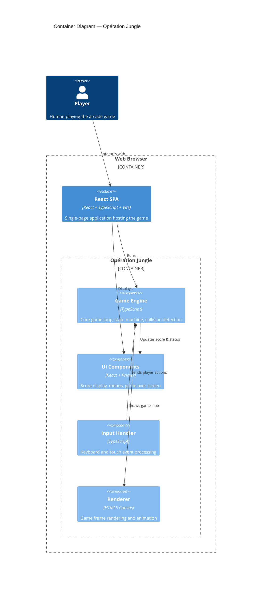

# C4 Containers — Opération Jungle

Container diagram for Opération Jungle, showing the internal structure of the browser-based game.

## Notes

- **No external services or databases** — everything runs in the browser.
- **Game Engine** manages the core game loop, state transitions, and collision detection.
- **UI Components** handle menus, score display, and game-over overlays using React + Primer.
- **Input Handler** normalizes keyboard (desktop) and touch (mobile) events into game actions.
- **Renderer** draws each frame on an HTML5 Canvas element.
- Status: **current** — this is the V1 architecture.
