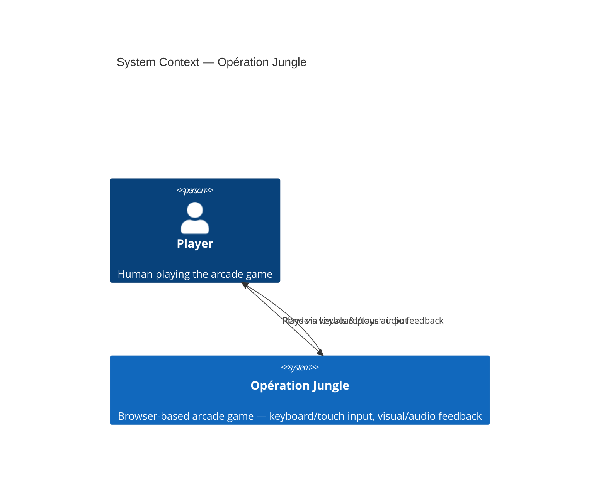

# C4 System Context — Opération Jungle

System context diagram for Opération Jungle, a browser-based arcade game.

## Notes

- **Fully client-side** — no backend, no external services, no databases.
- The Player interacts with Opération Jungle through **keyboard** (desktop) or **touch** (mobile) input.
- The game responds with **visual rendering** and **audio feedback** directly in the browser.
- Status: **current** — this is the V1 architecture.
