# MonJournal Components

The MonJournal Component diagram illustrates the internal structure of the React application, showing how UI components, custom hooks, and data models work together to deliver journaling, filtering, and viewing functionality.

---

## C4 Component Diagram

```mermaid
C4Component
  title MonJournal Components - React App Internal Structure
  
  Container_Boundary(react_app, "React App") {
    Component(layout, "Layout", "React Component", "Root layout from AppShell with header navigation")
    Component(home, "Home", "React Component", "Main container; composes FilterPanel, ThoughtList, TimelineView; manages filter state and view mode")
    Component(add_thought, "AddThought", "React Component", "Form for creating new thoughts; validates inputs and calls useThoughts.addThought()")
    Component(help_screen, "HelpScreen", "React Component", "Help/guide page from AppShell")
    Component(demo_screen, "DemoScreen", "React Component", "Demo page from AppShell")
    Component(about_screen, "AboutScreen", "React Component", "About page from AppShell")
    
    Component(filter_panel, "FilterPanel", "React Component", "Multi-criteria filter UI; renders text search, date range picker, tag select, surprise button")
    Component(thought_list, "ThoughtList", "React Component", "Displays filtered thoughts as compact cards with title, truncated content, date, tags")
    Component(timeline_view, "TimelineView", "React Component", "Groups thoughts by date; renders day separators with thought cards in reverse chronological order")
    Component(tag_input, "TagInput", "React Component", "Tag autocomplete input with chip display; provides tag suggestions")
    Component(inline_add_form, "InlineAddThoughtForm", "React Component", "Alternative inline form for quick thought capture (if present)")
    Component(control_zone, "ControlZone", "React Component", "UI control area; renders view toggle (List ↔ Timeline) and other controls")
    
    Component(use_thoughts, "useThoughts", "React Hook", "Core data hook; returns thoughts array, addThought(), getTags(), filterThoughts()")
    Component(use_local_storage, "useLocalStorage", "React Hook", "Wrapper around window.localStorage; provides getItem, setItem with JSON serialization")
    
    Component(thought_model, "thoughtModel", "TypeScript Module", "Thought type definition; exports createThought(), validateThought()")
    Component(tag_model, "tagModel", "TypeScript Module", "Tag type definition; exports deriveTags(), getTagColor()")
    Component(filter_logic, "filterLogic", "TypeScript Module", "Filtering functions; exports applyFilters(), matchesTextSearch(), matchesDateRange(), matchesTags()")
    Component(color_palette, "colorPalette", "TypeScript Module", "Fixed array of 8–12 distinct colors for tag assignment")
  }
  
  Container_Boundary(browser, "Browser Runtime") {
    ContainerDb(local_storage, "localStorage", "Browser localStorage API", "Persistent storage of thoughts under key monjournal_thoughts")
  }
  
  Rel(layout, home, "Routes to home page")
  Rel(layout, add_thought, "Routes to add thought page")
  Rel(layout, help_screen, "Routes to help page")
  Rel(layout, demo_screen, "Routes to demo page")
  Rel(layout, about_screen, "Routes to about page")
  
  Rel(home, filter_panel, "Composes and manages filters")
  Rel(home, control_zone, "Renders view toggle")
  Rel(home, thought_list, "Renders filtered thoughts in list view")
  Rel(home, timeline_view, "Renders filtered thoughts in timeline view")
  Rel(home, use_thoughts, "Reads thoughts, applies filters, retrieves tags")
  
  Rel(add_thought, tag_input, "Renders tag autocomplete")
  Rel(add_thought, use_thoughts, "Calls addThought() on form submission")
  Rel(add_thought, thought_model, "Creates new Thought object")
  
  Rel(filter_panel, tag_input, "Renders tag input for filtering")
  Rel(filter_panel, use_thoughts, "Gets available tags for filter options")
  Rel(filter_panel, filter_logic, "Applies filters to thoughts")
  
  Rel(thought_list, tag_input, "Displays tag chips for each thought")
  Rel(timeline_view, tag_input, "Displays tag chips for grouped thoughts")
  
  Rel(control_zone, home, "Updates view mode (list/timeline)")
  
  Rel(use_thoughts, thought_model, "Manages Thought type")
  Rel(use_thoughts, tag_model, "Derives tags from thoughts")
  Rel(use_thoughts, filter_logic, "Applies filters to thought array")
  Rel(use_thoughts, use_local_storage, "Reads/writes thoughts to localStorage")
  
  Rel(tag_model, color_palette, "Assigns colors to tags using palette")
  Rel(tag_model, tag_input, "Provides Tag objects with computed colors")
  
  Rel(use_local_storage, local_storage, "Reads/writes JSON data", "localStorage API")
```



---

## Component Descriptions

### Screen Components (Routes)

| Component | Purpose | Key Props | State |
|---|---|---|---|
| **Layout** | Root layout from AppShell with header and navigation | children | N/A (composition) |
| **Home** | Main container for journaling UI; composes filters, view toggle, and thought displays | none | filterState, viewMode, surprise selection |
| **AddThought** | Form page for creating new thoughts | onSave callback (via useThoughts) | title, content, tags (form inputs) |
| **HelpScreen** | Help/guide page (from AppShell) | — | — |
| **DemoScreen** | Demo page (from AppShell) | — | — |
| **AboutScreen** | About page (from AppShell) | — | — |

### Container Components

| Component | Purpose | Key Props | Children |
|---|---|---|---|
| **FilterPanel** | Multi-criteria filter UI; manages text search, date range, tag selection | existingTags, onFilterChange | TextInput, DatePicker, TagInput, SurpriseButton |
| **ThoughtList** | Renders array of thoughts as compact cards | thoughts, onSurpriseClick | ThoughtCard (repeat) |
| **TimelineView** | Groups thoughts by creation date; renders day separators | thoughts, onSurpriseClick | TimelineGroup (repeat by date) |
| **ControlZone** | Control area for view toggle and other UI controls | onViewModeChange, currentViewMode | View toggle, buttons |
| **InlineAddThoughtForm** | Quick-capture inline form (optional alternative) | onSubmit | TextInput, TagInput, SubmitButton |

### Input/Field Components

| Component | Purpose | Key Props | Behavior |
|---|---|---|---|
| **TagInput** | Autocomplete input for tag selection with chip display | existingTags, selectedTags, onChange | Suggests available tags, renders chips, filters on input |

---

## Hook and Module Descriptions

### Custom Hooks

| Hook | Returns | Side Effects | Memoization |
|---|---|---|---|
| **useThoughts** | `{ thoughts, addThought, getTags, filterThoughts }` | Loads/saves to localStorage on mount and after addThought | Optional useMemo for getTags() |
| **useLocalStorage** | `{ getItem, setItem }` | Direct localStorage read/write | N/A (pure I/O wrapper) |

### Data Models (TypeScript Modules)

| Module | Exports | Purpose |
|---|---|---|
| **thoughtModel** | Thought type, createThought(), validateThought() | Type definition and factory for thought creation |
| **tagModel** | Tag type, deriveTags(), getTagColor() | Tag derivation from thoughts array, deterministic color assignment |
| **filterLogic** | FilterState type, applyFilters(), matchesTextSearch(), matchesDateRange(), matchesTags() | Composable filter predicates |
| **colorPalette** | Array of 8–12 color strings (hex or RGB) | Fixed palette for tag color assignment |

---

## Data Flow Paths

### Path 1: Thought Capture (Write)
```
AddThought → form validation → useThoughts.addThought() 
  → thoughtModel.createThought() 
  → useLocalStorage.setItem() 
  → navigate to Home
  → Home re-renders from updated useThoughts
```

### Path 2: Thought Display with Filtering (Read)
```
Home (mount) 
  → useThoughts (loads from localStorage)
  → tagModel.deriveTags()
  → FilterPanel (renders tag options)
  → User applies filters
  → filterLogic.applyFilters()
  → ThoughtList or TimelineView re-render
```

### Path 3: Tag Color Assignment
```
useThoughts.getTags() 
  → tagModel.deriveTags()
  → tagModel.getTagColor() (for each unique tag name)
  → colorPalette lookup
  → Tag objects with colors returned
  → ThoughtCard and TagInput render colored chips
```

---

## Component Dependencies Graph

```
Layout (root)
  ├─ Home (container)
  │   ├─ FilterPanel (composes TagInput, FilterLogic)
  │   ├─ ControlZone
  │   ├─ ThoughtList (renders TagInput chips)
  │   ├─ TimelineView (renders TagInput chips)
  │   └─ useThoughts → useLocalStorage, thoughtModel, tagModel, filterLogic
  │
  ├─ AddThought (composes TagInput, thoughtModel)
  │   └─ useThoughts → useLocalStorage, thoughtModel
  │
  ├─ HelpScreen
  ├─ DemoScreen
  └─ AboutScreen
```

---

## Key Patterns

### Composition
- **FilterPanel** composes **TagInput** and **filterLogic** to provide filtered thought selection
- **Home** composes **FilterPanel**, **ThoughtList**, and **TimelineView** to deliver full journaling experience
- **ThoughtList** and **TimelineView** both compose **TagInput** to display tag chips

### Data Flow
- All thought data flows through **useThoughts** hook
- **useThoughts** is the single source of truth, backed by **useLocalStorage**
- Filters are applied by **filterLogic** before rendering in **ThoughtList** or **TimelineView**

### Separation of Concerns
- **Components**: UI rendering and user interaction
- **Hooks**: State management and data access
- **Models**: Domain logic (thought creation, tag derivation, filtering)

---

## Related Documentation

- **Container Diagram**: [containers.md](containers.md) — Shows React App and localStorage containers
- **System Context**: [system-context.md](system-context.md) — Shows MonJournal system boundaries
- **Architecture**: [../architecture.md](../architecture.md) — Detailed technical decisions and data flow examples
