# Component Diagram — Journal Personnel

## Overview
This diagram illustrates the internal structure of the Journal Personnel SPA, showing how React components, hooks, domain services, and the repository interact. It provides a deeper view of the UI layer and application logic boundaries.

## Diagram

```mermaid
C4Component
  title Component Diagram — Journal Personnel

  Person(user, "Diariste", "Interacts with UI")

  Container_Boundary(ui, "UI Layer (React Components)") {
    Component(app, "App", "React Root", "Layout, routing, state providers")
    Component(entryForm, "EntryForm", "React Component", "Create/edit form with date picker and textarea")
    Component(timeline, "Timeline", "React Component", "Chronological list with date anchors")
    Component(searchPanel, "SearchPanel", "React Component", "Date range search interface")
    Component(surpriseView, "SurpriseView", "React Component", "Display random entry with navigation")
    Component(entryDetail, "EntryDetail", "React Component", "View single entry with edit/delete")
    Component(themeSelector, "ThemeSelector", "React Component", "Light/dark mode toggle")
  }

  Container_Boundary(hooks, "Application Hooks") {
    Component(useJournalEntries, "useJournalEntries", "Custom Hook", "Fetch all entries, manage loading state")
    Component(useCreateEntry, "useCreateEntry", "Custom Hook", "Create and persist new entry")
    Component(useEditEntry, "useEditEntry", "Custom Hook", "Modify existing entry")
    Component(useDeleteEntry, "useDeleteEntry", "Custom Hook", "Delete entry with confirmation")
    Component(useSearchEntries, "useSearchEntries", "Custom Hook", "Filter entries by date range")
    Component(useSurpriseEntry, "useSurpriseEntry", "Custom Hook", "Select random entry")
    Component(useTheme, "useTheme", "Custom Hook", "Manage light/dark mode")
  }

  Container_Boundary(domain, "Domain Layer") {
    Component(entryEntity, "JournalEntry", "TypeScript Type", "{ id, date, text, createdAt, updatedAt }")
    Component(searchService, "SearchService", "Pure Function", "filterByDateRange(entries, start, end)")
    Component(randomSelector, "RandomSelector", "Pure Function", "selectRandom(items) → T | null")
    Component(validation, "Validation", "Pure Functions", "validateDate, validateText, etc.")
  }

  Container_Boundary(adapters, "Repository & Infrastructure") {
    Component(entryRepo, "IEntryRepository", "Interface", "Contract for CRUD operations")
    Component(localStorageRepo, "LocalStorageRepository", "Adapter", "Implements IEntryRepository with localStorage")
    Component(dateUtils, "DateUtils", "Utility", "ISO 8601 parsing, formatting, comparison")
    Component(uuidGen, "UUIDGenerator", "Utility", "Generate UUID v4 for entries")
    Component(mswHandlers, "MSW Handlers", "Mock API", "Mock GET/POST/PUT/DELETE endpoints (phase 2)")
  }

  Container_Boundary(design, "Design System") {
    Component(primerReact, "Primer React", "Component Library", "Button, TextInput, Heading, Box, Stack, etc.")
    Component(cssVars, "CSS Variables", "Theme System", "Colors, spacing, typography tokens")
    Component(darkMode, "Dark Mode", "Theme", "System preference detection + manual toggle")
  }

  Rel(user, app, "Interacts with")
  Rel(app, entryForm, "Renders")
  Rel(app, timeline, "Renders")
  Rel(app, searchPanel, "Renders")
  Rel(app, surpriseView, "Renders")
  Rel(app, themeSelector, "Renders")
  
  Rel(entryForm, useCreateEntry, "Calls")
  Rel(entryForm, useEditEntry, "Calls")
  Rel(timeline, useJournalEntries, "Calls")
  Rel(searchPanel, useSearchEntries, "Calls")
  Rel(surpriseView, useSurpriseEntry, "Calls")
  Rel(entryDetail, useEditEntry, "Calls")
  Rel(entryDetail, useDeleteEntry, "Calls")
  Rel(themeSelector, useTheme, "Calls")
  
  Rel(useCreateEntry, validation, "Uses for")
  Rel(useCreateEntry, entryEntity, "Creates")
  Rel(useCreateEntry, entryRepo, "Calls")
  
  Rel(useJournalEntries, entryRepo, "Calls")
  
  Rel(useSearchEntries, searchService, "Calls")
  Rel(useSearchEntries, entryRepo, "Calls")
  
  Rel(useSurpriseEntry, randomSelector, "Calls")
  Rel(useSurpriseEntry, entryRepo, "Calls")
  
  Rel(entryRepo, localStorageRepo, "Delegates to")
  Rel(localStorageRepo, dateUtils, "Uses")
  Rel(localStorageRepo, uuidGen, "Uses")
  
  Rel(app, primerReact, "Uses for styling")
  Rel(app, cssVars, "Applies theme tokens")
  Rel(themeSelector, darkMode, "Controls")
```



## Component Descriptions

### UI Layer Components

#### App (React Root)
- **Responsibility** : Layout container, manage application state, route between views
- **Props** : None (root)
- **State** : currentView, theme
- **Children** : EntryForm, Timeline, SearchPanel, SurpriseView, ThemeSelector
- **Key behaviors** :
  - Display Timeline by default
  - Switch to EntryForm when user clicks "New Entry"
  - Switch to SearchPanel when user clicks "Search"
  - Switch to SurpriseView when user clicks "Surprise"
  - Apply theme globally via CSS variables

#### EntryForm
- **Responsibility** : Capture user input for new or edited entry
- **Props** :
  - `initialEntry?: JournalEntry` (for edit mode)
  - `onSubmit: (data) => Promise<void>`
  - `onCancel: () => void`
- **State** : date (today default), text (empty), isSubmitting, error
- **Renders** :
  - Date input (calendar picker)
  - Textarea for entry text
  - Save and Cancel buttons
  - Error message if validation fails

#### Timeline
- **Responsibility** : Display all entries in chronological order with date anchors
- **Props** :
  - `entries: JournalEntry[]`
  - `onEntryClick: (entry) => void`
  - `onDateClick: (date) => void`
  - `sortOrder?: 'asc' | 'desc'` (default 'desc')
- **Renders** :
  - Vertical timeline with date headers
  - Entry list items grouped by date
  - Click handlers for dates and entries

#### SearchPanel
- **Responsibility** : Capture date range for filtered search
- **Props** :
  - `onSearch: (startDate, endDate) => Promise<void>`
  - `onCancel: () => void`
- **State** : startDate, endDate, isSearching, error
- **Renders** :
  - Start date input
  - End date input
  - Search and Clear buttons
  - Validation feedback

#### SurpriseView
- **Responsibility** : Display single random entry with navigation
- **Props** :
  - `entry: JournalEntry | null`
  - `onNext: () => void`
  - `onBack: () => void`
  - `isLoading: boolean`
  - `error?: string | null`
- **Renders** :
  - Entry date and full text
  - "Next Surprise" button
  - "Back" button
  - "No entries" message if empty

#### EntryDetail
- **Responsibility** : Display single entry with edit/delete options
- **Props** :
  - `entry: JournalEntry`
  - `onEdit: () => void`
  - `onDelete: () => void`
  - `onBack: () => void`
- **State** : showDeleteConfirm
- **Renders** :
  - Entry date, text, timestamps
  - Edit and Delete buttons
  - Confirmation dialog for delete

#### ThemeSelector
- **Responsibility** : Toggle between light and dark modes
- **Props** :
  - `theme: 'light' | 'dark'`
  - `onThemeChange: (theme) => void`
- **Renders** :
  - Toggle button (sun/moon icon)
  - Theme indicator

### Application Hooks

#### useJournalEntries
```typescript
const { entries, isLoading, error, refetch } = useJournalEntries();
```
- Calls `repository.getAll()` on mount
- Returns sorted array (by date, configurable order)
- Handles loading and error states

#### useCreateEntry
```typescript
const { createEntry, isCreating, error } = useCreateEntry();
await createEntry({ date: '2026-05-28', text: 'My thoughts...' });
```
- Validates date and text
- Calls `repository.create()`
- Updates local state on success
- Returns created entry with ID and timestamps

#### useEditEntry
```typescript
const { editEntry, isEditing, error } = useEditEntry();
await editEntry(entryId, { text: 'Updated text' });
```
- Validates updates
- Calls `repository.update()`
- Updates `updatedAt` timestamp
- Refetches entries on success

#### useDeleteEntry
```typescript
const { deleteEntry, isDeleting, error } = useDeleteEntry();
await deleteEntry(entryId);
```
- Shows confirmation dialog (via component state, not hook)
- Calls `repository.delete()`
- Refetches entries on success

#### useSearchEntries
```typescript
const { results, search, isSearching, error } = useSearchEntries();
await search({ startDate: '2026-05-20', endDate: '2026-06-01' });
```
- Gets all entries via `repository.getAll()`
- Calls `SearchService.filterByDateRange()`
- Returns filtered array
- Performance: O(n), target < 100ms

#### useSurpriseEntry
```typescript
const { surpriseEntry, getSurprise, error } = useSurpriseEntry();
getSurprise(); // updates state with random entry
```
- Gets all entries via `repository.getAll()`
- Calls `RandomSelector.selectRandom()`
- Returns single entry or null
- Performance: O(1), target < 50ms

#### useTheme
```typescript
const { theme, setTheme } = useTheme();
setTheme('dark'); // persists to localStorage
```
- Reads from `localStorage['journal_theme']`
- Detects system preference on first visit
- Applies CSS custom properties to root element
- Persists user choice

### Domain Layer Components

#### JournalEntry (Type)
```typescript
type JournalEntry = {
  id: string;                    // UUID
  date: string;                  // YYYY-MM-DD
  text: string;                  // Free-form text (non-empty)
  createdAt: string;            // ISO 8601 (immutable)
  updatedAt: string;            // ISO 8601 (mutable)
};
```

#### SearchService
```typescript
function filterByDateRange(
  entries: JournalEntry[],
  startDate: string,
  endDate: string
): JournalEntry[] {
  return entries.filter(e => e.date >= startDate && e.date <= endDate);
}
```
- Pure function, no side effects
- O(n) complexity
- Inclusive of start and end dates

#### RandomSelector
```typescript
function selectRandom<T>(items: T[]): T | null {
  if (!items.length) return null;
  return items[Math.floor(Math.random() * items.length)];
}
```
- Pure function, uniform distribution
- Handles empty array gracefully

#### Validation
Pure functions for business rule checks:
- `validateDate(date: string): boolean` — checks YYYY-MM-DD format
- `validateText(text: string): boolean` — ensures non-empty
- `validateDateRange(start: string, end: string): boolean` — ensures start <= end

### Repository & Infrastructure Components

#### IEntryRepository (Interface)
Contract for CRUD operations:
```typescript
interface IEntryRepository {
  getAll(): Promise<JournalEntry[]>;
  getById(id: string): Promise<JournalEntry | null>;
  create(entry: Omit<JournalEntry, 'id' | 'createdAt' | 'updatedAt'>): Promise<JournalEntry>;
  update(id: string, updates: Partial<JournalEntry>): Promise<JournalEntry>;
  delete(id: string): Promise<void>;
}
```

#### LocalStorageRepository (Adapter)
Implements `IEntryRepository` using browser localStorage:
- **getAll()** : Read `journal_entries` key, deserialize JSON, return array
- **create()** : Generate UUID + timestamps, add to array, serialize, store
- **update()** : Find entry, merge updates, update `updatedAt`, serialize, store
- **delete()** : Find and remove entry, serialize, store
- **Error handling** : Catch quota exceeded, corrupted data; throw descriptive errors

#### DateUtils (Utility)
Helpers for date manipulation:
- `parseISO8601(dateString)` : Parse YYYY-MM-DD or ISO string
- `formatISO8601(date)` : Format Date as YYYY-MM-DD or ISO
- `isValidDate(dateString)` : Validate YYYY-MM-DD format
- `compareDate(d1, d2)` : Compare two date strings

#### UUIDGenerator (Utility)
- `generateUUID()` : Create UUID v4
- `isValidUUID(uuid)` : Validate UUID format

#### MSW Handlers (Mock Service Worker)
Handlers for future API integration (phase 2):
- `GET /api/entries` : Return all entries
- `POST /api/entries` : Create entry
- `PUT /api/entries/:id` : Update entry
- `DELETE /api/entries/:id` : Delete entry
- Currently inactive; ready to activate when backend is added

### Design System Components

#### Primer React
Library of accessible, pre-built components:
- **Layout** : Box, Stack, Grid, Container
- **Forms** : TextInput, Textarea, FormControl, Label
- **Data** : DataTable (future)
- **Buttons** : Button, IconButton, LinkButton
- **Overlays** : Dialog, Popover, Tooltip
- **Typography** : Heading, Text

#### CSS Variables
Theme tokens for light and dark modes:
- **Colors** : text color, background, border, accent
- **Spacing** : padding, margin units (4px scale)
- **Typography** : font sizes, line heights, font weights

#### Dark Mode Theme
- Automatic detection via `prefers-color-scheme` media query
- Manual override via `useTheme` hook
- CSS variables swap for light ↔ dark
- Persisted to `localStorage['journal_theme']`

## Data Flow Examples

### Example 1: Create Entry
```
User types in EntryForm → clicks Save
  ↓
EntryForm.onSubmit({ date, text })
  ↓
useCreateEntry hook: validateDate(), validateText()
  ↓
SearchService.filterByDateRange() [check no duplicates]
  ↓
repository.create() → LocalStorageRepository
  ↓
UUIDGenerator, DateUtils (generate ID, timestamps)
  ↓
Write to localStorage['journal_entries']
  ↓
Hook updates state, returns success
  ↓
Component re-renders, shows confirmation
  ↓
App.setState(currentView = 'timeline')
  ↓
Timeline renders with new entry visible
```

### Example 2: Search by Date Range
```
User fills SearchPanel → clicks Search
  ↓
SearchPanel.onSearch(startDate, endDate)
  ↓
useSearchEntries hook: validateDateRange()
  ↓
repository.getAll() → LocalStorageRepository
  ↓
Read from localStorage['journal_entries']
  ↓
SearchService.filterByDateRange(entries, start, end)
  ↓
Hook returns filtered results
  ↓
App.setState(results, currentView = 'search-results')
  ↓
Timeline renders with filtered entries only
```

### Example 3: Select Random Entry
```
User clicks "Surprise" button
  ↓
App calls useSurpriseEntry()
  ↓
Hook: repository.getAll()
  ↓
Read from localStorage['journal_entries']
  ↓
RandomSelector.selectRandom(entries)
  ↓
Math.floor(Math.random() * entries.length) → pick one
  ↓
Hook returns surprise entry
  ↓
App.setState(currentView = 'surprise')
  ↓
SurpriseView renders the entry
```

## Performance Implications

| Component | Operation | Complexity | Target |
|-----------|-----------|-----------|--------|
| Timeline | Render 1000 entries | O(n) | < 1s |
| SearchService | Filter 1000 entries | O(n) | < 100ms |
| RandomSelector | Pick from 1000 entries | O(1) | < 50ms |
| LocalStorageRepository | Read/write | O(n) JSON parse/stringify | < 50ms |

Optimization strategies:
- **Virtualization** : Use `react-window` for 1000+ entries (phase 2)
- **Memoization** : useCallback for expensive functions
- **Lazy loading** : Load entries on demand if needed
- **Indexed search** : Build date index in phase 2 for large datasets

