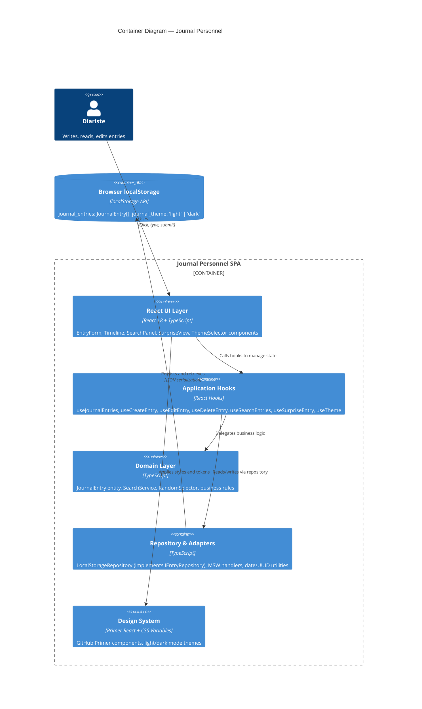

# Container Diagram — Journal Personnel

## Overview
Journal Personnel consists of a single deployable SPA (single-page application) running entirely in the browser. The app is divided into logical technical containers: the React UI layer, application business logic, domain layer, and infrastructure adapters. All data is stored in browser localStorage.

## Diagram



## Container Description

### 1. React UI Layer (`src/components/`)
**Technology** : React 18 + TypeScript + Primer React  
**Responsibility** : Render user interface, handle user interactions  
**Components** :
- `EntryForm` : Create/edit entry form with date picker and textarea
- `Timeline` : Chronological list of entries with date anchors
- `SearchPanel` : Date range search form
- `SurpriseView` : Display random entry with "Next" and "Back" buttons
- `EntryDetail` : Display single entry with edit/delete options
- `ThemeSelector` : Light/dark mode toggle
- `App` : Root component, layout manager

**Key interfaces** :
- Receives props from parent components
- Calls hooks for data and state management
- Emits events (onClick, onSubmit) back to parent

### 2. Application Hooks (`src/hooks/`)
**Technology** : React Hooks + TypeScript  
**Responsibility** : Orchestrate domain logic, manage local state, coordinate with repository  
**Hooks** :
- `useJournalEntries()` → fetches all entries, handles loading/error
- `useCreateEntry(date, text)` → validates, creates, persists, returns success/error
- `useEditEntry(id, updates)` → modifies entry, updates timestamp
- `useDeleteEntry(id)` → deletes entry after confirmation
- `useSearchEntries(startDate, endDate)` → filters entries by date range
- `useSurpriseEntry()` → selects random entry
- `useTheme()` → manages light/dark mode state, reads from storage

**Key interfaces** :
- Pure state management (useState, useCallback)
- Side-effect handling (useEffect)
- Delegation to domain layer for business logic
- Delegation to repository for persistence

### 3. Domain Layer (`src/domain/`)
**Technology** : TypeScript (zero dependencies)  
**Responsibility** : Business rules, entity definitions, pure functions  
**Entities & Services** :
- `JournalEntry` type : `{ id, date, text, createdAt, updatedAt }`
- `SearchService.filterByDateRange(entries, start, end)` : pure function, O(n)
- `RandomSelector.selectRandom(items)` : uniform random selection
- Business rules : date validation, non-empty text, timestamp immutability

**Key interfaces** :
- No dependencies on React, storage, or HTTP
- Fully testable in isolation
- Reusable from any adapter layer

### 4. Repository & Adapters (`src/infrastructure/`)
**Technology** : TypeScript + localStorage API + MSW  
**Responsibility** : Data persistence, API simulation, utility functions  
**Components** :
- `LocalStorageRepository` (implements `IEntryRepository`)
  - `getAll()` : read from localStorage, deserialize JSON
  - `create(entry)` : generate ID/timestamps, serialize, store
  - `update(id, updates)` : merge fields, update `updatedAt`, serialize, store
  - `delete(id)` : remove from array, serialize, store
  - Error handling : catch quota exceeded, corrupted data

- `MSW Server` (for future API testing)
  - Handlers for GET /api/entries, POST /api/entries, PUT, DELETE
  - Mock responses matching real API contracts
  - Ready to swap with real API in phase 2

- Utility functions
  - `DateUtils` : ISO 8601 parsing, formatting, comparison
  - `UUIDGenerator` : UUID v4 generation
  - `LocalStorageManager` : safe read/write with error handling

### 5. Design System (`src/styles/`)
**Technology** : Primer React + CSS Variables  
**Responsibility** : Visual design, theme management, component primitives  
**Includes** :
- Primer React components : Button, TextInput, Heading, Box, Stack, etc.
- CSS custom properties (variables) for colors, spacing, typography
- Light/dark mode theme definitions
- Global styles and layout utilities

**Key features** :
- GitHub Primer design tokens
- Automatic light/dark mode switching via CSS variables
- No additional CSS framework (Tailwind not needed)
- Accessible color contrast built-in

### 6. Browser localStorage
**Technology** : HTML5 localStorage API  
**Capacity** : ~5–10 MB per domain (varies by browser)  
**Keys** :
- `journal_entries` : JSON array of JournalEntry objects
- `journal_theme` : User's theme preference ('light' | 'dark')

**Data format** :
```json
{
  "journal_entries": [
    {
      "id": "uuid-1",
      "date": "2026-05-28",
      "text": "My thoughts...",
      "createdAt": "2026-05-28T14:30:00Z",
      "updatedAt": "2026-05-28T14:30:00Z"
    }
  ],
  "journal_theme": "light"
}
```

## Communication Patterns

### Write Flow (Create Entry)
1. User fills EntryForm, clicks "Save"
2. EntryForm calls `useCreateEntry(date, text)`
3. Hook validates via domain layer, calls `repository.create()`
4. Repository serializes, writes to localStorage
5. Hook updates React state, returns success
6. Component re-renders with new entry
7. Timeline automatically includes new entry

### Read Flow (Display Timeline)
1. Page loads, App component mounts
2. App calls `useJournalEntries()`
3. Hook calls `repository.getAll()`
4. Repository reads from localStorage, deserializes JSON
5. Hook returns entries, sets loading state
6. Timeline component re-renders with entries

### Search Flow (Date Range)
1. User fills SearchPanel, clicks "Search"
2. SearchPanel calls `useSearchEntries(startDate, endDate)`
3. Hook gets all entries, calls `SearchService.filterByDateRange()`
4. Service returns filtered array (O(n) complexity)
5. Hook updates state
6. Timeline re-renders with filtered entries

### Random Selection Flow (Surprise)
1. User clicks "Surprise" button
2. Component calls `useSurpriseEntry()`
3. Hook gets all entries, calls `RandomSelector.selectRandom()`
4. Selector returns random entry uniformly
5. Hook updates state
6. SurpriseView renders the entry

## Performance Characteristics

| Operation | Complexity | Target | Notes |
|-----------|-----------|--------|-------|
| Create | O(1) write, O(n) re-serialize | < 50ms | Serialize full array to localStorage |
| Read all | O(n) deserialize | < 50ms | ~10-100KB JSON typical |
| Update | O(n) re-serialize | < 50ms | Find entry, merge, re-serialize |
| Delete | O(n) re-serialize | < 50ms | Remove entry, re-serialize |
| Search | O(n) filter | < 100ms | Linear scan, typical with 1000 entries |
| Random | O(1) | < 50ms | Array index random selection |
| Timeline render | O(n) React render | < 1s | For 1000 entries, virtualization optional |

## Scalability Limits

- **Entry capacity** : ~10,000 entries before localStorage quota risk
- **Text size per entry** : No programmatic limit (localStorage quota constraint)
- **Concurrent users** : Single user, single device (by design)
- **Sync conflicts** : None (no sync)

## Deployment Unit

**Single deployment artifact** :
- **Type** : Static SPA bundle (HTML, JS, CSS)
- **Build tool** : Vite
- **Output** : `dist/` folder
- **Hosting** : GitHub Pages or any static web server
- **Size target** : < 500 KB gzipped (React + Primer + logic + styles)

