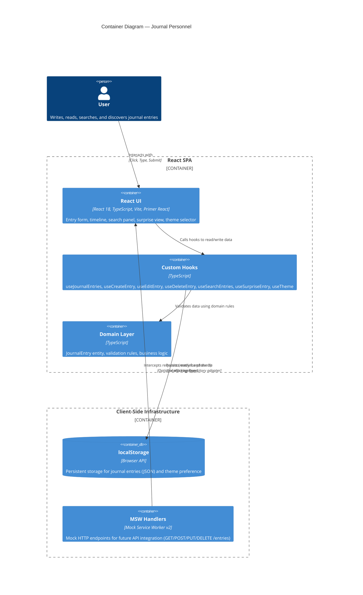

# C4 — Containers — Journal Personnel

## Overview

The Journal Personnel application is a single-page application deployed as a static site. All data persists on the client side using browser localStorage. This container diagram shows the three main containers that compose the system:

1. **React SPA (Frontend Container)** — The user-facing application built with React 18, TypeScript, Vite, and Primer React
2. **MSW Mock API (Simulation Layer)** — Mock Service Worker handlers for future API endpoints and testing
3. **Browser localStorage (Data Persistence)** — Client-side storage for all journal entries and application state

---

## C4 Container Diagram



---

## Container Descriptions

### 1. React SPA (Frontend Container)

**Purpose**: The entire user-facing application where users create, read, edit, delete, search, and discover journal entries.

**Technology Stack**:
- **React 18.x** — UI framework, Hooks API for state management
- **TypeScript** — Full type safety, strict mode
- **Vite** — Build tool, dev server with Hot Module Replacement (HMR)
- **Primer React** — GitHub's design system components (@primer/react, @primer/primitives)
- **Browser APIs** — localStorage (via LocalStorageRepository adapter)

**Key Components**:
- **React UI** — Presentational components (EntryForm, Timeline, SearchPanel, SurpriseView, ThemeSelector)
- **Custom Hooks** — Application business logic orchestration (useJournalEntries, useCreateEntry, useSearchEntries, useSurpriseEntry, useTheme)
- **Domain Layer** — Pure business logic, validation, and entity definitions (JournalEntry, ValidationRules)

**Responsibilities**:
- Render user interface for all journaling workflows
- Manage local component state and side effects
- Validate user input before persistence
- Handle user interactions (click, submit, keyboard navigation)
- Apply theme (light/dark mode) via CSS variables
- Coordinate data flow between UI and storage layers

**Deployment**: Deployed as static files to GitHub Pages. No server-side rendering or backend required.

**Performance Targets**:
- Page load: < 2 seconds (on 4G)
- Timeline render (1000 entries): < 1 second, 60 fps scroll
- Create/Edit/Delete operations: < 50 ms
- Search (1000 entries): < 100 ms

---

### 2. MSW Mock API (Simulation Layer)

**Purpose**: Provides mock HTTP endpoints for testing and future API integration. Sits between the React SPA and external services (if phase 2 adds backend).

**Technology Stack**:
- **Mock Service Worker v2** — Intercepts HTTP requests at the service worker level
- **TypeScript** — Type-safe handler definitions
- **Node.js (test environment)** — setupServer for Jest/Vitest tests

**Key Features**:
- **Mock Handlers** — Simulate HTTP endpoints: GET /entries, POST /entries, PUT /entries/:id, DELETE /entries/:id
- **Response Simulation** — Returns realistic JSON payloads matching real API contract
- **Request Interception** — Transparently intercepts fetch/XMLHttpRequest without code changes
- **Error Simulation** — Can mock network errors, timeouts, and validation failures

**Responsibilities**:
- Intercept HTTP requests from the React SPA
- Return mock responses for testing (phase 2)
- Validate request payloads
- Simulate realistic API behavior (latency, errors, edge cases)
- Support development workflow without a live backend

**Status in MVP**: Inactive. localStorage is the primary adapter. MSW is ready for phase 2 when backend API is added.

**Testing Contract**:
```typescript
// Example MSW handler (pseudo-code)
http.post('/entries', async ({ request }) => {
  const body = await request.json();
  // validate body
  return HttpResponse.json({ 
    id: uuid(),
    ...body,
    createdAt: new Date().toISOString(),
    updatedAt: new Date().toISOString()
  });
})
```

---

### 3. Browser localStorage (Data Persistence)

**Purpose**: Stores all journal entries and application preferences locally on the user's device.

**Technology Stack**:
- **Browser localStorage API** — Key-value store provided by the browser
- **JSON serialization** — All objects converted to/from JSON strings
- **LocalStorageRepository Adapter** — TypeScript interface implementing IEntryRepository

**Schema**:
- **Key: `journal_entries`** — JSON array of JournalEntry objects
- **Key: `journal_theme`** — String ('light' | 'dark') for user's theme preference

**Data Structure** (journal_entries):
```json
[
  {
    "id": "550e8400-e29b-41d4-a716-446655440000",
    "date": "2026-05-28",
    "text": "Today was productive. Completed the architecture design for phase 2.",
    "createdAt": "2026-05-28T14:30:00Z",
    "updatedAt": "2026-05-28T14:30:00Z"
  },
  {
    "id": "550e8400-e29b-41d4-a716-446655440001",
    "date": "2026-05-28",
    "text": "Evening reflection: learning Vite was fun.",
    "createdAt": "2026-05-28T20:15:00Z",
    "updatedAt": "2026-05-28T20:15:00Z"
  }
]
```

**Responsibilities**:
- Persist all journal entries across browser sessions
- Store user's theme preference for continuity
- Provide synchronous read/write access (implemented as Promise-based for future API swap)
- Handle quota management (show error if quota exceeded)
- Gracefully degrade if localStorage is unavailable

**Access Patterns**:
- **Write** — serialize JournalEntry object to JSON, store under `journal_entries` key
- **Read** — deserialize JSON from `journal_entries`, return array of typed objects
- **Update** — merge updates into existing entry, re-serialize, store
- **Delete** — remove entry from array, re-serialize, store

**Size & Limits**:
- **Quota**: ~5–10 MB per domain (varies by browser)
- **Typical Entry**: ~500 bytes (200 chars text + metadata)
- **Safe Capacity**: ~10,000 entries before quota risk
- **Overflow Handling**: Show error toast; do not corrupt existing data

**Isolation & Security**:
- localStorage is scoped to same domain (same-origin policy)
- Not encrypted; assume single-user, trusted browser environment
- Accessible from JavaScript on same domain (XSS risk if applicable; mitigated by React auto-escaping)
- Persists across browser tab closes (intentional feature for journaling use case)

---

## Data Flow Across Containers

### Create Entry Flow
```
User → React UI (EntryForm) 
  → useCreateEntry Hook 
  → Domain Layer (validate) 
  → LocalStorageRepository.create() 
  → localStorage
  → UI update (re-render via Hook state)
```
**Latency**: < 50 ms

### Read Timeline Flow
```
Component Mount 
  → useJournalEntries Hook 
  → LocalStorageRepository.getAll() 
  → localStorage 
  → Parse JSON 
  → Sort by date 
  → React UI (Timeline) renders entries
```
**Latency**: < 100 ms (for 1000 entries)

### Search Flow
```
User → React UI (SearchPanel) 
  → useSearchEntries Hook 
  → Domain Layer (SearchService.filterByDateRange) 
  → Results passed to UI 
  → Timeline re-renders filtered entries
```
**Latency**: < 100 ms (for 1000 entries)

### Surprise Entry Flow
```
User → React UI (SurpriseView button) 
  → useSurpriseEntry Hook 
  → Domain Layer (RandomSelector.selectRandom) 
  → SurpriseView component displays entry
```
**Latency**: < 50 ms

---

## Container Interactions

| Container | Interacts With | Protocol | Purpose |
|-----------|----------------|----------|---------|
| React SPA | localStorage | localStorage API (Promise-based adapter) | CRUD operations on journal entries |
| React SPA | MSW | HTTP (fetch/XMLHttpRequest) | Test harness & future API swap (inactive MVP) |
| useHooks | Domain Layer | TypeScript function calls | Validation, filtering, random selection |
| LocalStorageRepository | localStorage | Browser localStorage API | Serialization/deserialization of entries |

---

## Future Evolution (Phase 2)

When a backend is added, the architecture will evolve as follows:

1. **Replace localStorage with HTTP API**: LocalStorageRepository swapped for HttpRepository
2. **MSW transition**: From mock-only to real API routing
3. **Add authentication**: Guard endpoints with JWT tokens
4. **Cloud sync**: Entries replicated to backend database
5. **Multi-device support**: Same account accessible across devices

**Key Benefit of Current Architecture**: Hexagonal design with clear adapter boundaries allows phase 2 backend integration without rewriting domain logic or React components.

---

## Related Artifacts

- **Architecture**: [how/architecture.md](../architecture.md)
- **System Context**: [how/c4/system-context.md](./system-context.md)
- **Implementation Slices**: [how/slices/](../slices/)
