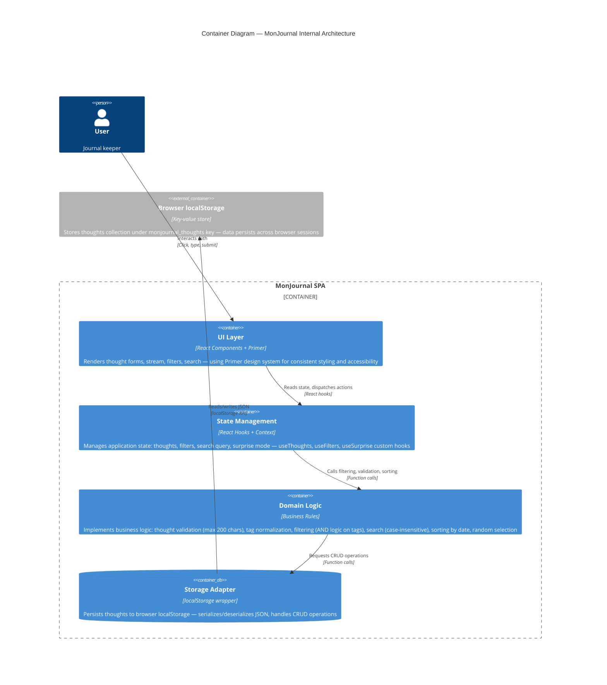

# Container Diagram — MonJournal

## Overview

The container diagram shows the internal structure of MonJournal as a single-page application, with clear boundaries between the UI, state management, business logic, and storage layers.

## C4Container Diagram



## Container Descriptions

### 1. UI Layer (React Components + Primer)

**Purpose:** Render all user-facing interface elements

**Responsibilities:**
- ThoughtForm: Create/edit thought with text and tags
- ThoughtStream: Display thoughts sorted by date (newest first)
- ThoughtItem: Individual thought display with content, tags, actions
- FilterBar: Tag selection pills and clear filters button
- SearchBar: Keyword input for text search
- SurpriseButton: Random thought discovery trigger
- SurpriseModal: Overlay showing single random thought

**Technology:** React 18, TypeScript, Primer CSS (@primer/react)

**Dependencies:** State Management layer (via React context)

---

### 2. State Management (React Hooks + Context)

**Purpose:** Centralize application state and provide hooks for components

**Responsibilities:**
- Store current list of thoughts
- Maintain filter selections (selected tags)
- Track search query
- Manage surprise mode state
- Provide hooks: useThoughts(), useFilters(), useSurprise()
- Synchronize state with storage layer on mutations

**Technology:** React Context API, custom hooks (useState, useCallback, useReducer)

**Dependencies:** Domain Logic layer (for validation, filtering)

---

### 3. Domain Logic (Business Rules)

**Purpose:** Implement thought management and filtering rules

**Responsibilities:**
- Validate thoughts (max 200 characters, required text)
- Normalize tags (lowercase, deduplication)
- Sort thoughts by date (descending, newest first)
- Filter thoughts by tags (AND logic: must have ALL selected tags)
- Search thoughts by keyword (case-insensitive substring match)
- Select random thought from filtered set
- Calculate available tags from current thoughts

**Technology:** TypeScript pure functions

**Dependencies:** None (utility functions only)

---

### 4. Storage Adapter (localStorage wrapper)

**Purpose:** Abstract browser storage operations

**Responsibilities:**
- Load thoughts from localStorage on app startup
- Serialize thoughts to JSON before writing
- Deserialize JSON from localStorage on load
- Implement CRUD: create, read, update, delete
- Handle errors (quota exceeded, corrupted data)
- Provide fallback (empty array if no data or on error)

**Technology:** TypeScript, browser localStorage API

**Dependencies:** None (standard browser API)

---

### 5. Browser localStorage (External)

**Purpose:** Persist data across browser sessions

**Storage Format:**
```json
{
  "monjournal_thoughts": [
    {
      "id": "uuid-1",
      "text": "Had a great day at the park",
      "tags": ["happiness", "nature"],
      "createdAt": 1685472000000,
      "updatedAt": 1685472000000
    }
  ]
}
```

**Quota:** Typically 5-10MB per origin (device-dependent)

---

## Data Flow Example

### Creating a Thought

```
User types in ThoughtForm
  ↓
UI captures text & tags
  ↓
onClick handler calls stateM.addThought()
  ↓
State Management validates via Domain Logic
  ↓
Storage Adapter serializes & writes to localStorage
  ↓
State updates → ThoughtStream re-renders with new thought
```

### Filtering by Tag

```
User clicks tag pill in FilterBar
  ↓
UI updates stateM.selectedTags
  ↓
Domain Logic applies AND filter: keeps only thoughts with ALL selected tags
  ↓
ThoughtStream receives filtered list
  ↓
UI re-renders showing only matching thoughts
```

---

## Technology Choices

| Component | Technology | Why |
|-----------|-----------|-----|
| **UI Framework** | React 18 | Component-based, fast, large ecosystem |
| **Build Tool** | Vite | Fast development, optimized builds |
| **UI System** | Primer | GitHub design system, accessible, familiar |
| **Type Safety** | TypeScript | Catch errors early, better IDE support |
| **State** | React Hooks + Context | Lightweight, no external dependencies |
| **Markdown Rendering** | react-markdown | Simple, no heavy dependencies |
| **Persistence** | localStorage | No backend needed, instant, works offline |

---

## Deployment Architecture

MonJournal is deployed as **static assets**:
- index.html
- JavaScript bundles (main.js, vendor.js)
- CSS bundles (main.css, primer.css)
- Assets (icons, fonts)

Hosting options:
- **Vercel** (recommended, Git integration)
- **Netlify** (static hosting)
- **GitHub Pages** (free, Git-based)
- **AWS S3 + CloudFront** (CDN)
- **Any static web server** (nginx, Apache)

No backend server required.

---

**Next:** See [Architecture](../architecture.md) for detailed design decisions and data model.
