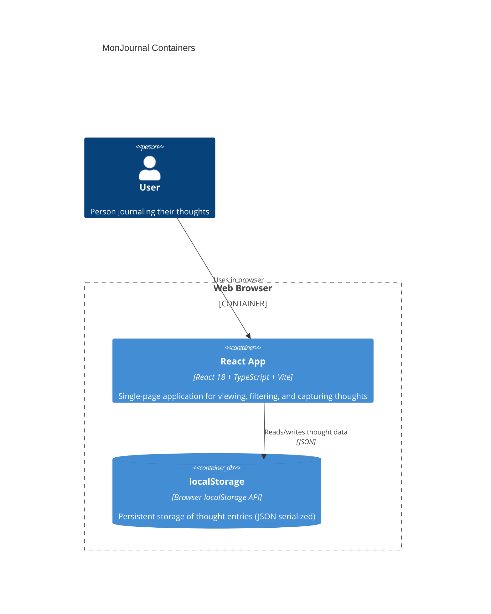

# MonJournal Containers

MonJournal is a lightweight personal thought journal application built as a single-page application (SPA) with browser-only storage. This diagram shows the key containers: the React web application and the browser's localStorage data store.

## Architecture Overview

The container diagram below illustrates:

1. **React App (Web SPA)** — The frontend application running in the browser
2. **localStorage (Data Store)** — Browser's persistent storage for thought data

Data flows bidirectionally: the app reads thought data on startup and writes new thoughts after capture.

---

## Container Diagram



---

## Technology Stack

| Component | Technology | Purpose |
|---|---|---|
| **Frontend Framework** | React 18+ | UI rendering and state management |
| **Language** | TypeScript | Type-safe development |
| **Build Tool** | Vite | Fast bundling and development server |
| **Data Persistence** | Browser localStorage | Local-only thought storage (no server) |
| **Routing** | React Router | Client-side navigation (from AppShell) |
| **Styling** | CSS (AppShell theme) | Visual presentation |

---

## Data Flow

### Read Path (App Startup)
1. User opens MonJournal in browser
2. React app initializes
3. `useThoughts` hook reads from `localStorage.getItem('monjournal_thoughts')`
4. Thoughts array is parsed and loaded into component state
5. UI renders the list of thoughts

### Write Path (Thought Capture)
1. User fills in form on `/add` page (title, content, tags)
2. Form validation passes
3. `useThoughts.addThought()` creates a new Thought object (UUID + timestamp)
4. `localStorage.setItem('monjournal_thoughts', JSON.stringify(thoughts))`
5. App navigates back to `/` and displays the new thought

---

## Storage Format

Thoughts are serialized as JSON in localStorage under the key `monjournal_thoughts`:

```json
{
  "thoughts": [
    {
      "id": "550e8400-e29b-41d4-a716-446655440000",
      "title": "Morning reflection",
      "content": "Woke up early today, feeling productive.",
      "createdAt": 1717459200000,
      "tags": ["personal", "morning"]
    }
  ]
}
```

---

## Key Characteristics

- **Browser-Only**: No backend services, API, or authentication
- **Single-Device**: Data stored locally; no cloud sync
- **Immutable Data**: Thoughts are never modified or deleted (V1 constraint)
- **Synchronous I/O**: localStorage reads/writes happen immediately
- **Simple State Management**: React hooks + Context API (no Redux)
- **Performance**: Optimized for thousands of thoughts; scales via in-memory filtering

For detailed technical decisions and non-functional requirements, see [Architecture](../architecture.md).
