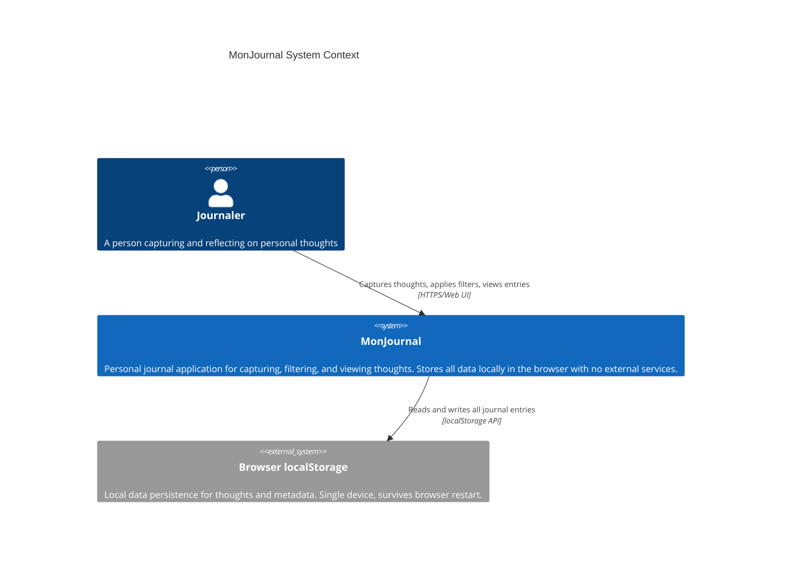

# MonJournal System Context

The MonJournal System Context diagram shows how the journaling application interacts with users and external systems. MonJournal is a personal thought journal built for complete privacy with no backend services — all data remains local to the user's browser.

---

## C4 System Context Diagram

---

## Diagram Description

### Elements

| Element | Type | Description |
|---------|------|-------------|
| **Journaler** | Person | External actor — the end user who uses MonJournal to capture, organize, and reflect on personal thoughts. |
| **MonJournal** | System | The main application — a React-based SPA that provides UI for journaling, filtering thoughts by text/date/tags, and viewing thoughts in list or timeline mode. All logic executes in the browser. |
| **Browser localStorage** | External System | Browser's local storage API used to persist all thoughts and metadata. Data survives browser restarts but is limited to a single device and browser. |

### Interactions

1. **Journaler ↔ MonJournal**: User interacts via the web UI to:
   - Create new thoughts with title, content, and tags
   - Apply filters (text search, date range, tag selection)
   - Switch between list and timeline view modes
   - Discover random entries via the "Surprise" feature

2. **MonJournal ↔ localStorage**: The application:
   - Reads all thoughts on startup (single JSON array under key `monjournal_thoughts`)
   - Writes new or updated thoughts after each action
   - Derives tags dynamically from all thoughts (no separate tag storage)

---

## Related Documentation

- **Architecture**: See [../architecture.md](../architecture.md) for detailed tech stack, state management, and component hierarchy.
- **Data Model**: Thoughts are immutable journal entries with ID, title, content, creation timestamp, and optional tags.
- **Scope**: MonJournal V1 is single-device, no cloud sync, no authentication.

