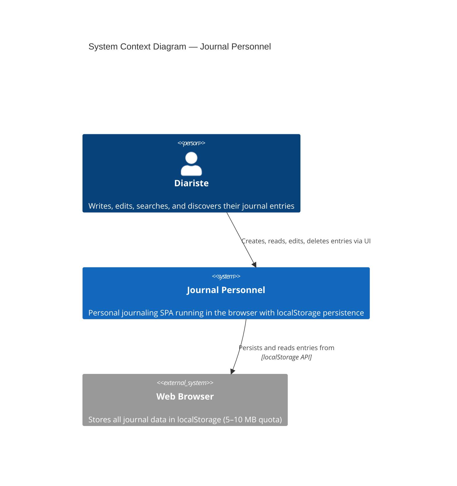

# System Context — Journal Personnel

## Overview
The Journal Personnel system is a simple personal journaling application that lives entirely in the user's browser. No external systems or services are required — the user writes to and reads from their local device only.

## Diagram

## Context Description

### Actors & Users

- **Diariste (Primary User)** : Individual who writes, reads, edits, and discovers personal journal entries. No login, no account creation required.

### Systems & Boundaries

- **Journal Personnel Application** : Single-page React application deployed on GitHub Pages. All business logic runs on the client. No backend API, no cloud sync, no external dependencies (except for build/deployment infrastructure).

- **Web Browser & localStorage** : The browser's localStorage API serves as the entire data persistence layer. All journal entries are serialized to JSON and stored locally under the key `journal_entries`. This is a single-user, single-device model.

### Key Interactions

1. **User → App** : User interacts with the UI (forms, buttons, timeline) to manage entries
2. **App → Browser localStorage** : App reads/writes all entry data to localStorage
3. **No external systems** : No API calls, no cloud services, no synchronization

### Out of Scope

- Multi-device synchronization
- Cloud backup or export
- Authentication or authorization
- External analytics or monitoring
- API integrations with third-party services

### Technology Stack

- **Frontend** : React 18 + Vite + TypeScript
- **UI Design** : GitHub Primer design system
- **Persistence** : Browser localStorage
- **Deployment** : GitHub Pages (static)

### Critical Assumptions

- User has a modern web browser (Chrome 100+, Firefox 100+, Safari 15+, Edge 100+)
- User accepts that data is local-only (no backup by default)
- localStorage quota (~5–10 MB) is sufficient for personal use
- Single-user, single-device usage model

