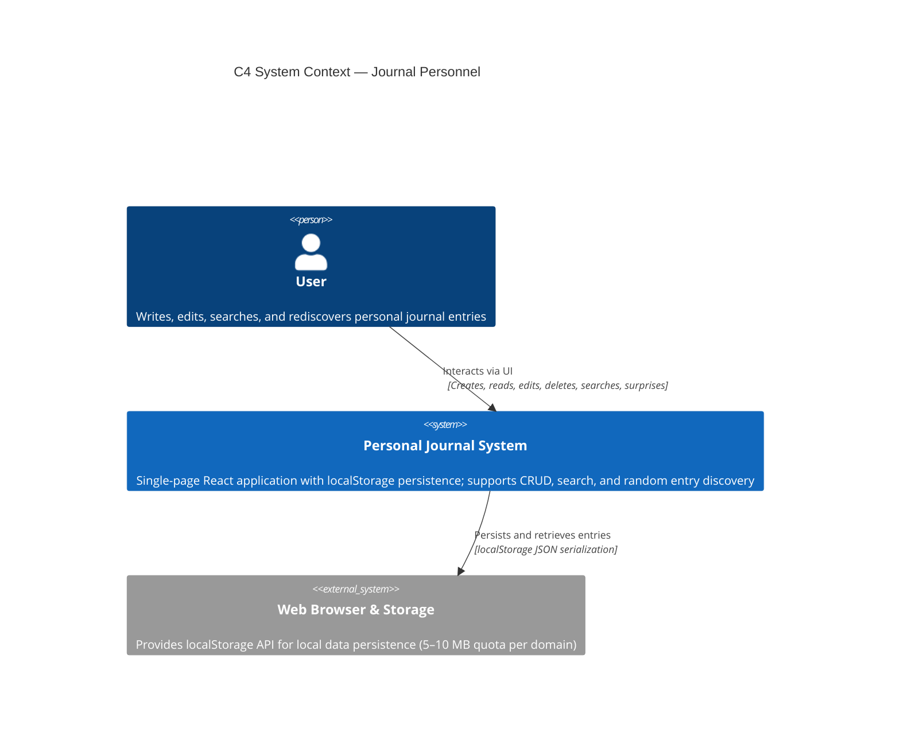

# C4 — System Context — Journal Personnel

## Overview

The Journal Personnel system is a personal journaling application that runs entirely in the user's browser. It uses localStorage for data persistence, requiring no backend server or external services. Users can create, read, edit, delete, search, and discover journal entries through an intuitive React-based interface.

## System Context Diagram

## Context Description

### Actors & Users

- **User** : An individual who writes, reads, edits, searches, and discovers personal journal entries. No authentication required; single-user, single-device model.

### Systems & Boundaries

- **Personal Journal System** : A client-side SPA built with React 18 + Vite + TypeScript. All business logic, data processing, and UI rendering occur in the browser. No backend server, no API calls to external services.

- **Web Browser & localStorage** : The browser's localStorage API serves as the complete persistence layer. Journal entries are serialized as JSON and stored under the key `journal_entries`. localStorage provides ~5–10 MB quota (varies by browser).

### Key Data Flows

1. **Create Entry** :
   - User submits form with date and text
   - System validates data (domain layer)
   - System persists entry to localStorage
   - UI updates with new entry in timeline

2. **Read & Timeline** :
   - System retrieves all entries from localStorage on app load
   - Entries are sorted by date (newest first by default)
   - Timeline component renders entries chronologically

3. **Search** :
   - User enters start and end dates in search panel
   - System filters entries by date range
   - Results displayed in sorted order

4. **Surprise** :
   - User triggers "Get Surprise" action
   - System selects one entry uniformly at random from all entries
   - Selected entry displayed in surprise view

5. **Edit & Delete** :
   - User modifies entry via form (edit) or triggers deletion
   - System updates `updatedAt` timestamp on edit
   - Changes persisted to localStorage immediately

### Out of Scope

- Multi-device synchronization
- Cloud backup or export
- Authentication, authorization, or multi-user support
- External analytics or monitoring services
- API integrations with third-party systems
- Encryption or advanced security

### Technology Stack

- **Frontend Framework** : React 18 (Hooks, functional components)
- **Build Tool** : Vite with TypeScript
- **UI Components** : GitHub Primer React (`@primer/react`)
- **Persistence** : Browser localStorage (client-side only)
- **Deployment** : GitHub Pages (static files)
- **Testing** : MSW v2 for mock API (inactive MVP; ready for phase 2)

### Critical Assumptions

- User has a modern web browser (Chrome/Firefox/Safari/Edge 100+ equivalent)
- User accepts local-only data model (no automatic backup)
- localStorage quota (~5–10 MB) is sufficient for typical journaling use
- Single-user, single-device workflow
- No shared-user or collaborative scenarios

### Key Constraints

- **Data Limit** : ~10,000 entries before localStorage quota risk
- **Performance** : All operations complete in <50–100 ms
- **Accessibility** : WCAG 2.1 AA compliance required
- **Browser Support** : ES2020+ (async/await, spread, nullish coalescing)

