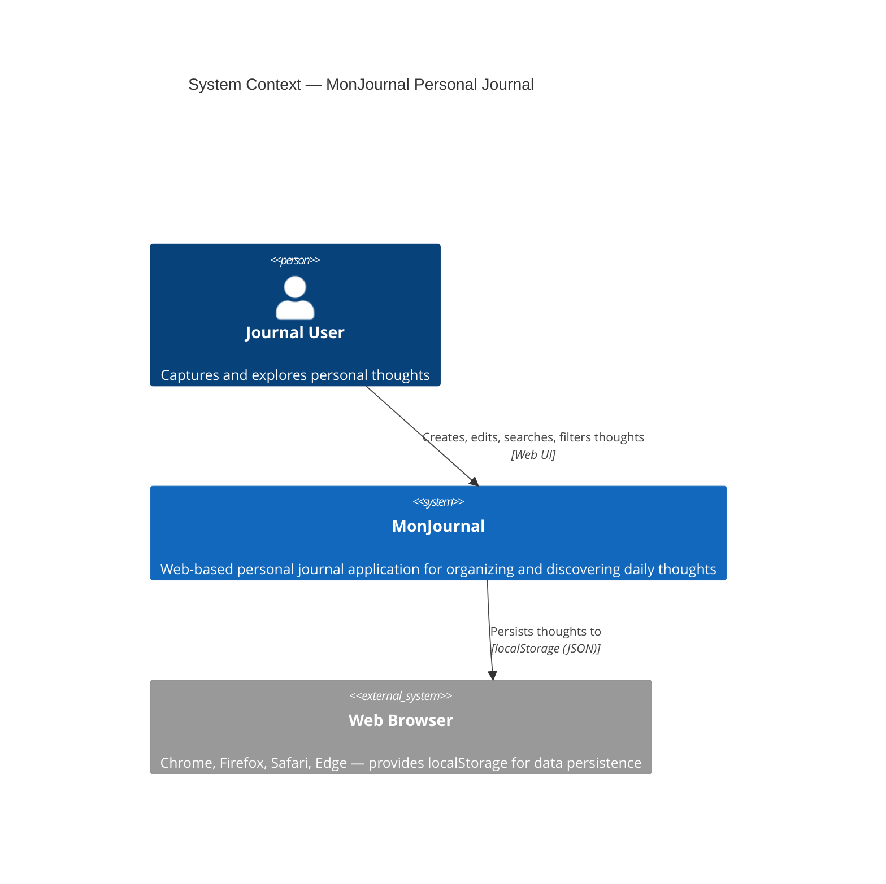

# System Context Diagram — MonJournal

## Overview

The system context diagram shows MonJournal as a single-page web application that users interact with through a web browser. All data persists locally to the browser's localStorage.

## C4Context Diagram

## Description

**MonJournal** is a self-contained web application that:

1. **Users interact with** via a modern, Primer-based web interface
2. **Stores all data** in browser localStorage — no cloud synchronization
3. **Operates entirely offline** once loaded
4. **Provides CRUD operations** for personal thoughts (create, read, edit, delete)
5. **Supports tagging, search, filtering, and surprise discovery** of thoughts

The system has no external dependencies:
- No backend server or API
- No database
- No external services
- No authentication or user management

All computation and storage happen client-side, making it a true "local-first" application.

## Key Characteristics

| Aspect | Details |
|--------|---------|
| **Scope** | Single-page application (SPA) |
| **Users** | One person per browser (single-user app) |
| **Data Storage** | Browser localStorage only |
| **Internet Dependency** | Required for first load only, then fully offline-capable |
| **Deployment** | Static hosting (CDN, Vercel, Netlify, S3) |
| **Data Portability** | Manual export/import via localStorage inspection or future export feature |

---

**Next:** See [Container Diagram](./containers.md) for internal component architecture.
