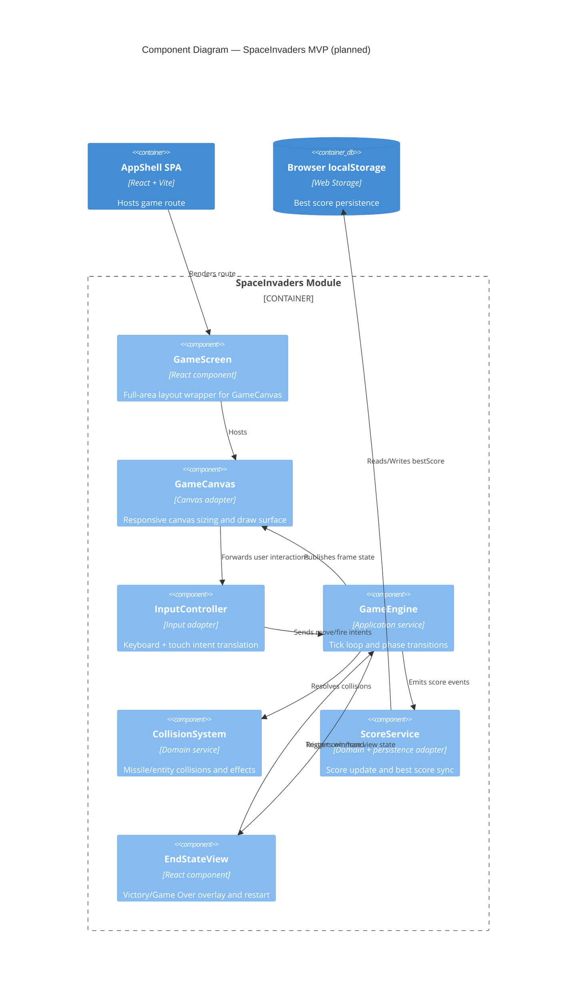

# C4 Components — SpaceInvaders MVP Runtime

## Scope

This view decomposes the SpaceInvaders game module into technical components aligned with `architecture.md`.

## Related Documents

- [Architecture — SpaceInvaders MVP](../architecture.md)
- [C4 Deployment View](deployment.md)
